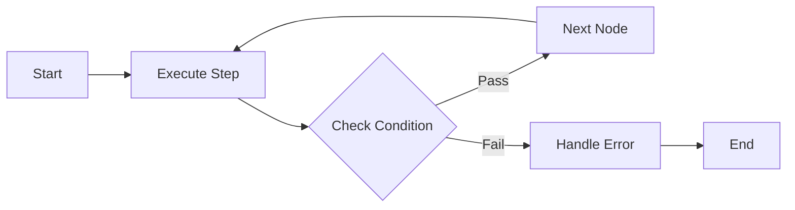

# Documentation Style Guide

Single guide for **both** documentation types in this repo. Agents often read only
one guide and miss the other type's rules, so the internal-docs and public-docs
standards are merged here.

> **Find the right file first.** Before/after changing code, consult the
> **Documentation Map** in the root [README.md](../README.md#documentation-map) to
> find which doc file owns the affected area, then update that file in the same
> change.

## Two Types of Documentation

### Internal Documentation (`docs/`)

**Location**: `docs/*.md`
**Audience**: Developers working on the MCP Moira codebase
**Purpose**: Technical reference for maintaining and extending the system
**Content**: Architecture, implementation details, internal APIs, development procedures

### Public Documentation (`packages/docs/`)

**Location**: `packages/docs/src/content/docs/docs/` (EN) + `packages/docs/src/content/docs/ru/docs/` (RU)
**Audience**: Users creating and using workflows — including AI agents that follow workflow instructions (docs must be machine-readable)
**Purpose**: Guide for workflow creation and MCP tool usage
**Content**: Workflow patterns, node specifications, MCP tool reference

### Key Differences

| Aspect        | Internal (`docs/`)      | Public (`packages/docs/`)    |
| ------------- | ----------------------- | ---------------------------- |
| Scope         | Full system internals   | User-facing features only    |
| Detail level  | Implementation-specific | Usage-focused                |
| Code examples | TypeScript internals    | Workflow JSON, MCP calls     |
| Updates       | When code changes       | When user experience changes |

### Synchronization Rule

When a feature affects both:

1. Update internal docs with implementation details.
2. Update public docs with user-facing behavior.
3. Ensure no contradictions between sources.

## Forbidden Content (applies to ALL docs)

Never add any of the following to internal **or** public documentation:

- **Historical information** — "was changed", "replaced", "improved", "in v2.0 we…", "legacy support for X". Just describe current behavior.
- **Marketing language** — "enhanced", "better", "professional", "amazing", "powerful", "best-in-class", "enterprise-grade".
- **Counts that drift with code** — test counts ("42/42 tests", "5 passing"), tool/node-type/package counts ("11 tools", "8 node types", "6-package monorepo"). Describe by name/area, not by number.
- **Version-specific details** — "v0.1.0", "latest version".
- **Emotional / subjective** — "it's important to note", "pay attention", "this perfectly fits", "we recommend".
- **Empty content** — "Coming soon", "TBD", "this section will be expanded", heading-only sections.
- **Obvious statements** — "install dependencies", "save the file", "read the documentation".

### Always include instead

- **Technical facts only**, verifiable from code or system behavior.
- **Code examples with real syntax** from source.
- **Concrete commands and paths.**
- **Interface definitions from source code.**
- **Error messages and solutions.**

---

# Internal Documentation (`docs/`)

Standards for the developer-facing docs under `docs/`.

## File Responsibilities

### README.md

**Purpose**: Technical overview for quick understanding
**Content**: Architecture, node types, commands, file structure, documentation map
**Style**: Concise technical facts

### docs/SYSTEM.md

**Purpose**: Complete system reference
**Content**: Interfaces, types, validation rules, template processing
**Style**: Code-based documentation with TypeScript examples

### docs/WORKFLOW.md

**Purpose**: Workflow format specification
**Content**: Node specs, condition operators, JSON examples
**Style**: Specification document with concrete examples

### docs/DEVELOPMENT.md

**Purpose**: Development process guide
**Content**: Setup, testing, debugging, handler development
**Style**: Step-by-step technical procedures

(For the full file→area map, see the Documentation Map in the root README.md.)

## Update Procedures

### Adding New Features

**DO:**

````markdown
## New Node Type: custom-node

### Interface

```typescript
interface CustomNode {
  type: "custom-node";
  id: string;
  customField: string;
  connections: { success: string };
}
```

### Usage

```json
{
  "type": "custom-node",
  "id": "example",
  "customField": "value",
  "connections": { "success": "next-node" }
}
```
````

**DON'T:**

```markdown
## Enhanced Custom Node Feature

We've improved the system by adding a new enhanced custom node type that provides better functionality than the previous approach. This replaces the old method and offers enhanced capabilities.
```

### Updating Existing Features

**DO:**

- Update interface definitions with current code.
- Add new examples showing actual usage.
- Update command syntax to match package.json.

**DON'T:**

- Mention what "changed" or was "updated".
- Keep old examples alongside new ones.
- Add version history or migration notes.

### Removing Features

**DO:**

- Delete documentation for removed features.
- Update examples to use current syntax.
- Remove references from other docs.

**DON'T:**

- Mark as "deprecated" or "legacy".
- Keep old documentation "for reference".
- Explain why something was removed.

## Quality Checklist (internal docs)

Before committing documentation changes:

### Content Quality

- [ ] Only technical facts included
- [ ] No marketing language or opinions
- [ ] No historical information
- [ ] No drift-prone counts or version numbers
- [ ] All code examples use real syntax from source

### Structure Quality

- [ ] Information not duplicated between files
- [ ] Each file maintains its specific purpose
- [ ] Length appropriate for content type
- [ ] Clear section hierarchy

### Factual Accuracy

- [ ] All interfaces match source code
- [ ] All commands exist in package.json
- [ ] All file paths are accurate
- [ ] All examples actually work

## Emergency Documentation Rules

### If Documentation Becomes Outdated

**FIX**: Update specific outdated sections.
**DON'T**: Rewrite entire files unless absolutely necessary.

### If Information is Duplicated

**FIX**: Choose primary location and delete duplicates.
**DON'T**: Keep "for reference" or mark as "see also".

### If File Becomes Too Long

**FIX**: Split into focused sections.
**DON'T**: Add table of contents or overview sections.

## Quality Verification Rules

### Principle: Substantive Analysis Over Formal Counting

Agents often verify work by counting items instead of checking actual functionality.

### BAD Verification (formal counting)

```
"6/6 tasks completed"
"All files updated"
"Changes applied to 10 files"
"Documentation sections added"
```

These say nothing about whether the work actually solved the problem.

### GOOD Verification (substantive analysis)

```
"npm test passes: 1227/1227"
"curl localhost:${DOCKER_PORT}/api/health returns 200"
"Expression node correctly increments: current_iteration 1→2"
"Template {{#if variable}} renders conditional content"
```

These prove functionality works.

### Verification Requirements

1. **Functional proof required** — run tests and show output; test endpoints and show HTTP responses; demonstrate before/after state.
2. **No assumptions** — "should work", "code looks correct", "applied standard pattern" are NOT acceptable.
3. **Evidence format** — command executed + output; request sent + response received; state before + action + state after.

### Examples

**Task**: Fix failing test

- BAD: "Fixed the test by updating expected value"
- GOOD: "npm run test:unit auth.test.ts → 15/15 pass (was 14/15)"

**Task**: Add new API endpoint

- BAD: "Added endpoint handler in routes.ts"
- GOOD: "curl -X POST localhost:${DOCKER_PORT}/api/new → 201 Created, response body matches schema"

**Task**: Update workflow connections

- BAD: "Updated 5 connection targets"
- GOOD: "moira-workflow file.json structure --graph shows node-a→node-b→node-c path"

## Communication Style Rules

### Forbidden in any communication

**Efficiency violations**: using search/grep when full file context is available; multiple searches instead of single analysis; checking obvious facts already in context.

**Response bloat**: answers longer than 4 lines (except code generation); preambles ("The answer is…", "Here is…"); explanations after completing tasks; summaries of what was done.

**Emotional language**: exclamations and celebrations ("Success!", "Great!", "Perfect!"); marketing terms ("amazing", "powerful", "flexible"); emojis in technical content; congratulations for partial completion.

**Subjective assessments**: personal recommendations ("I suggest", "you should"); quality judgments ("better", "best", "excellent"); difficulty estimates ("easy", "simple", "complex").

### Required response style

**Directness**: one-word answers when appropriate; technical facts without interpretation; code examples with real syntax; concrete paths and commands.

**Efficiency**: deep consideration before responding; use full context instead of searching; address only the specific task; minimize token usage while maintaining quality.

**Structure**: facts first, examples second; no introductions or conclusions; relative paths only, never absolute; minimal duplication between sections.

---

# Public Documentation (`packages/docs/`)

Standards for user-facing documentation at
`packages/docs/src/content/docs/docs/` (EN) and `…/ru/docs/` (RU).

## Mandatory Sync With Code Changes

Any code change that alters user-facing behavior MUST update the corresponding
public documentation in the same change. This is required, not optional — public
docs are the contract users and AI agents rely on, and they drift silently when
changes ship without doc updates.

A change triggers a required public-docs update when it touches any of:

- The variable model (`variableRegistry`, `globalInputs`, node-local `node-id.name` resolution, variable scoping/validation).
- Node types or their schema/fields (e.g. `agent-directive`, `condition`, `expression`, `telegram-notification`, note nodes).
- The workflow-definition schema (top-level fields, `inputSchema` shape).
- MCP tools (names, parameters, actions, descriptions) and the agent-facing contract.
- Template syntax, magic variables, or condition operators.
- Workflow-authoring rules surfaced to users.

When such a change lands:

- Update both the English page under `docs/...` and its Russian mirror under `ru/docs/...` (keep them in parity).
- Verify every example still matches current behavior (`variableRegistry`/`globalInputs` shapes, JSON validity, command syntax).
- A repository-wide search for removed concepts (e.g. `initialData`, deprecated field names) must return no non-negated references in the public docs.

Treat a public-docs update as part of the definition of done for the code change, alongside tests.

## Purpose & Audience

**Audience**: End users of the MCP Moira product (not project developers).
**Goal**: User understands how to use Moira workflows and MCP tools.
**Principle**: Each page is self-contained — a user should not need to read other pages to understand the current one.
**Includes**: AI agents that follow workflow instructions (documentation must be machine-readable).

## Page Structure

Every documentation page MUST follow this structure:

```markdown
---
title: Page Title
description: One sentence describing what this page covers
---

Intro paragraph (1-3 sentences) explaining what the user will learn.

## Section 1

Content...

## Section 2

Content with examples...

## Related

- [Related Page 1](/docs/path/to/page/)
- [Related Page 2](/docs/path/to/page/)
```

### Required Elements

| Element                          | Required      | Notes                        |
| -------------------------------- | ------------- | ---------------------------- |
| Frontmatter (title, description) | YES           | Always present               |
| Intro paragraph                  | YES           | Before first H2              |
| At least one example             | YES           | Code block, JSON, or command |
| Related links                    | If applicable | At end of page               |

### Heading Hierarchy

- H1: Never use (title comes from frontmatter).
- H2: Main sections.
- H3: Subsections within H2.
- H4: Use sparingly, prefer flattening structure.

## Required Content

### Technical Facts

Every claim must be verifiable from code or system behavior:

```markdown
## Workflow Execution

Workflows execute through MCP tools:

- `mcp__moira__start` - begins execution, returns processId
- `mcp__moira__step` - advances to next node, returns directive

Each step returns:

- `directive`: instruction for AI agent
- `completionCondition`: success criteria
- `inputSchema`: expected response format (optional)
```

### Concrete Commands

Show the exact syntax the user will type:

````markdown
## Starting a Workflow

Start a workflow by ID:

```bash
mcp__moira__start({ workflowId: "test-planning" })
```

With an execution note:

```bash
mcp__moira__start({
  workflowId: "development-flow",
  note: "Feature: auth system"
})
```
````

### Working Examples

Every example must be copy-pasteable and functional:

````markdown
## Node Configuration

Agent-directive node with template:

```json
{
  "id": "greet-user",
  "type": "agent-directive",
  "directive": "Greet {{user_name}} and ask about their project",
  "completionCondition": "User greeted",
  "connections": { "success": "gather-requirements" }
}
```
````

### Use Cases with Scenarios

Show real-world application:

````markdown
## When to Use Condition Nodes

**Scenario**: a code-review workflow needs different paths based on the result.

```json
{
  "id": "check-review",
  "type": "condition",
  "condition": {
    "operator": "eq",
    "left": { "contextPath": "passed" },
    "right": true
  },
  "connections": { "true": "merge-code", "false": "fix-issues" }
}
```

- If `passed: true` → workflow continues to merge.
- If `passed: false` → workflow loops back to fix.
````

## Visual Components

### Mermaid Diagrams

Use for complex flows, architecture, sequences.

````markdown

````

**Mermaid guidelines:**

- Use `flowchart LR` (left-to-right) for process flows.
- Use `flowchart TD` (top-down) for hierarchies.
- Keep node labels short (3-5 words max).
- Use decision diamonds `{}` for branching.
- Limit to 10-15 nodes per diagram.

### CardGrid

Use for feature lists, options, comparisons.

```markdown
import { CardGrid, Card } from '@astrojs/starlight/components';

<CardGrid>
  <Card title="Agent Directive Node" icon="rocket">
    Executes a single task with directive and completion condition.
  </Card>
  <Card title="Condition Node" icon="random">
    Branches the workflow based on the structured condition.
  </Card>
</CardGrid>
```

### Aside

Use for tips, warnings, critical information.

```markdown
import { Aside } from '@astrojs/starlight/components';

<Aside type="tip">
Use the `note` parameter in start() to identify executions in the session list.
</Aside>

<Aside type="caution">
Workflow state is not persisted between MCP server restarts.
</Aside>

<Aside type="danger">
Never expose API keys in workflow templates. Use environment variables.
</Aside>
```

**Aside types:** `tip` (helpful suggestion), `note` (additional info), `caution` (potential issue), `danger` (critical warning).

### Code Blocks

Use for CLI commands, JSON configs, TypeScript. Always specify the language.

````markdown
```bash
# CLI command with comment
mcp__moira__list({ search: "test" })
```

```json
{ "workflowId": "example", "note": "Testing workflow" }
```

```typescript
interface WorkflowNode {
  id: string;
  type: "start" | "condition" | "agent-directive";
  directive: string;
}
```
````

### Steps

Use for sequential instructions the user performs.

```markdown
import { Steps } from '@astrojs/starlight/components';

<Steps>
1. Configure the MCP server in your client settings
2. Authenticate with `/mcp`
3. Start a workflow with `mcp__moira__start`
4. Follow directives from `mcp__moira__step`
</Steps>
```

### Tabs

Use for alternative configurations (different clients, OS).

````markdown
import { Tabs, TabItem } from '@astrojs/starlight/components';

<Tabs>
  <TabItem label="Claude Desktop">
    Add to `claude_desktop_config.json`:
    ```json
    { "mcpServers": { "moira": { "url": "https://${MOIRA_HOST}/mcp" }}}
    ```
  </TabItem>
  <TabItem label="Cursor">
    Add to MCP settings in Cursor preferences...
  </TabItem>
</Tabs>
````

### Tables

Use for structured data, comparisons, feature lists.

```markdown
| Type              | Purpose                                                |
| ----------------- | ------------------------------------------------------ |
| `start`           | Entry point for workflow execution                     |
| `end`             | Terminal node marking completion                       |
| `agent-directive` | Task for agent with directive and completion condition |
```

**Table guidelines:** use for data with 2+ columns and 3+ rows; keep cells concise; align columns consistently; prefer tables over bullet lists for structured comparisons.

### Numbered Lists

Use for explaining how something works (descriptions), vs `<Steps>` for user actions (instructions).

```markdown
### Execution Flow

1. Agent starts a workflow via MCP tool
2. Receives the current step directive and completion condition
3. Executes the directive
4. Returns the result via `step()`
5. Engine validates and advances to the next step
6. Repeat until the workflow completes
```

### Combining Components

- Mermaid diagram + numbered list = visual overview + detailed explanation.
- CardGrid + Aside = feature list + important note.
- Table + code example = reference data + practical usage.

## Page Patterns

### Introduction Pages

Structure: Problem → Solution → How It Works → Key Concepts → Next Steps.

### Reference Pages

Structure: Intro → Start Command → Process Flow → Features → Related.

### "Related" vs "Next Steps"

- **Next Steps** — for introduction/getting-started pages (action-oriented, "do this next").
- **Related** — for reference/concept pages (additional reading, "learn more about").

## Pre-Publication Checklist (public docs)

### Content Quality

- [ ] Has intro paragraph before first H2
- [ ] Contains at least one working example
- [ ] No marketing language (amazing, powerful, best)
- [ ] No historical references (was, became, improved)
- [ ] No empty sections or stubs
- [ ] No obvious statements

### Technical Accuracy

- [ ] All commands are copy-pasteable
- [ ] All JSON examples are valid
- [ ] All paths exist in the codebase
- [ ] All interfaces match source code
- [ ] Examples actually work when tested

### Visual Elements

- [ ] Mermaid diagrams render correctly
- [ ] Diagrams have clear node labels
- [ ] Aside types are appropriate
- [ ] Code blocks have language specified

### Completeness

- [ ] Page is self-contained
- [ ] User can accomplish the goal with only this page
- [ ] Related links included if applicable
- [ ] No external dependencies left unexplained

## Quick Reference

| Do                      | Don't                |
| ----------------------- | -------------------- |
| State facts             | Make claims          |
| Show examples           | Describe in abstract |
| Use Mermaid for flows   | Use ASCII art        |
| Link to related pages   | Duplicate content    |
| Write complete sections | Add stubs            |
| Test all examples       | Assume correctness   |
