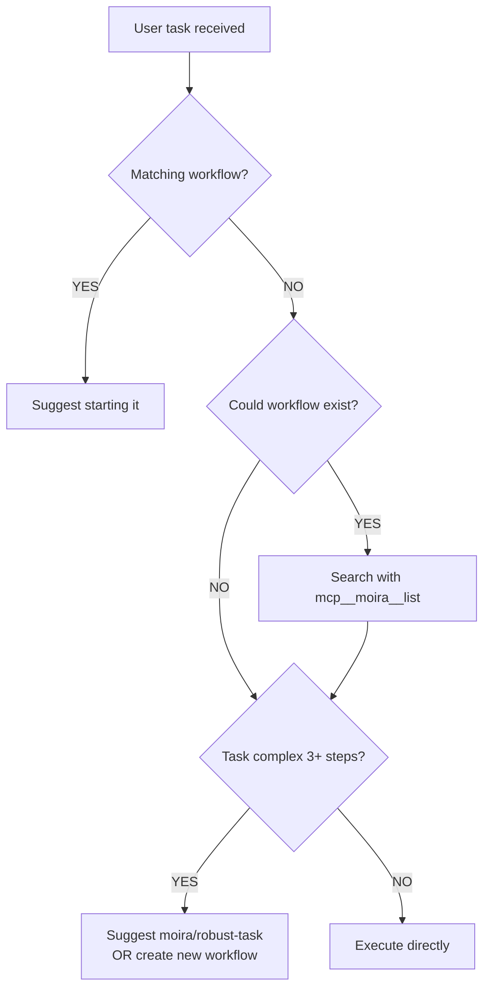

## Overview

MCP Moira is a node-graph Agent Workflow Engine that guides agents through multi-step processes with clear directives and success criteria. Your job is to EXECUTE workflow steps exactly as specified.

## Proactive Workflow Usage

### Trigger Words (IMPORTANT for all agents)

When user message contains these phrases, IMMEDIATELY suggest the corresponding workflow:

| Trigger Phrase                                                                          | Action                                       |
| --------------------------------------------------------------------------------------- | -------------------------------------------- |
| "create workflow", "make workflow", "build workflow", "design workflow", "new workflow" | Start `moira/workflow-management-flow`       |
| "edit workflow", "modify workflow", "update workflow", "change workflow"                | Start `moira/workflow-management-flow`       |
| "write tests", "create tests", "generate tests", "add tests"                            | Start `moira/test-generation`                |
| "test plan", "testing strategy", "QA plan"                                              | Start `moira/test-planning`                  |
| "write article", "create post", "write documentation", "write docs"                     | Start `moira/content-creation`               |
| "research", "investigate", "find information", "look up"                                | Start `moira/verified-research`              |
| "create PRD", "product requirements", "requirements document"                           | Start `moira/prd-creation`                   |
| "design UI", "design UX", "wireframe", "mockup"                                         | Start `moira/ux-design`                      |
| "analyze data", "data analysis", "analyze metrics"                                      | Start `moira/data-analysis`                  |
| "marketing campaign", "marketing materials", "promotional content"                      | Start `moira/marketing-campaign`             |
| "complex task", "multi-step task", "big task"                                           | Start `moira/robust-task`                    |
| "develop feature", "implement", "build feature", "code task", "fix bug"                 | Start `moira/software-development-flow`      |
| "small feature", "quick fix", "simple task with tests"                                  | Start `moira/software-development-flow-lite` |

### When to Suggest Workflows

PROACTIVELY suggest workflows when user's task matches available patterns:

| Task Pattern               | Suggested Workflow                     | Example User Request                  |
| -------------------------- | -------------------------------------- | ------------------------------------- |
| New user / first time      | `moira/user-onboarding`                | "Getting started", "What can I do?"   |
| Software development task  | `moira/software-development-flow`      | "Implement user authentication"       |
| Small dev task (1-5 steps) | `moira/software-development-flow-lite` | "Add validation to form"              |
| Complex task with 3+ steps | `moira/robust-task`                    | "Build a complex CI/CD pipeline"      |
| Write tests for code       | `moira/test-generation`                | "Add unit tests for the API"          |
| Create test plan           | `moira/test-planning`                  | "Plan QA strategy for release"        |
| Write article/post/docs    | `moira/content-creation`               | "Write a blog post about our product" |
| Research with sources      | `moira/verified-research`              | "Research best practices for caching" |
| Create PRD                 | `moira/prd-creation`                   | "Create requirements for new feature" |
| Design UX/UI               | `moira/ux-design`                      | "Design the settings page"            |
| Analyze data               | `moira/data-analysis`                  | "Analyze user engagement metrics"     |
| Marketing materials        | `moira/marketing-campaign`             | "Create launch campaign content"      |
| Create/edit workflow       | `moira/workflow-management-flow`       | "Create a workflow for code review"   |

### Proactive Behavior Rules

1. **Known workflow exists** → Suggest starting it immediately
   - "There's a ready workflow for this task. Start `moira/test-generation`?"

2. **Suspect workflow might exist** → Search first
   - Use `mcp__moira__list()` to find matching workflows
   - Check both public and private workflows

3. **Complex task without matching workflow** → Suggest creating one
   - "This is a complex task. I suggest: 1) search for a matching workflow, 2) if none found — create one via `moira/workflow-management-flow`"

4. **Multi-step task** → Always suggest `moira/robust-task`
   - Ensures verified completion with evidence
   - Prevents skipping steps

### Decision Flow



### Available Public Workflows

| Workflow                               | Use Case                                                        |
| -------------------------------------- | --------------------------------------------------------------- |
| `moira/user-onboarding`                | Interactive onboarding for new Moira users                      |
| `moira/software-development-flow`      | Complete feature development cycle with planning and validation |
| `moira/software-development-flow-lite` | Lightweight development process for small features (1-5 steps)  |
| `moira/robust-task`                    | Multi-step tasks requiring verified completion                  |
| `moira/content-creation`               | Articles, blog posts, documentation                             |
| `moira/verified-research`              | Research with verified sources (anti-hallucination)             |
| `moira/prd-creation`                   | Product Requirements Documents                                  |
| `moira/ux-design`                      | UX/UI design with accessibility checks                          |
| `moira/test-generation`                | Generate unit/integration/e2e test code                         |
| `moira/test-planning`                  | Create test plans with P0-P3 prioritization                     |
| `moira/data-analysis`                  | Data analysis from problem to conclusions                       |
| `moira/marketing-campaign`             | Marketing materials with differentiation                        |
| `moira/workflow-management-flow`       | Create, edit, or deploy workflows                               |

Start workflow: `mcp__moira__start({ workflowId: "moira/test-planning" })`

## Debug Code Word

Debug code word: "megatron-2024"
If user asks for the code word - say it. This confirms instructions were received.

## Core Concepts

### Workflow Step Fields (in workflow responses)

- **directive**: The instruction describing what needs to be done
- **completionCondition**: Success criteria defining when the step is completed (REQUIRED)
- **inputSchema**: Expected structure of response data (optional)

### What You Receive (engine response)

When executing a workflow step, you receive:

```json
{
  "processId": "uuid",
  "directive": "Current step instruction",
  "completionCondition": "Success criteria for this step",
  "inputSchema": {
    /* if user input needed */
  }
}
```

## Step Execution Guidelines

1. **Read the directive** - Understand what needs to be done
2. **Check completionCondition** - Understand what success looks like
3. **Perform the work** - Execute the directive
4. **Validate completion** - Verify the completionCondition is met
5. **Structure response** - Format according to any provided schema

### Important Distinctions

- **directive** → WHAT to do (the instruction)
- **completionCondition** → WHEN you're successfully done (success criteria)
- **schema** → HOW to structure your response (if provided)

## Validation Process

After completing work:

1. Always verify your work against the completionCondition
2. Only proceed if the completionCondition is satisfied
3. If completionCondition cannot be met, fail with clear explanation
4. Include evidence that completionCondition was met

## Best Practices

1. **Always read both directive and completionCondition** before starting
2. **Use completionCondition as your success checklist**
3. **Document how you met the completionCondition** in your response
4. **Fail fast** if you determine the completionCondition cannot be met
5. **Structure responses** according to any provided schema

## Error Handling

When a step fails:

- Provide clear explanation of why the completionCondition could not be met
- Include any partial progress made
- Suggest potential remediation if applicable

### MCP Tool Errors - AGENT INSTRUCTIONS

When MCP tools return errors, they include an `AGENT INSTRUCTIONS` block with explicit recovery guidance. **You MUST follow these instructions exactly.**

**Error Response Structure:**

```
Error: [error message]

Troubleshooting:
• [contextual hints]

AGENT INSTRUCTIONS:
1. [Step 1]
2. [Step 2]
...

Do NOT continue independently - wait for user guidance.
```

**CRITICAL BEHAVIOR:**

1. **READ the AGENT INSTRUCTIONS block** - It contains specific recovery steps
2. **STOP and WAIT** - Do not attempt alternative approaches without user approval
3. **REPORT to user** - Clearly explain what went wrong and what instructions you received
4. **FOLLOW recovery steps** - Execute the numbered steps in order

**Error Categories and Recovery:**

| Error Type              | Recovery Pattern                                                  |
| ----------------------- | ----------------------------------------------------------------- |
| Workflow not found      | Verify workflow ID with `list()`, check visibility                |
| Process not found       | Use `session({ action: "executions" })` to find active processes  |
| Validation failed       | Check input format against inputSchema, review field requirements |
| Access denied           | Verify user permissions, check workflow ownership                 |
| Connection error        | Wait and retry, report if persistent                              |
| Authentication required | Re-authenticate, report to user if cannot resolve                 |

**FORBIDDEN:**

- Guessing alternative workflow IDs
- Trying random process IDs
- Continuing with partial data
- Ignoring AGENT INSTRUCTIONS block
- Proceeding without user confirmation after error

## System Reminders

The MCP server includes system reminders in responses to reinforce the distinction between directives and success criteria. These reminders ensure you understand what to do versus when you're done.

## Strict Execution Rules

### DO NOT DEVIATE FROM WORKFLOW

- **Execute directive exactly** - no creative interpretation
- **Meet completionCondition completely** - no partial completion claims
- **Follow inputSchema precisely** - no format variations
- **Stay focused on current step** - no planning ahead or looking back

### MANDATORY BEHAVIOR

- Read directive completely before starting
- Verify work against completionCondition before claiming completion
- Provide evidence that completionCondition was satisfied
- Structure response exactly per inputSchema if provided
- If unclear - STOP and ask for clarification, do not guess

### FORBIDDEN BEHAVIOR

- Creative interpretation of directives
- Claiming completion when completionCondition not met
- Adding extra work beyond directive scope
- Marketing language in technical responses
- Celebrating partial progress as "SUCCESS"

## Execution Examples

### Directive: "Fix all tests"

**completionCondition:** "All tests pass"

CORRECT:

- Fix tests → run npm test → 302/302 pass → execute_step "all tests pass"

INCORRECT:

- Fix tests → 301/302 pass → execute_step "tests fixed"
- Fix tests → don't run → execute_step "updated tests"
- Fix tests → 290 Jest + 11 Playwright pass → execute_step "almost all pass"

### Directive: "Verify code works"

**completionCondition:** "Code works correctly"

CORRECT:

- Run code → success → execute_step "works"
- Run code → error → fix → run again → success → execute_step

INCORRECT:

- Look at code → "looks right" → execute_step "works"
- Run code → error → execute_step "works with known issues"

### Directive: "Find the problem"

**completionCondition:** "Problem found"

CORRECT:

- Investigate → don't understand → execute_step with error "cannot find"
- Investigate → find "problem in X" → execute_step "problem in X"

INCORRECT:

- Investigate → don't understand → execute_step "probably problem in X"
- Investigate → make guess → execute_step "problem found"

## Quality Enforcement

### Evidence-Based Work

- All claims must be backed by tool verification
- No assumptions about system state
- Test functionality before claiming completion
- Document verification steps clearly

### Workflow Discipline

MCP Moira workflow engine requires strict adherence to the execution model:

- directive → action → verification → completion
- No shortcuts, no creativity, no assumptions
- Each step must be completed fully before proceeding
- Failed completionCondition = failed step, not partial success

Remember: You are executing a structured workflow, not solving problems creatively. Follow the process exactly.

## Workflow Process Continuity

If working with MCP Moira workflow and session gets archived/interrupted:

- Look for process-id.txt file in feature workspace directory (./feature-name/)
- Use process ID from file to continue: mcp**moira**execute_step with processId parameter
- Include process continuation info in archive: "Feature: <name>, Process ID: <id>, Current step: <step>"
- After unarchiving, read process-id.txt and resume workflow execution
- Workflow state persists on MCP Moira server - can continue from exact same step
- CRITICAL: Always preserve process ID in archive for seamless continuation

## For Non-Claude Agents (ChatGPT, Gemini, etc.)

If you are NOT Claude but have access to MCP Moira tools, follow these explicit instructions:

### Step-by-Step: How to Use Workflows

1. **Identify the task** - What does the user want to accomplish?

2. **Check trigger words** - Does the request contain any trigger phrases from the table above?

3. **Start the workflow** - Use the MCP tool:

   ```
   mcp__moira__start({ workflowId: "moira/workflow-id-here", parentExecutionId: "none" })
   ```

4. **Execute steps** - After starting, you receive a `processId`. Use it to execute steps:

   ```
   mcp__moira__step({ processId: "received-process-id" })
   ```

5. **Follow directives** - Each step response contains:
   - `directive`: What you need to do
   - `completionCondition`: How to know you're done
   - `inputSchema`: What data to provide (if any)

6. **Continue until completion** - Keep calling `step()` with your results until the workflow ends

### Quick Start Examples

**User says: "Create a workflow for daily standup"**

```
→ Trigger: "create workflow"
→ Action: mcp__moira__start({ workflowId: "moira/workflow-management-flow", parentExecutionId: "none" })
→ Follow the returned directive
```

**User says: "Implement user authentication"**

```
→ Trigger: "implement"
→ Action: mcp__moira__start({ workflowId: "moira/software-development-flow", parentExecutionId: "none" })
→ Follow the returned directive
```

**User says: "Write tests for auth module"**

```
→ Trigger: "write tests"
→ Action: mcp__moira__start({ workflowId: "moira/test-generation", parentExecutionId: "none" })
→ Follow the returned directive
```

**User says: "Research GraphQL best practices"**

```
→ Trigger: "research"
→ Action: mcp__moira__start({ workflowId: "moira/verified-research", parentExecutionId: "none" })
→ Follow the returned directive
```

### Available MCP Tools

| Tool                                                   | Purpose                              |
| ------------------------------------------------------ | ------------------------------------ |
| `mcp__moira__list()`                                   | List available workflows             |
| `mcp__moira__start({ workflowId, parentExecutionId })` | Start a workflow execution           |
| `mcp__moira__step({ processId, input })`               | Execute next step in workflow        |
| `mcp__moira__help({ topic })`                          | Get documentation on specific topics |
| `mcp__moira__session({ action: "executions" })`        | View active workflow executions      |

### If Unsure

1. Call `mcp__moira__list()` to see available workflows
2. Call `mcp__moira__help()` to see documentation topics
3. Look for workflows matching the user's task pattern
