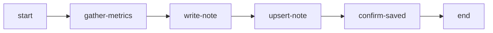
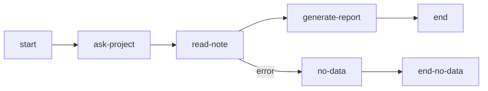

import { Aside, Steps } from "@astrojs/starlight/components";

Notes provide persistent key-value storage scoped to each user. Data saved in notes survives across workflow executions, enabling preferences, accumulated results, and cross-workflow data pipelines.

## Use Cases

- **User preferences**: Store commit style, preferred region, coding conventions
- **Data accumulation**: Weekly analysis results compared over time
- **Cross-workflow pipelines**: Collector workflow saves data, Reporter workflow reads it
- **Session continuity**: Intermediate results survive session archiving

## MCP Tool

The `notes` MCP tool provides 6 actions for agent access:

```json
notes({ action: "save", key: "commit-style", value: "conventional", tags: ["preferences"] })
notes({ action: "get", key: "commit-style" })
notes({ action: "list", tag: "preferences" })
notes({ action: "history", key: "commit-style" })
notes({ action: "delete", key: "commit-style" })
notes({ action: "stats" })
```

| Action    | Purpose                         |
| --------- | ------------------------------- |
| `save`    | Create or update a note         |
| `get`     | Read note content by key        |
| `list`    | List notes with tag/key filters |
| `history` | View version history of a note  |
| `delete`  | Soft delete a note              |
| `stats`   | Usage statistics and quota info |

### Key Format

Keys accept alphanumeric characters, underscore, and hyphen. Length: 1-100 characters.

```
my-config          # valid
project_settings   # valid
2024-report        # valid
```

### Limits

| Limit             | Value      |
| ----------------- | ---------- |
| Note size         | 100 KB     |
| Total per user    | 1 MB       |
| Tags per note     | 10         |
| Tag length        | 1-50 chars |
| Versions per note | 50         |

## Automatic Node Types

Three node types execute note operations without agent interaction. They run server-side and continue to the next node automatically.

### read-note

Reads notes matching filter criteria into a context variable:

```json
{
  "type": "read-note",
  "id": "load-metrics",
  "outputVariable": "metricsNotes",
  "filter": {
    "tag": "metrics",
    "keyPattern": "metrics-"
  },
  "connections": {
    "default": "process-data",
    "error": "no-data-handler"
  }
}
```

| Property            | Required | Description                       |
| ------------------- | -------- | --------------------------------- |
| `outputVariable`    | Yes      | Context variable to store results |
| `filter.tag`        | No       | Filter by exact tag               |
| `filter.keyPattern` | No       | Filter by key prefix              |
| `filter.keySearch`  | No       | Search in key (contains)          |
| `singleMode`        | No       | Return object instead of array    |
| `connections.error` | No       | Error handler node                |

### write-note

Writes data from context to a note:

```json
{
  "type": "write-note",
  "id": "save-results",
  "key": "results-{{projectName}}-{{date}}",
  "source": "{{analysisData}}",
  "tags": ["analysis", "{{projectName}}"],
  "connections": {
    "default": "next-step"
  }
}
```

| Property    | Required | Description                             |
| ----------- | -------- | --------------------------------------- |
| `key`       | No\*     | Note key (required in single mode)      |
| `source`    | Yes      | Context variable or template with value |
| `tags`      | No       | Tags to assign                          |
| `batchMode` | No       | Process array of `[{key, value, tags}]` |

When `source` resolves to an object or array, the value is auto-serialized to a JSON string. Strings pass through unchanged, numbers and booleans convert to their string form.

### upsert-note

Finds existing note by search criteria or creates a new one:

```json
{
  "type": "upsert-note",
  "id": "update-latest",
  "search": { "tag": "latest-metrics" },
  "keyTemplate": "latest-metrics-{{projectName}}",
  "value": "{{metricsData}}",
  "tags": ["metrics", "latest-metrics"],
  "connections": {
    "default": "next-step"
  }
}
```

| Property            | Required | Description                      |
| ------------------- | -------- | -------------------------------- |
| `search.tag`        | No       | Search by tag                    |
| `search.keyPattern` | No       | Search by key prefix             |
| `keyTemplate`       | Yes      | Key for new note if not found    |
| `value`             | Yes      | Context variable with note value |
| `tags`              | No       | Tags to assign                   |
| `outputVariable`    | No       | Store upsert result in context   |

When `value` resolves to an object or array, the value is auto-serialized to a JSON string.

<Aside type="tip">
  All filter, key, and tag parameters support `{"{{variable}}"}` template expressions resolved from
  execution context.
</Aside>

## Template Syntax

Reference note content in directive and completionCondition fields using `{{note:KEY}}` syntax:

```
Analyze the project using this configuration: {{note:project-config}}
```

Note content is injected before the agent sees the directive. Missing notes produce `[NOTE NOT FOUND: KEY]`.

Template variables inside note content are resolved after injection:

```
// Note "greeting" contains: "Hello, {{userName}}!"
// Directive: {{note:greeting}}
// Agent sees: "Hello, Alice!" (when userName="Alice")
```

## Tutorial: Cross-Workflow Data Pipeline

This example shows two workflows communicating through Notes: a Collector saves project metrics, a Reporter reads and analyzes them.

### Workflow 1: Metrics Collector

Collects metrics and saves them as notes:



Key nodes:

**write-note** saves raw metrics with a timestamped key. The `source` field references agent output using dot-path syntax — objects and arrays are auto-serialized to JSON:

```json
{
  "type": "write-note",
  "id": "write-metrics-note",
  "key": "metrics-{{gather-metrics.projectName}}-{{gather-metrics.collectionDate}}",
  "source": "{{gather-metrics.metrics}}",
  "tags": ["metrics", "{{gather-metrics.projectName}}", "raw-data"]
}
```

**upsert-note** maintains a "latest" reference:

```json
{
  "type": "upsert-note",
  "id": "upsert-latest-summary",
  "search": { "tag": "latest-metrics" },
  "keyTemplate": "latest-metrics-{{gather-metrics.projectName}}",
  "value": "{{gather-metrics.metrics}}",
  "tags": ["metrics", "{{gather-metrics.projectName}}", "latest-metrics"]
}
```

### Workflow 2: Metrics Reporter

Reads saved metrics and generates a report:



**read-note** loads all metrics by tag and key prefix:

```json
{
  "type": "read-note",
  "id": "load-all-metrics",
  "outputVariable": "metricsNotes",
  "filter": {
    "tag": "metrics",
    "keyPattern": "metrics-"
  }
}
```

The report directive uses `{{note:KEY}}` to inject the latest snapshot. Dot-path syntax references agent output from previous nodes:

```
Generate a metrics report.

Latest metrics snapshot:
{{note:latest-metrics-{{ask-project.projectName}}}}

All collected metrics:
{{metricsNotes}}
```

### Running the Pipeline

<Steps>
  1. Start the Metrics Collector workflow and provide project metrics 2. Notes are saved
  automatically via write-note and upsert-note nodes 3. Start the Metrics Reporter workflow for the
  same project 4. read-note loads all metrics, `{{ note: KEY }}` injects the latest snapshot 5.
  Agent generates a report comparing data across collection dates
</Steps>

The Collector can run multiple times — each run adds a new timestamped note while upsert-note keeps the "latest" reference current.

## Web UI

Notes are managed through the web interface at the Notes page (accessible from sidebar navigation):

- View all notes with key, tags, size, and preview
- Filter by tag or search by key name
- Create, edit, and delete notes
- View version history and restore previous versions
- Monitor quota usage

## Related

- [MCP Tools Reference](/docs/reference/tools/) — `notes` tool with all 6 actions
- [Nodes](/docs/concepts/nodes/) — Automatic node type configuration
- [Templates](/docs/concepts/templates/) — Template variable syntax including `{{note:KEY}}`
