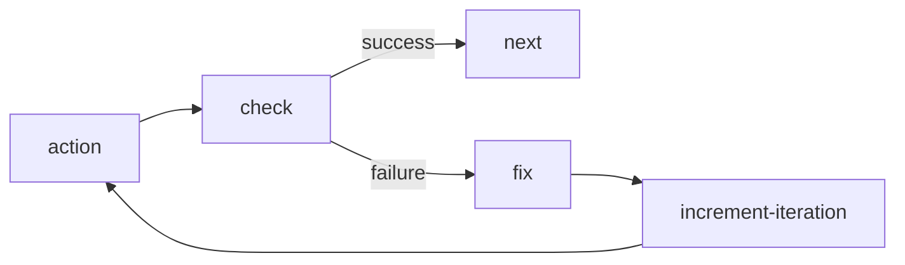
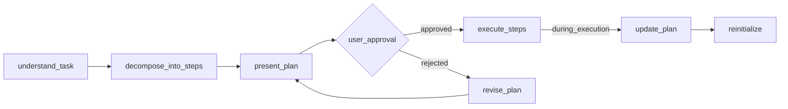
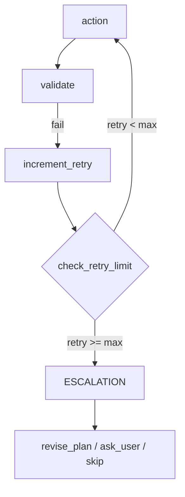
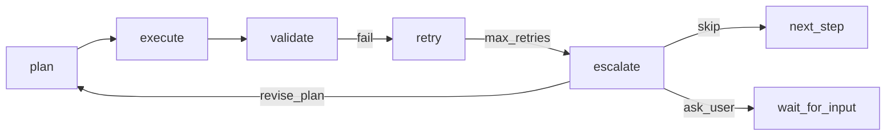

import { Aside, Steps, Tabs, TabItem } from "@astrojs/starlight/components";

This guide covers workflow creation from scratch, including common patterns, validation loops, and best practices.

## Quick Start

<Steps>
  1. Define the workflow goal and main stages 2. Design the node graph structure 3. Create JSON with
  proper node definitions 4. Validate connections and reachability 5. Save via MCP tools
</Steps>

## Workflow Structure

Every workflow needs:

```json
{
  "id": "my-workflow",
  "metadata": {
    "name": "Human Readable Name",
    "version": "1.0.0",
    "description": "What this workflow does"
  },
  "nodes": [
    // start node (exactly one)
    // action nodes
    // condition nodes (for branching)
    // end node (at least one)
  ]
}
```

## Common Patterns

### Validation Loop

Use when you need to verify results and retry on failure:



```json
{
  "id": "do-work",
  "type": "agent-directive",
  "directive": "Complete the task",
  "completionCondition": "Task completed",
  "inputSchema": {
    "type": "object",
    "properties": {
      "result_valid": { "type": "string", "enum": ["yes", "no"] }
    },
    "required": ["result_valid"]
  },
  "connections": { "success": "check-result" }
},
{
  "id": "check-result",
  "type": "condition",
  "condition": {
    "operator": "eq",
    "left": { "contextPath": "result_valid" },
    "right": "yes"
  },
  "connections": {
    "true": "next-step",
    "false": "fix-issues"
  }
},
{
  "id": "fix-issues",
  "type": "agent-directive",
  "directive": "Fix the issues found",
  "connections": { "success": "increment-iteration" }
},
{
  "id": "increment-iteration",
  "type": "agent-directive",
  "directive": "Increment iteration counter",
  "inputSchema": {
    "type": "object",
    "properties": {
      "iteration": { "type": "number" }
    },
    "required": ["iteration"]
  },
  "connections": { "success": "do-work" }
}
```

<Aside type="tip">
  Separate responsibilities: action nodes DO work, check nodes ONLY verify, fix nodes ONLY repair.
  Use iteration counters to prevent infinite loops.
</Aside>

### Branching by Action Type

Use when workflow has different paths for different scenarios:

```json
{
  "id": "get-action",
  "type": "agent-directive",
  "directive": "Ask user: create new or edit existing?",
  "inputSchema": {
    "properties": {
      "action": { "type": "string", "enum": ["create", "edit"] }
    },
    "required": ["action"]
  },
  "connections": { "success": "route-action" }
},
{
  "id": "route-action",
  "type": "condition",
  "condition": {
    "operator": "eq",
    "left": { "contextPath": "action" },
    "right": "create"
  },
  "connections": {
    "true": "create-branch",
    "false": "edit-branch"
  }
}
```

### User Approval Gate

Use for critical actions that need confirmation:

```json
{
  "id": "show-plan",
  "type": "agent-directive",
  "directive": "Present plan to user and ask for approval",
  "inputSchema": {
    "properties": {
      "approved": { "type": "string", "enum": ["yes", "no"] },
      "feedback": { "type": "string" }
    },
    "required": ["approved"]
  },
  "connections": { "success": "check-approval" }
},
{
  "id": "check-approval",
  "type": "condition",
  "condition": {
    "operator": "eq",
    "left": { "contextPath": "approved" },
    "right": "yes"
  },
  "connections": {
    "true": "proceed",
    "false": "revise-plan"
  }
}
```

## Input Schema Patterns

### Yes/No Response

```json
{
  "inputSchema": {
    "type": "object",
    "properties": {
      "result": { "type": "string", "enum": ["yes", "no"] },
      "details": { "type": "string" }
    },
    "required": ["result"]
  }
}
```

### Numeric Count

```json
{
  "inputSchema": {
    "type": "object",
    "properties": {
      "count": { "type": "number", "minimum": 0 },
      "total": { "type": "number", "minimum": 1 }
    },
    "required": ["count", "total"]
  }
}
```

### Array of Items

```json
{
  "inputSchema": {
    "type": "object",
    "properties": {
      "items": {
        "type": "array",
        "items": { "type": "string" },
        "minItems": 1
      }
    },
    "required": ["items"]
  }
}
```

### Enum Choice (Multiple Options)

```json
{
  "inputSchema": {
    "type": "object",
    "properties": {
      "action": {
        "type": "string",
        "enum": ["create", "edit", "delete", "cancel"]
      },
      "reason": { "type": "string" }
    },
    "required": ["action"]
  }
}
```

### File Path with Pattern

```json
{
  "inputSchema": {
    "type": "object",
    "properties": {
      "file_path": {
        "type": "string",
        "pattern": "^[a-zA-Z0-9/_.-]+\\.(json|yaml|yml)$"
      }
    },
    "required": ["file_path"]
  }
}
```

## Condition Operators

| Operator  | Description        | Example               |
| --------- | ------------------ | --------------------- |
| `eq`      | Equal              | `"right": "value"`    |
| `neq`     | Not equal          | `"right": "value"`    |
| `lt`      | Less than          | `"right": 10`         |
| `gt`      | Greater than       | `"right": 0`          |
| `lte`     | Less or equal      | `"right": 100`        |
| `gte`     | Greater or equal   | `"right": 1`          |
| `and`     | Logical AND        | `"conditions": [...]` |
| `or`      | Logical OR         | `"conditions": [...]` |
| `exists`  | Variable exists    | —                     |
| `isEmpty` | Array/string empty | —                     |

### Complex Condition Example

```json
{
  "condition": {
    "operator": "and",
    "conditions": [
      {
        "operator": "eq",
        "left": { "contextPath": "status" },
        "right": "ready"
      },
      {
        "operator": "gt",
        "left": { "contextPath": "count" },
        "right": 0
      }
    ]
  }
}
```

## Declaring Knowledge as Globals

Declare reusable knowledge as global variables in the workflow `variableRegistry` with a `default` value:

```json
{
  "variableRegistry": {
    "quality_rules": {
      "type": "string",
      "description": "Reusable quality rules the agent applies across steps",
      "default": "Rule 1: ... Rule 2: ..."
    },
    "validation_checklist": {
      "type": "string",
      "description": "Checklist the agent verifies before completing a step",
      "default": "Check 1: ... Check 2: ..."
    }
  }
}
```

Reference in directives:

```json
{
  "directive": "Follow these rules: {{quality_rules}}"
}
```

<Aside type="tip">
  This makes workflows self-documenting. All knowledge is embedded, no external docs needed.
</Aside>

## Validation Checklist

Before saving, verify:

1. **Structure**
   - Exactly one start node
   - At least one end node
   - All node IDs unique
   - All connections point to existing nodes

2. **Reachability**
   - All nodes reachable from start
   - No orphan nodes
   - All paths lead to end

3. **Node Definitions**
   - `directive` not empty
   - `completionCondition` defined
   - `connections.success` specified
   - `inputSchema` is valid JSON Schema

4. **Conditions**
   - `true` and `false` connections defined
   - Operator is valid

## Saving Workflows

<Tabs>
  <TabItem label="Create New">
    ```typescript
    mcp__moira__manage({
      action: "create",
      workflow: {
        id: "my-workflow",
        metadata: { name: "...", version: "1.0.0", description: "..." },
        nodes: [...]
      }
    })
    ```
  </TabItem>
  <TabItem label="Edit Existing">
    ```typescript
    mcp__moira__manage({
      action: "edit",
      workflowId: "my-workflow",
      changes: {
        metadata: { version: "1.1.0" },
        updateNodes: [
          { nodeId: "step-1", changes: { directive: "New text" } }
        ]
      }
    })
    ```
  </TabItem>
  <TabItem label="File Upload">
    ```typescript
    // For agents with file system access
    const { uploadUrl } = await mcp__moira__token({ action: "upload" });
    // Upload JSON file to uploadUrl
    ```
  </TabItem>
</Tabs>

## Agent Capabilities Detection

Different agents have different capabilities. Design workflows to detect and adapt:

### Capability Categories

| Capability  | Examples                  | Detection Method             |
| ----------- | ------------------------- | ---------------------------- |
| File System | Read, Write, Create files | Ask agent to confirm access  |
| Web Access  | Fetch URLs, Search        | Check if agent has web tools |
| MCP Only    | Moira tools only          | Default assumption           |

### Detection Pattern

```json
{
  "id": "detect-capabilities",
  "type": "agent-directive",
  "directive": "Report your capabilities: can you access the file system? can you fetch URLs?",
  "inputSchema": {
    "type": "object",
    "properties": {
      "has_file_access": { "type": "boolean" },
      "has_web_access": { "type": "boolean" }
    },
    "required": ["has_file_access", "has_web_access"]
  },
  "connections": { "success": "route-by-capabilities" }
}
```

### Conditional Branching

```json
{
  "id": "route-by-capabilities",
  "type": "condition",
  "condition": {
    "operator": "eq",
    "left": { "contextPath": "has_file_access" },
    "right": true
  },
  "connections": {
    "true": "file-based-flow",
    "false": "mcp-only-flow"
  }
}
```

<Aside type="tip">
  Always provide fallback paths for agents with limited capabilities. MCP tools are always
  available.
</Aside>

## Planning Pattern

Use when workflow needs to create and execute a plan with user approval and revision capability.

### The Problem

Workflows often need a planning phase, but:

- Plans are created once and never revised
- Requirements for plan quality are not formalized
- No ability to adapt the plan during execution
- Agent loses context in long sessions

### Pattern Structure



### Key Components

1. **variableRegistry.plan_writing_requirements** — rules for writing plans (agent sees when creating)
2. **decompose_into_steps** — directive with `{{plan_writing_requirements}}` for plan creation
3. **user_approval_branch** — approved → execute, rejected → revise_plan → present_plan
4. **update_during_execution** — ability to adapt plan during execution

### Plan Writing Requirements

The main problem: agent loses context (session archival, simple forgetting). Plans must be written so any step can be given to an agent WITHOUT the rest of the plan — and it can execute.

| Requirement           | Why Important                       | Example                                                        |
| --------------------- | ----------------------------------- | -------------------------------------------------------------- |
| Flat linear list      | Easier to track without hierarchy   | 1, 2, 3... not 1.1, 1.2, 1.2.1                                 |
| Self-sufficient steps | Any step executable without context | "Step 3: Create file X.ts with function Y" not "Continue work" |
| Explicit actions      | Not "as usual", but specifically    | "Make commit" in every step where needed                       |
| Measurable result     | Easy to verify completion           | "expected_output: file X.ts created and contains function Y"   |
| Independence          | Minimal dependencies between steps  | Step 4 shouldn't require knowledge of step 2 details           |
| Full file paths       | Agent shouldn't guess               | `/full/path/to/file.json`, not "in appropriate folder"         |
| Redundancy allowed    | Better repeat than forget           | Repeat "make commit" in each step if needed                    |

### Item Atomicity (S9)

Each plan or task item must be self-contained. An agent often receives ONE item's directive in isolation — without the rest of the plan — so the item must carry everything needed to execute it:

- Restate the nuances the item depends on.
- Repeat the relevant original requirement inside the item.
- Duplicate cross-cutting actions (progress report, run tests, commit) into EVERY item that needs them.

There is no shared or global scope across items. Redundancy is required, not a smell: repeating a cross-cutting action in every item is correct, because the agent cannot rely on having seen it in another item.

```json
{
  "id": "execute-plan-item",
  "type": "agent-directive",
  "directive": "Execute one plan item.\n\nThe item text is self-contained: it states the original requirement, the files to read/modify with full paths, and the cross-cutting actions (run tests, make commit) that apply to THIS item.\n\nDo NOT assume any context from other items.",
  "completionCondition": "Item executed, tests run, and commit made as stated in the item",
  "connections": { "success": "next-item" }
}
```

<Aside type="tip">
  Two related patterns build on this guide: the [Replan Pattern](/docs/patterns/replan/) revises a
  multi-step plan mid-execution, and the [Completeness Self-Review
  Pattern](/docs/patterns/self-review/) verifies every requirement against the real artifact before
  delivery.
</Aside>

### Implementation Example

```json
{
  "variableRegistry": {
    "plan_writing_requirements": {
      "type": "string",
      "description": "Rules the agent follows when writing the plan",
      "default": "PLAN WRITING REQUIREMENTS:\n\n- Flat linear list — no hierarchy, no nested sub-items, just 1, 2, 3...\n- One item = one task — not micro-step ('download file'), but complete task ('update workflow to v2.1.0')\n- Full self-sufficiency — contains EVERYTHING for execution: why do it, what to do, which files to read/modify, where to save, what to commit\n- NO separate 'global rules' — everything needed for item must be IN the item\n- Explicit actions — not 'as usual', but specifically: 'upload to moira-local via token', 'make commit'\n- Redundancy allowed — better repeat 'make commit' in each item than forget\n- Full file paths — not 'in appropriate folder', but /full/path/to/file.json\n- Measurable result — easy to verify item completion"
    }
  },
  "nodes": [
    {
      "type": "start",
      "id": "start",
      "connections": { "default": "analyze-task" }
    },
    {
      "id": "decompose-into-steps",
      "type": "agent-directive",
      "directive": "Create a plan for task execution.\n\nFollow requirements: {{plan_writing_requirements}}\n\nFor each step provide:\n- What to do (action)\n- Expected output (measurable result)",
      "inputSchema": {
        "type": "object",
        "properties": {
          "steps": {
            "type": "array",
            "items": {
              "type": "object",
              "properties": {
                "action": { "type": "string" },
                "expected_output": { "type": "string" }
              },
              "required": ["action", "expected_output"]
            }
          }
        },
        "required": ["steps"]
      },
      "connections": { "success": "present-plan" }
    },
    {
      "id": "present-plan",
      "type": "agent-directive",
      "directive": "Show plan to user.\n\n⚠️ MANDATORY: WAIT FOR USER RESPONSE\n- Ask: 'Approve plan? (yes/no)'\n- STOP and wait for user to type response",
      "inputSchema": {
        "type": "object",
        "properties": {
          "plan_approved": { "type": "string", "enum": ["yes", "no"] },
          "user_feedback": { "type": "string" }
        },
        "required": ["plan_approved"]
      },
      "connections": { "success": "check-plan-approval" }
    },
    {
      "id": "check-plan-approval",
      "type": "condition",
      "condition": {
        "operator": "eq",
        "left": { "contextPath": "plan_approved" },
        "right": "yes"
      },
      "connections": {
        "true": "execute-steps",
        "false": "revise-plan"
      }
    },
    {
      "id": "revise-plan",
      "type": "agent-directive",
      "directive": "User didn't approve plan. Feedback: {{user_feedback}}\n\nRevise plan based on feedback.\nFollow: {{plan_writing_requirements}}",
      "connections": { "success": "present-plan" }
    }
  ]
}
```

### Update Plan During Execution

For long workflows, add ability to update plan mid-execution:

```json
{
  "id": "update-plan-during-execution",
  "type": "agent-directive",
  "directive": "Update plan during execution.\n\nCurrent step: {{current_step_index}}\nReason for update: {{update_reason}}\n\n1. Analyze current progress\n2. Update remaining steps (don't change completed ones)\n3. Save history to ./plan-changes-history.md\n\nFollow: {{plan_writing_requirements}}",
  "connections": { "success": "reinitialize-tracking" }
},
{
  "id": "reinitialize-tracking",
  "type": "agent-directive",
  "directive": "Reinitialize tracking after plan update.\n\n1. Update tracking.json with new total_steps\n2. Adjust current_step_index if needed\n3. Continue execution",
  "connections": { "success": "execute-current-step" }
}
```

<Aside type="tip">
  Store plan in a file (e.g., `./plan.md`) instead of context for large plans. This prevents context
  overflow and enables recovery after session archival.
</Aside>

## Escalation Pattern

Use when workflow has validation loops that can get stuck. Provides escape mechanism after repeated failures.

### The Problem

When agent is stuck in a validation loop:

- Retries forever without progress
- Same errors repeat
- No way to break out
- User waits indefinitely

### Pattern Structure



### When to Apply

- Workflows with planning (robust-task, development)
- Workflows with result validation (workflow-management, test-generation)
- Any "do → check → retry" cycles

### Escalation Options

| Option        | When to Use            | Example                            |
| ------------- | ---------------------- | ---------------------------------- |
| `revise_plan` | Current plan is flawed | Tests fail because design is wrong |
| `ask_user`    | Need human decision    | Unclear requirements               |
| `skip`        | Step is non-critical   | Optional enhancement               |

### Implementation Example

```json
{
  "id": "increment-retry",
  "type": "agent-directive",
  "directive": "Increment retry counter. Current: {{step_retry}}",
  "inputSchema": {
    "type": "object",
    "properties": {
      "step_retry": { "type": "number", "minimum": 1 }
    },
    "required": ["step_retry"]
  },
  "connections": { "success": "check-retry-limit" }
},
{
  "id": "check-retry-limit",
  "type": "condition",
  "condition": {
    "operator": "gte",
    "left": { "contextPath": "step_retry" },
    "right": 3
  },
  "connections": {
    "true": "notify-escalation",
    "false": "retry-action"
  }
},
{
  "id": "notify-escalation",
  "type": "telegram-notification",
  "message": "⚠️ *Escalation Required*\n\nStep failed after {{step_retry}} attempts.\n\nOptions:\n- revise_plan\n- ask_user\n- skip",
  "parseMode": "Markdown",
  "connections": { "default": "ask-escalation-decision", "error": "ask-escalation-decision" }
},
{
  "id": "ask-escalation-decision",
  "type": "agent-directive",
  "directive": "Step failed after {{step_retry}} attempts.\n\nAsk user for decision:\n1. **revise_plan** — go back to planning and reconsider approach\n2. **ask_user** — request human help with specific problem\n3. **skip** — skip this step and continue\n\n⚠️ WAIT FOR USER RESPONSE",
  "inputSchema": {
    "type": "object",
    "properties": {
      "escalation_decision": {
        "type": "string",
        "enum": ["revise_plan", "ask_user", "skip"]
      },
      "user_input": { "type": "string" }
    },
    "required": ["escalation_decision"]
  },
  "connections": { "success": "route-escalation" }
},
{
  "id": "route-escalation",
  "type": "condition",
  "condition": {
    "operator": "eq",
    "left": { "contextPath": "escalation_decision" },
    "right": "revise_plan"
  },
  "connections": {
    "true": "revise-plan",
    "false": "route-escalation-skip"
  }
},
{
  "id": "route-escalation-skip",
  "type": "condition",
  "condition": {
    "operator": "eq",
    "left": { "contextPath": "escalation_decision" },
    "right": "skip"
  },
  "connections": {
    "true": "mark-step-skipped",
    "false": "handle-user-help"
  }
}
```

### Combining with Planning Pattern

When using both Planning and Escalation patterns:



The `revise_plan` option loops back to the Planning phase, allowing the agent to reconsider the approach based on what it learned from failures.

<Aside type="tip">
  Set `max_retries` based on task complexity. Simple tasks: 2-3 retries. Complex tasks: 3-5 retries.
  Always provide `skip` option for non-critical steps.
</Aside>

## Production Patterns

Real patterns from production workflows (development-flow, 104 nodes).

### Express/Full Mode Branching

Route to simplified or full flow based on task complexity:

```
[get-requirements] → [check-mode] → express=true → [express-flow]
                                  → express=false → [full-flow]
```

```json
{
  "id": "check-development-mode",
  "type": "condition",
  "condition": {
    "operator": "eq",
    "left": { "contextPath": "development_mode" },
    "right": "express"
  },
  "connections": {
    "true": "express-implementation",
    "false": "analyze-and-plan"
  }
}
```

### Plan Refinement Loop

Present plan → get feedback → refine → confirm:

```
[present-plan] → [check-approval] → approved → [continue]
                                  → rejected → [refine] → [confirm] → [continue]
```

### Numeric Validation Pattern (Recommended)

<Aside type="caution">
  **Problem with boolean validation:** Agents tend to be optimistic. When asked "Is result valid?
  yes/no", they may answer "yes" even when issues were found. This defeats the purpose of validation
  loops.
</Aside>

**Solution:** Use numeric issue count instead of boolean. The engine mechanically checks if count equals zero — no room for interpretation.

```json
{
  "id": "validate-result",
  "type": "agent-directive",
  "directive": "ONLY CHECK the result. Count any issues found.",
  "inputSchema": {
    "type": "object",
    "properties": {
      "issues_count": {
        "type": "number",
        "minimum": 0,
        "description": "Number of issues found (0 = valid)"
      },
      "issues": {
        "type": "array",
        "items": { "type": "string" },
        "description": "List of issues if any"
      }
    },
    "required": ["issues_count"]
  },
  "connections": { "success": "route-validation" }
},
{
  "id": "route-validation",
  "type": "condition",
  "condition": {
    "operator": "eq",
    "left": { "contextPath": "issues_count" },
    "right": 0
  },
  "connections": {
    "true": "next-step",
    "false": "fix-issues"
  }
}
```

**Why this works:**

- Agent cannot lie about a count (number is objective)
- Condition `issues_count == 0` is checked mechanically by engine
- No room for "almost ready" or "minor issues" interpretation

**When to use:** ALL validation loops should use this pattern. Replace existing `is_valid: enum["yes","no"]` with `issues_count: number`.

### Numeric Validation with Test Counts

Validate using numeric checks instead of yes/no:

```json
{
  "id": "run-tests",
  "type": "agent-directive",
  "directive": "Run tests and report results",
  "inputSchema": {
    "type": "object",
    "properties": {
      "tests_passed": { "type": "number" },
      "tests_failed": { "type": "number" }
    },
    "required": ["tests_passed", "tests_failed"]
  },
  "connections": { "success": "check-tests" }
},
{
  "id": "check-tests",
  "type": "condition",
  "condition": {
    "operator": "eq",
    "left": { "contextPath": "tests_failed" },
    "right": 0
  },
  "connections": {
    "true": "continue",
    "false": "fix-tests"
  }
}
```

### Telegram Notifications

Notifications keep users informed during long-running workflows. Use them strategically - too many notifications become noise.

#### When to Use Notifications

| Scenario                    | Why Notify                              |
| --------------------------- | --------------------------------------- |
| **Step start** (long tasks) | User sees progress, can plan their time |
| **User input required**     | User knows to check and respond         |
| **Critical errors**         | Immediate awareness of blockers         |
| **Task completion**         | User can review results                 |

#### When NOT to Use

- Short workflows (< 5 minutes total)
- Between every small step
- For internal validation loops
- When error is auto-recoverable

#### Pattern: Step Start Notification

For multi-step tasks, notify at each major stage:

```json
{
  "id": "notify-step-start",
  "type": "telegram-notification",
  "message": "🚀 *Step {{current_step}}/{{total_steps}}*\n\n{{current_step_description}}",
  "parseMode": "Markdown",
  "connections": {
    "default": "execute-step",
    "error": "execute-step"
  }
}
```

#### Pattern: User Input Required

Alert when workflow is blocked waiting for user:

```json
{
  "id": "notify-approval-needed",
  "type": "telegram-notification",
  "message": "⏳ *Awaiting your approval*\n\nPlan ready for review. Please confirm to proceed.",
  "parseMode": "Markdown",
  "connections": {
    "default": "present-plan-to-user",
    "error": "present-plan-to-user"
  }
}
```

#### Pattern: Escalation Alert

When automatic retries fail and human decision needed:

```json
{
  "id": "notify-escalation",
  "type": "telegram-notification",
  "message": "⚠️ *Action Required*\n\nStep {{current_step}} failed after {{max_retries}} attempts.\n\nOptions:\n- Skip this step\n- Handle manually",
  "parseMode": "Markdown",
  "connections": {
    "default": "ask-user-decision",
    "error": "ask-user-decision"
  }
}
```

#### Pattern: Completion Summary

Notify when task finishes:

```json
{
  "id": "notify-completion",
  "type": "telegram-notification",
  "message": "✅ *Task Complete*\n\n{{task_name}}\n\nDeliverable: {{deliverable_summary}}",
  "parseMode": "Markdown",
  "connections": {
    "default": "end",
    "error": "end"
  }
}
```

<Aside type="tip">
  Always set `connections.error` → same as `default` for graceful degradation when Telegram fails.
</Aside>

<Aside type="note">
  For very long tasks (hours), consider periodic "still working" heartbeat notifications so user
  knows the process is alive.
</Aside>

## File Persistence Patterns

For agents with file system access, use files to:

- Offload large data from workflow context
- Track execution progress across iterations
- Enable recovery after interruptions
- Create audit trail

<Aside type="note">
  These patterns only work for agents with file access. Design fallback paths for MCP-only agents.
</Aside>

### Directory Structure

Use templates for organized file storage:

```
./{{task_name}}/
├── process-id.txt              # Workflow execution ID
├── plan.md                     # Current plan
├── step-{{step_index}}/
│   ├── iteration-{{iteration}}/
│   │   ├── result.md           # Step result
│   │   └── artifacts/          # Generated files
│   └── summary.md              # Step summary
└── final-report.md             # Completion report
```

### Progress Tracking

Save process ID for recovery:

```json
{
  "id": "save-process-id",
  "type": "agent-directive",
  "directive": "Save process ID to ./{{task_name}}/process-id.txt for recovery",
  "completionCondition": "File created with process ID",
  "connections": { "success": "next-step" }
}
```

### Iteration Snapshots

Store iteration results in files instead of context:

```json
{
  "id": "save-iteration-result",
  "type": "agent-directive",
  "directive": "Save iteration {{current_iteration}} result to ./{{task_name}}/step-{{step_index}}/iteration-{{current_iteration}}/result.md",
  "completionCondition": "Result saved to file",
  "inputSchema": {
    "type": "object",
    "properties": {
      "file_path": { "type": "string" }
    },
    "required": ["file_path"]
  },
  "connections": { "success": "next-iteration" }
}
```

### Context Offloading

Reference files instead of storing large data in context:

```json
{
  "id": "analyze-with-file-reference",
  "type": "agent-directive",
  "directive": "Read analysis from {{analysis_file_path}} and continue processing",
  "completionCondition": "Analysis loaded and processed"
}
```

### When to Use File Persistence

| Use Case            | File Approach                | Context Approach     |
| ------------------- | ---------------------------- | -------------------- |
| Large code analysis | Save to file, reference path | Not recommended      |
| Iteration history   | Save each iteration to file  | Only keep current    |
| Recovery data       | process-id.txt required      | Lost on interruption |
| Audit trail         | Append to log file           | Not available        |
| Small status flags  | Either works                 | Simpler              |

<Aside type="tip">
  Detect agent capabilities first (see Agent Capabilities Detection) and provide both file-based and
  context-only paths.
</Aside>

## User Input Problem

When a workflow requires user confirmation, the agent may "optimize" by filling inputSchema fields without actually asking the user.

### The Problem

```json
{
  "id": "approve-plan",
  "directive": "Show plan to user. Ask: 'Do you approve? (yes/no)'",
  "inputSchema": {
    "properties": {
      "approved": { "type": "string", "enum": ["yes", "no"] }
    }
  }
}
```

**What happens:** Agent shows the plan, then immediately fills `approved: "yes"` without waiting for user response.

**Why:** The agent sees it can fill the field and "optimizes" by not stopping to wait.

### Solution: Explicit Wait Instructions

Add explicit instructions that FORCE the agent to wait:

```json
{
  "id": "approve-plan",
  "directive": "Show plan to user.\n\n⚠️ MANDATORY: WAIT FOR USER RESPONSE\n- Ask: 'Do you approve? (yes/no)'\n- STOP and wait for user to type response\n- DO NOT fill 'approved' field until user explicitly says yes or no\n- Showing information ≠ getting confirmation",
  "completionCondition": "User explicitly responded yes or no (not assumed)",
  "inputSchema": {
    "properties": {
      "approved": { "type": "string", "enum": ["yes", "no"] },
      "user_response_text": {
        "type": "string",
        "description": "Exact text of user's response"
      }
    },
    "required": ["approved", "user_response_text"]
  }
}
```

### Key Techniques

1. **Add "WAIT FOR USER RESPONSE"** — explicit instruction to stop
2. **Require user_response_text** — forces agent to capture actual user input
3. **State what NOT to do** — "DO NOT fill field until..."
4. **Clarify the difference** — "Showing ≠ getting confirmation"

### Split into Two Nodes (Alternative)

For critical approvals, split into separate nodes:

```
[show-information] → [get-user-confirmation] → [route-decision]
```

First node only displays, second only captures response:

```json
{
  "id": "show-plan",
  "directive": "Display the plan to user. Explain each step.",
  "inputSchema": {
    "properties": {
      "plan_shown": { "type": "string", "enum": ["yes"] }
    }
  },
  "connections": { "success": "get-plan-approval" }
},
{
  "id": "get-plan-approval",
  "directive": "User sees the plan above. Ask: 'Do you approve this plan? (yes/no)'\n\nWAIT for user response. DO NOT proceed until user types yes or no.",
  "inputSchema": {
    "properties": {
      "approved": { "type": "string", "enum": ["yes", "no"] }
    }
  },
  "connections": { "success": "route-approval" }
}
```

<Aside type="caution">
  This is a known limitation of agent-executed workflows. Always test user input nodes manually
  before deploying.
</Aside>

## Best Practices

1. **One node = one responsibility** — don't mix checking and fixing
2. **Clear directives** — start with verb: Create, Check, Fix
3. **Explicit negations** — "DO NOT fix, ONLY check"
4. **Use inputSchema** — always define expected response structure
5. **Numeric validation** — use counts instead of yes/no for precise checks
6. **Iteration counters** — prevent infinite loops
7. **User approval gates** — for critical actions
8. **Self-documenting** — declare knowledge as variableRegistry defaults
9. **Graceful notifications** — Telegram errors shouldn't block workflow

## Related

- [Nodes](/docs/concepts/nodes/) — Node types reference
- [Templates](/docs/concepts/templates/) — Dynamic content
- [Tools](/docs/reference/tools/) — MCP tools reference
- [Replan Pattern](/docs/patterns/replan/) — Revise a multi-step plan mid-execution
- [Completeness Self-Review](/docs/patterns/self-review/) — Verify every requirement before delivery
