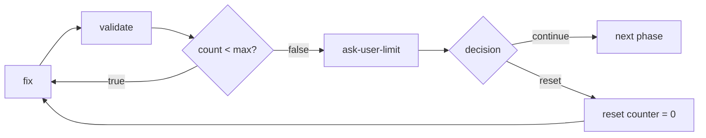

import { Aside } from "@astrojs/starlight/components";

## Purpose

When automated retries fail, escalate to user for manual intervention. Prevents infinite loops and allows human judgment for complex failures.

## Bounded-Loop Limit Escalation

When a bounded loop (a [validation loop](/docs/patterns/validation-loop/) or fix/retry cycle) reaches its iteration limit, the limit branch routes to an ask-user node. It never silently skips to the next phase — that hides unresolved issues from the user.

The ask-user node offers two decisions:

- **continue** — accept the current result and proceed despite remaining issues
- **reset** — zero the counter via an expression node and loop back to the fix step



The decision is captured with a two-option enum:

```json
{
  "type": "agent-directive",
  "id": "ask-user-limit",
  "directive": "Validation reached its limit of {{max_validation_rounds}} rounds with {{issues_count}} issues remaining.\n\nAsk the user how to proceed:\n- continue: accept the current result and move on\n- reset: keep fixing (the round counter resets to 0)",
  "completionCondition": "User chose continue or reset",
  "inputSchema": {
    "type": "object",
    "properties": {
      "decision": { "type": "string", "enum": ["continue", "reset"] }
    },
    "required": ["decision"]
  },
  "connections": { "success": "route-limit-decision" }
}
```

Route the decision: `continue` proceeds to the next phase, `reset` runs the counter-reset expression node and loops back.

```json
{
  "type": "condition",
  "id": "route-limit-decision",
  "condition": {
    "operator": "eq",
    "left": { "contextPath": "decision" },
    "right": "reset"
  },
  "connections": {
    "true": "reset-validation-counter",
    "false": "next-phase"
  }
}
```

```json
{
  "type": "expression",
  "id": "reset-validation-counter",
  "expressions": ["validation_round = 0"],
  "connections": { "default": "fix-step" }
}
```

<Aside type="caution">
  Routing the limit branch straight to the next phase is the silent-skip anti-pattern. Always route
  it through an ask-user node so the user keeps control over unresolved issues.
</Aside>

## Structure

```
[action] → [verify] → failure → [check-retries] → retries<max → [retry]
                                               → retries>=max → [escalate-to-user]
```

## Implementation

### Retry Limit Check

```json
{
  "type": "condition",
  "id": "check-retry-limit",
  "condition": {
    "operator": "lt",
    "left": { "contextPath": "current_iteration" },
    "right": 3
  },
  "connections": {
    "true": "fix-and-retry",
    "false": "escalate-to-user"
  }
}
```

### Escalation Node

```json
{
  "type": "agent-directive",
  "id": "escalate-to-user",
  "directive": "Automated resolution failed after {{current_iteration}} attempts.\n\nProblem: {{last_error}}\nAttempted fixes: {{attempted_fixes}}\n\nAsk user how to proceed:\n- Continue with current result as-is?\n- Reset counter and try fixing again?\n- Provide manual fix instructions?\n- Skip this step?\n- Abort workflow?",
  "inputSchema": {
    "type": "object",
    "properties": {
      "user_decision": { "type": "string", "enum": ["continue", "reset", "fix", "skip", "abort"] },
      "user_instructions": { "type": "string" }
    },
    "required": ["user_decision"]
  },
  "connections": { "success": "route-user-decision" }
}
```

<Aside type="tip">
  Always provide context to the user: what failed, how many attempts, what was tried. This helps
  them make informed decisions.
</Aside>

### Route User Decision

```json
{
  "type": "condition",
  "id": "check-reset",
  "condition": {
    "operator": "eq",
    "left": { "contextPath": "user_decision" },
    "right": "reset"
  },
  "connections": {
    "true": "reset-counter",
    "false": "check-continue"
  }
}
```

```json
{
  "type": "expression",
  "id": "reset-counter",
  "expressions": ["current_iteration = 0"],
  "connections": { "default": "fix-and-retry" }
}
```

```json
{
  "type": "condition",
  "id": "check-continue",
  "condition": {
    "operator": "eq",
    "left": { "contextPath": "user_decision" },
    "right": "continue"
  },
  "connections": {
    "true": "proceed-to-next",
    "false": "check-abort"
  }
}
```

```json
{
  "type": "condition",
  "id": "check-abort",
  "condition": {
    "operator": "eq",
    "left": { "contextPath": "user_decision" },
    "right": "abort"
  },
  "connections": {
    "true": "workflow-aborted",
    "false": "check-skip"
  }
}
```

```json
{
  "type": "condition",
  "id": "check-skip",
  "condition": {
    "operator": "eq",
    "left": { "contextPath": "user_decision" },
    "right": "skip"
  },
  "connections": {
    "true": "proceed-to-next",
    "false": "apply-user-fix"
  }
}
```

## Collecting Error Context

Track errors during retries:

```json
{
  "id": "handle-error",
  "directive": "Record error details for escalation context.\n\nCurrent iteration: {{current_iteration}}\nError encountered: [describe error]",
  "inputSchema": {
    "properties": {
      "last_error": { "type": "string" },
      "attempted_fix": { "type": "string" }
    },
    "required": ["last_error"]
  }
}
```

## Graceful Abort

```json
{
  "type": "agent-directive",
  "id": "workflow-aborted",
  "directive": "User chose to abort workflow.\n\nCleanup tasks:\n- Save partial progress\n- Document what was completed\n- Note why abort was necessary",
  "inputSchema": {
    "properties": {
      "cleanup_completed": { "type": "boolean" },
      "progress_summary": { "type": "string" }
    },
    "required": ["cleanup_completed"]
  },
  "connections": { "success": "end-aborted" }
}
```

## Escalation Levels

For complex workflows, consider multiple escalation levels:

1. **Auto-retry**: First 3 attempts
2. **Agent analysis**: Deeper investigation
3. **User notification**: Inform but continue
4. **User intervention**: Require decision
5. **Full abort**: Stop workflow

## Real Example

From `development-flow.json`:

```json
{
  "id": "collect-user-feedback",
  "directive": "Verification failed {{current_iteration}} times.\n\nAsk user:\n- Provide guidance for resolution?\n- Skip this step?\n- Modify the plan?\n\nSummarize the problem and what has been attempted.",
  "inputSchema": {
    "properties": {
      "user_guidance": { "type": "string" },
      "decision": { "type": "string", "enum": ["continue", "skip", "modify"] }
    },
    "required": ["decision"]
  }
}
```

## Related Patterns

- [Validation Loop](/docs/patterns/validation-loop/) - Automatic retry before escalation
- [Step Verification](/docs/patterns/step-verification/) - What triggers escalation
