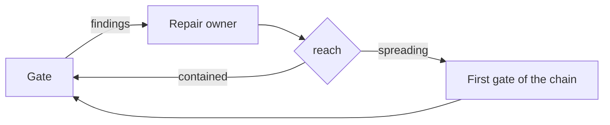

import { Aside } from "@astrojs/starlight/components";

A workflow with several validation gates normally sends every repair back to the earliest gate whose
evidence could have gone stale. That is right when the fix changed behaviour and absurd when it
corrected a sentence in a test name. Paying the full chain for a one-line correction is not only
slow: it teaches the run to batch findings until a round feels worth the chain, and it tempts the
author to delete gates that were earning their cost.

This pattern gives the run a way to establish which gates actually went stale — one answer from the
agent that made the correction, and one condition that reads it.

## Structure



## 1. The repair owner states the reach after the repair

The value is a node-local property — declared in the node's `inputSchema` but not in `globalInputs`,
so it is read as `node-id.field` and cannot outlive the transition that routes on it. A registry
global would be wrong here: one shared name would keep the last answer written to it, and the
condition after another gate's repair could route on a value that repair never produced.

```json
{
  "id": "repair-test-adequacy",
  "type": "agent-directive",
  "directive": "Reproduce every confirmed gap and repair it at the root …\n\nAfter the repair, state its reach as repair_reach: a description of what you actually changed, never of how important the finding was. It is `contained` when the change stayed in the tests, fixtures and coverage artifacts this gate judges, left production behaviour untouched, and the project's own deterministic checks over what you changed have been run and pass. It is `spreading` when it reached production code, contracts, schemas, configuration, dependencies or generated output, or when those checks could not be run or did not pass.",
  "completionCondition": "Repository content changed to repair all reproduced test-adequacy defects",
  "inputSchema": {
    "type": "object",
    "properties": {
      "repair_reach": {
        "type": "string",
        "enum": ["contained", "spreading"],
        "description": "Where the correction actually landed"
      }
    },
    "required": ["current_iteration", "repair_reach"],
    "globalInputs": ["current_iteration"]
  },
  "connections": { "success": "route-test-adequacy-reach" }
}
```

The value is required and its enum has exactly two members, so every response the schema accepts
picks a route deliberately.

## 2. A condition routes on it

```json
{
  "id": "route-test-adequacy-reach",
  "type": "condition",
  "condition": {
    "operator": "eq",
    "left": { "contextPath": "repair-test-adequacy.repair_reach" },
    "right": "contained"
  },
  "connections": {
    "true": "review-test-adequacy",
    "false": "validate-cheap"
  }
}
```

Write the condition so the full chain is the branch anything other than `contained` takes. The
conservative direction is then the default direction.

## What keeps the short route honest

**Reach describes what changed, not how much the finding mattered.** A severity tier invites an
argument about importance; a reach answer can be checked against the diff that was just made.

**The agent that made the correction states it, after making it.** Before the repair nobody knows
what the fix will touch — least of all a reviewer, which in the delegated case never sees the repair
at all, and which would otherwise be deciding how much re-validation its own findings deserve. That
is the one judgement a reviewer's independence does not extend to.

**The deterministic checks stand in for the skipped chain.** `contained` requires that the project's
own lint, type and targeted-test checks over what changed have been run and passed. Without that half
the short route is simply skipped validation.

**A repair that outgrew its label takes the long route.** The answer describes the change that
happened, not the intention it started with.

<Aside type="caution">
  The short route is not an exemption from the gate. It returns to the gate that raised the finding,
  and that gate confirms closure before the run moves on.
</Aside>

## Where the delegated review fits

When the gate that raised the finding is a delegated review, `contained` returns to that reviewer
rather than walking the chain in front of it. This does not spend an extra delegation: the spreading
route ends at the same reviewer anyway, so the shortcut removes the chain, not the review.

## Related

- [Validation Loop](/docs/patterns/validation-loop/) - the ordinary loop this pattern refines
- [Subagent Review](/docs/patterns/subagent-review/) - the delegated gate a contained repair returns to
- [Minimal Graph](/docs/patterns/minimal-graph/) - what earns a branch of its own
- [Anti-Patterns](/docs/patterns/anti-patterns/) - severity tiers, counters, and state without a consumer
