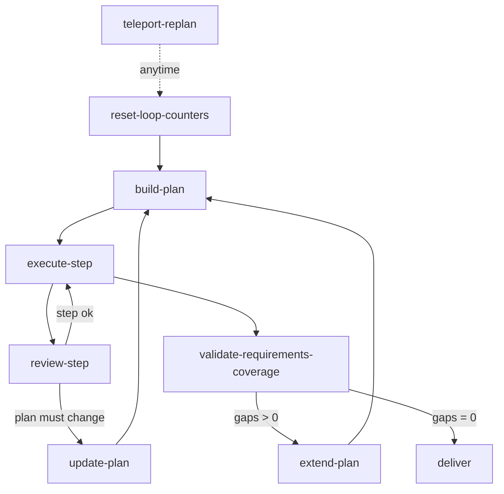

import { Aside } from "@astrojs/starlight/components";

A workflow that builds a multi-step plan and then executes its items needs a way to change that plan after execution has started. Three mechanisms cover the cases: jump back at any time, branch to a plan update when a step review reveals the plan itself is wrong, and extend the plan when a final coverage check finds gaps.

## Three Ways to Revise a Plan



## Variable Registry

Declare the loop counters and the dispatcher with numeric or string defaults:

```json
{
  "variableRegistry": {
    "validation_round": {
      "type": "number",
      "description": "Re-validation pass counter",
      "default": 0
    },
    "max_validation_rounds": {
      "type": "number",
      "description": "Re-validation bound",
      "default": 5
    },
    "requirements_gaps_count": {
      "type": "number",
      "description": "Unmet requirements at coverage check",
      "default": 0
    },
    "plan_change_target": {
      "type": "string",
      "description": "Dispatcher: refine | extend | update",
      "default": ""
    }
  }
}
```

## 1. Teleport (Anytime)

A `teleport` node is reachable at any point in execution via `step({ processId, teleportTo: "teleport-replan" })`. It has NO incoming connections — it is excluded from unreachable-node warnings and cannot be reached through normal routing.

```json
{
  "type": "teleport",
  "id": "teleport-replan",
  "hint": "Use when the whole plan needs restructuring, not just the current step",
  "directive": "Capture why the plan must change, then a new plan will be built.\n\nReason for replanning: state what changed and what the plan must now cover.",
  "completionCondition": "Reason for replanning captured",
  "inputSchema": {
    "type": "object",
    "properties": {
      "replan_reason": { "type": "string" }
    },
    "required": ["replan_reason"]
  },
  "connections": { "success": "reset-loop-counters" }
}
```

The teleport's outbound chain resets the loop counters before jumping to the plan-build node, so the new plan starts its validation loops fresh:

```json
{
  "type": "expression",
  "id": "reset-loop-counters",
  "expressions": ["validation_round = 0", "requirements_gaps_count = 0"],
  "connections": { "default": "build-plan" }
}
```

<Aside type="caution">
  Do NOT provide `input` when teleporting. The teleport node presents its own directive once the
  jump lands. Execution context (all variables) is preserved across the jump.
</Aside>

## 2. Step-Validation Replan

When a per-step review concludes the PLAN — not just the current step — must change, route to a plan-update branch instead of retrying the step. The review node writes a global flagging the scope of the problem:

```json
{
  "type": "agent-directive",
  "id": "review-step",
  "directive": "Review the completed step. Decide whether the failure is local to this step or means the plan itself is wrong.\n\nIf the plan structure must change, set plan_change_target to \"update\".",
  "completionCondition": "Step reviewed and scope of any problem classified",
  "inputSchema": {
    "type": "object",
    "globalInputs": ["plan_change_target"],
    "properties": {
      "step_ok": { "type": "string", "enum": ["yes", "no"] }
    },
    "required": ["plan_change_target", "step_ok"]
  },
  "connections": { "success": "route-plan-change" }
}
```

```json
{
  "type": "condition",
  "id": "route-plan-change",
  "condition": {
    "operator": "eq",
    "left": { "contextPath": "plan_change_target" },
    "right": "update"
  },
  "connections": {
    "true": "update-plan",
    "false": "execute-step"
  }
}
```

The `update-plan` node revises the plan and routes back to `build-plan` (or directly to the next item) once the structure is corrected.

## 3. Post-Final Extension

Before final delivery, a coverage check counts requirements not yet satisfied. Gaps route to an extend/fix branch; zero gaps route to delivery.

```json
{
  "type": "agent-directive",
  "id": "validate-requirements-coverage",
  "directive": "Compare the produced work against every original requirement. Count the requirements with no concrete evidence of completion.",
  "completionCondition": "Every requirement checked against the artifact and gap count reported",
  "inputSchema": {
    "type": "object",
    "globalInputs": ["requirements_gaps_count"],
    "properties": {
      "coverage_notes": { "type": "string" }
    },
    "required": ["requirements_gaps_count"]
  },
  "connections": { "success": "check-requirements-gaps" }
}
```

```json
{
  "type": "condition",
  "id": "check-requirements-gaps",
  "condition": {
    "operator": "eq",
    "left": { "contextPath": "requirements_gaps_count" },
    "right": 0
  },
  "connections": {
    "true": "deliver",
    "false": "extend-plan"
  }
}
```

`extend-plan` adds items for the missing requirements and routes back to `build-plan`, re-entering execution until coverage reaches zero gaps.

## Dispatcher Variable

A single `plan_change_target` global can select between the three revisions when they share one update node. The value (`refine`, `extend`, or `update`) is written by the node that detected the need, and a condition node routes on it. Default `""` means no revision pending.

## Related

- [Validation Loop](/docs/patterns/validation-loop/) - Bounded re-validation around a single node
- [Completeness Self-Review](/docs/patterns/self-review/) - The coverage check before delivery
- [Escalation](/docs/patterns/escalation/) - Routing a loop bound to the user
- [Workflow Creation](/docs/guides/workflow-creation/) - Plan-item atomicity rules
