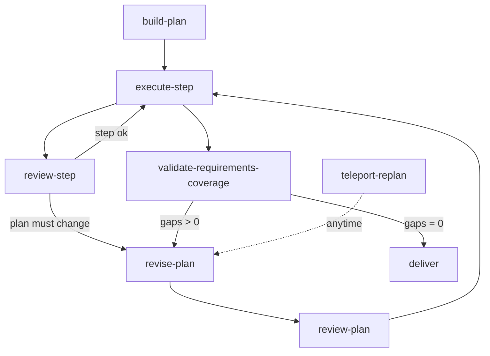

import { Aside } from "@astrojs/starlight/components";

A workflow that builds a multi-step plan and then executes its items needs a way to change that plan
after execution has started. This is the plan-shaped case of
[Process Revision](/docs/patterns/process-revision/): the same three parts — a jump entry, a revision
owner, a re-entry into the normal loop — applied to a plan. Three situations reach the revision: the
agent sees mid-execution that the plan itself is wrong, a step review concludes the failure is not
local to that step, or a coverage check before delivery finds requirements the plan never covered.

## The routes


```mermaid
flowchart TD
    A[build-plan] --> B[execute-step]
    B --> R[review-step]
    R -->|step ok| B
    R -->|plan must change| U[revise-plan]
    B --> F[validate-requirements-coverage]
    F -->|gaps > 0| U
    F -->|gaps = 0| D[deliver]
    T[teleport-replan] -.anytime.-> U
    U --> V[review-plan] --> B
```

One revision owner serves all three routes. Adding a second revision node, or a dispatcher variable
that selects between several of them, duplicates the same contract and lets the copies drift apart.

## 1. Teleport, at any point in execution

A `teleport` node is reachable with `step({ processId, teleportTo: "teleport-replan" })`. It has no
incoming connections — it is excluded from unreachable-node warnings and cannot be reached through
normal routing. Its `hint` reaches the agent on every step, so it states both the legitimate trigger
and the cases that belong to other owners:

```json
{
  "type": "teleport",
  "id": "teleport-replan",
  "hint": "Jump here during execution when the approved plan itself no longer fits reality: new facts, scope that was missed, or the outcome of an executed unit invalidates the remaining plan. Not for a blocking review finding, not for a defect in the produced result, and not for a unit that is merely hard or blocked.",
  "directive": "You jumped here because the approved plan no longer fits the real work. State plainly what changed and what the plan must become: which units are obsolete, which must be added or reordered, and which completed outcomes stay valid.\n\nKeep every unit already executed at its position: the cursor is unchanged, so preserved positions are what let the run continue instead of repeating finished work.",
  "completionCondition": "The reason the plan no longer fits and the required plan change are stated, with executed units preserved at their positions",
  "inputSchema": { "type": "object", "properties": {} },
  "connections": { "success": "revise-plan" }
}
```

<Aside type="caution">
  Do NOT provide `input` when teleporting. The teleport node presents its own directive once the
  jump lands. Execution context, including the cursor over the plan, is preserved across the jump.
</Aside>

## 2. Step review that finds the plan wrong

When a per-step review concludes that the plan — not just the current step — must change, it routes
to the same revision owner instead of retrying the step:

```json
{
  "type": "condition",
  "id": "route-plan-change",
  "condition": {
    "operator": "eq",
    "left": { "contextPath": "step_scope" },
    "right": "plan"
  },
  "connections": {
    "true": "revise-plan",
    "false": "execute-step"
  }
}
```

The reviewing node writes `step_scope` through `inputSchema.globalInputs`, and the global is declared
in `variableRegistry` with the two values the routes handle.

## 3. Coverage check before delivery

Before final delivery, a coverage check counts requirements with no concrete evidence of completion.
Gaps route to the revision owner, which extends the plan; zero gaps route to delivery:

```json
{
  "type": "agent-directive",
  "id": "validate-requirements-coverage",
  "directive": "Compare the produced work against every original requirement. Count the requirements with no concrete evidence of completion.",
  "completionCondition": "Every requirement checked against the artifact and gap count reported",
  "inputSchema": {
    "type": "object",
    "globalInputs": ["requirements_gaps_count"],
    "properties": {
      "coverage_notes": { "type": "string" }
    },
    "required": ["requirements_gaps_count"]
  },
  "connections": { "success": "check-requirements-gaps" }
}
```

```json
{
  "type": "condition",
  "id": "check-requirements-gaps",
  "condition": {
    "operator": "eq",
    "left": { "contextPath": "requirements_gaps_count" },
    "right": 0
  },
  "connections": {
    "true": "deliver",
    "false": "revise-plan"
  }
}
```

## What the revision owner must preserve

The owner publishes the new plan and keeps two things true, exactly as the general pattern requires.
Units already executed stay at their positions, so the execution cursor remains meaningful and
finished work is not repeated; their recorded evidence stays as written. The plan length is derived
from the plan the owner just published, not asserted separately, and it becomes authoritative for
execution only after the new plan passes its independent review — and, in interactive mode, the
user's approval.

## Related

- [Process Revision](/docs/patterns/process-revision/) - the general pattern behind these routes
- [Validation Loop](/docs/patterns/validation-loop/) - bounded re-validation around a single node
- [Completeness Self-Review](/docs/patterns/self-review/) - the coverage check before delivery
- [Escalation](/docs/patterns/escalation/) - routing a loop bound to the user
- [Workflow Creation](/docs/guides/workflow-creation/) - plan-item atomicity rules
