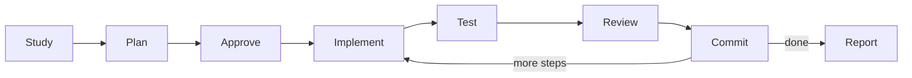
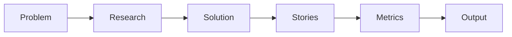
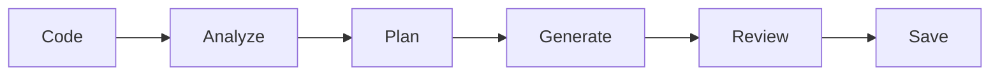
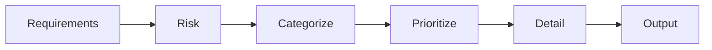
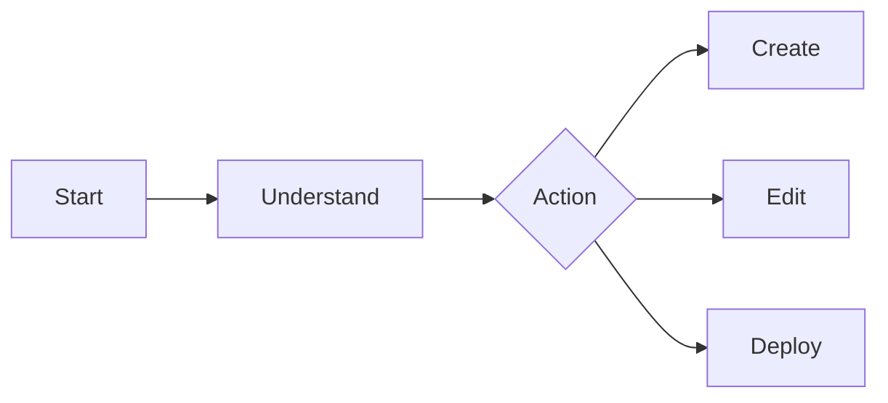

import { Aside } from '@astrojs/starlight/components';

Moira includes workflow templates for common structured tasks. Templates ensure consistent execution quality through domain knowledge, validation loops, and user approval gates.

## Starting a Workflow

```bash
mcp__moira__start({ workflowId: "<workflow-id>" })
```

---

## Software Development

### software-development-flow

Complete feature development cycle with planning, iterative implementation, and validation.


| Feature | Description |
|---------|-------------|
| Full dev cycle | From requirements to validated delivery |
| Iterative implementation | Step-by-step with gate validation |
| Plan review | Subagent validates plan before execution |
| Numerical checks | Evidence-based completion verification |

**Use for:** Feature development, bug fixes, code tasks requiring structured planning and validation.

```bash
mcp__moira__start({ workflowId: "moira/software-development-flow", parentExecutionId: "none" })
```

### software-development-flow-lite

Simplified development flow for small features (1-5 steps). Core loop: plan → implement → test → review → commit.



| Feature | Description |
|---------|-------------|
| Iterative implementation | Step-by-step with validation cycle |
| Plan review | Subagent validates plan before execution |
| Numerical checks | Test counts, quality standards, gate review |
| Lightweight | 42 nodes vs 153 in full SDF |

**Use for:** Small features (1-5 steps), bug fixes, quick enhancements needing structured development with tests.

```bash
mcp__moira__start({ workflowId: "moira/software-development-flow-lite", parentExecutionId: "none" })
```

[See details →](/docs/reference/workflows/software-development-lite/)

---

## Task Management

### quick-task (Recommended)

Fast task execution for 2-10 step tasks without complex infrastructure.


| Feature | Description |
|---------|-------------|
| Lightweight process | Fast start with minimal overhead |
| Simple validation | Plan approval + single review phase |
| Evidence required | Verifiable output for each step |

**Use for:** Most multi-step tasks. This is the recommended default workflow.

```bash
mcp__moira__start({ workflowId: "moira/quick-task", parentExecutionId: "none" })
```

[See details →](/docs/reference/workflows/quick-task/)

### robust-task

Reliable execution of complex, critical tasks with full infrastructure.


| Feature | Description |
|---------|-------------|
| Self-sufficient steps | Each step executable without full plan context |
| Evidence required | Proof of completion for each step |
| Retry mechanism | Up to 3 attempts with escalation options |
| Plan persistence | Saved to `./claude-temp-files/plan-{timestamp}.md` |

**Use for:** Any task with 3+ steps requiring verified completion.

```bash
mcp__moira__start({ workflowId: "moira/robust-task", parentExecutionId: "none" })
```

[See details →](/docs/reference/workflows/robust-task/)

---

## Content & Research

### content-creation

Text content creation: articles, posts, documentation.


| Feature | Description |
|---------|-------------|
| Research validation | Min 3 sources, 3 facts required |
| Draft validation | Structure and tone compliance |
| Formats | article, post, documentation |
| Tone options | formal, casual, technical, mixed |

```bash
mcp__moira__start({ workflowId: "content-creation" })
```

[See details →](/docs/reference/workflows/content-creation/)

### verified-research

Research with verified and reproducible sources. Solves AI hallucination and fake source problems.


| Feature | Description |
|---------|-------------|
| URL verification | All sources must be accessible |
| Alternative viewpoints | Minimum 2 opposing opinions |
| Citations | Each conclusion linked to source |
| Limitations | Explicit gaps and biases section |

```bash
mcp__moira__start({ workflowId: "moira/verified-research", parentExecutionId: "none" })
```

[See details →](/docs/reference/workflows/verified-research/)

---

## Product Development

### prd-creation

PRD (Product Requirements Document) creation with completeness guarantees.



| Feature | Description |
|---------|-------------|
| Problem-first | Start with problem, not solution |
| Data-backed | Analytics, interviews, support tickets |
| Testable AC | Min 3 acceptance criteria per story |
| Edge cases | Min 5 non-standard scenarios |

```bash
mcp__moira__start({ workflowId: "prd-creation" })
```

[See details →](/docs/reference/workflows/prd-creation/)

### ux-design

UX/UI design process with mandatory accessibility verification.


| Feature | Description |
|---------|-------------|
| Primary persona | Defined before design begins |
| Design rationale | Alternatives documented |
| WCAG AA | Mandatory accessibility checklist |
| Microcopy | Clarity-focused copy guidelines |

```bash
mcp__moira__start({ workflowId: "ux-design" })
```

[See details →](/docs/reference/workflows/ux-design/)

---

## Quality Assurance

### test-generation

Automated test code generation (unit, integration, e2e).



| Feature | Description |
|---------|-------------|
| Project analysis | Existing tests, framework detection |
| Test types | unit, integration, e2e |
| Case categories | happy path, edge cases, error cases |
| Validation | Syntax verification before save |

```bash
mcp__moira__start({ workflowId: "test-generation" })
```

[See details →](/docs/reference/workflows/test-generation/)

### test-planning

Test plan creation with P0-P3 prioritization.



| Feature | Description |
|---------|-------------|
| Categories | positive, negative, edge, security, performance |
| Priorities | P0 (blocker) to P3 (nice to have) |
| Coverage | AC and high-risk scenario coverage |
| Minimum | 2 tests per category |

```bash
mcp__moira__start({ workflowId: "test-planning" })
```

[See details →](/docs/reference/workflows/test-planning/)

---

## Data & Analytics

### data-analysis

Data analysis from problem definition to conclusions and visualization.


| Feature | Description |
|---------|-------------|
| CRISP-DM | Standard methodology |
| Validation | Data quality and EDA completeness |
| Approval gates | Problem definition, conclusions |

```bash
mcp__moira__start({ workflowId: "data-analysis" })
```

[See details →](/docs/reference/workflows/data-analysis/)

---

## Marketing

### marketing-campaign

Marketing materials creation with differentiation and conversion focus.


| Feature | Description |
|---------|-------------|
| No buzzwords | USPs must be concrete |
| Competitive | Gap identification required |
| Proof points | Data, testimonial, or case study |
| Legal check | Compliance review |

```bash
mcp__moira__start({ workflowId: "marketing-campaign" })
```

[See details →](/docs/reference/workflows/marketing-campaign/)

---

## Meta

### workflow-management-flow

Workflow creation, editing, and deployment.



<Aside type="tip">
Use this workflow to create custom workflows or modify existing templates.
</Aside>

| Feature | Description |
|---------|-------------|
| Node types | start, end, agent-directive, condition, notification |
| Operators | eq, ne, lt, gt, in, contains, exists, and, or, not |
| Templates | Variable substitution with validation |
| Validation | Schema and connection verification |

```bash
mcp__moira__start({ workflowId: "workflow-management-flow" })
```
