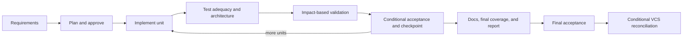
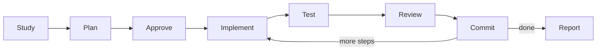
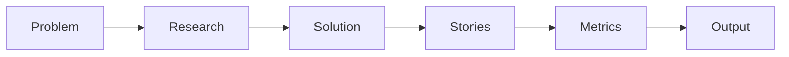
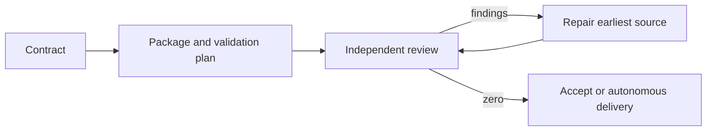
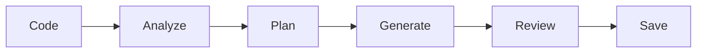
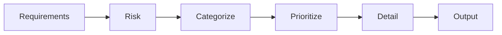
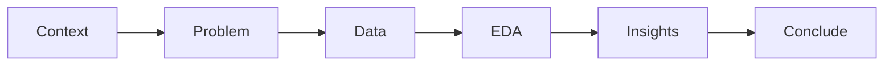
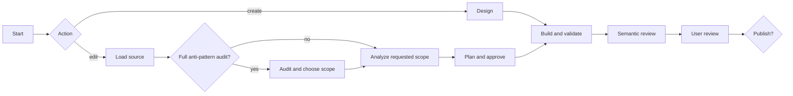

import { Aside } from '@astrojs/starlight/components';

Moira includes workflow templates for common structured tasks. Templates ensure consistent execution quality through domain knowledge, validation loops, and user approval gates.

## Starting a Workflow

```bash
mcp__moira__start({ workflowId: "<workflow-id>" })
```

---

## Software Development

### software-development-flow

Filesystem-first feature development with source-grounded planning, complete implementation units, independent semantic gates, impact-based validation, accepted-unit checkpoints, and explicit side-effect authority.


```mermaid
flowchart LR
    A[Requirements] --> B[Plan and approve] --> C[Implement unit]
    C --> D[Test adequacy and architecture]
    D --> E[Impact-based validation]
    E --> G[Conditional acceptance and checkpoint]
    G -->|more units| C
    G --> F[Docs, final coverage, and report]
    F --> H[Final acceptance]
    H --> I[Conditional VCS reconciliation]
```

| Feature | Description |
|---------|-------------|
| Durable artifacts | Requirements, plan revisions, implementation evidence, reviews, feedback, and final coverage stay in one correlated workspace |
| Source-grounded planning | Assigned tickets, PRs, specifications, and documents are preserved before requirements are extracted; initial VCS and discovery evidence protects unrelated work |
| Complete implementation units | Each approved unit owns dependencies, tests, applicable permanent docs, and focused evidence |
| Layered review | Test adequacy and project-grounded architecture are judged from the diff and primary sources by the implementing agent; a single delegated reviewer then judges the completed unit for completeness and quality, and never re-runs linters, type checks or suites |
| Agent-triggered replan | A teleport entry lets the agent restart planning the moment the plan itself is wrong, instead of waiting for a gate to notice |
| Impact-based validation | Runtime, browser, security, performance, broad builds, and full suites run only when project policy or actual risk makes them applicable |
| Conditional visual evidence | A plan unit explicitly opts into screenshot inspection and a portable self-contained HTML report; incidental UI changes do not enable it automatically |
| Incremental history | With approved VCS authority, each accepted unit checkpoints only its own changes before the next unit starts; unrelated work and workflow artifacts are excluded |
| Explicit authority | Checkpoints and final project-native VCS reconciliation are conditional; final user acceptance occurs before reconciliation, and tool availability never authorizes a side effect |
| Operating mode | The first step resolves `autonomous` or `interactive`. Autonomous runs skip the requirements, plan, unit, and feature approvals and deliver the final report instead; independent reviews, validation gates, and VCS authority are unchanged, and external blockers are decided on re-checked evidence rather than by waiting for a person |

**Use for:** Feature development, bug fixes, code tasks requiring structured planning and validation.

```bash
mcp__moira__start({ workflowId: "moira/software-development-flow", parentExecutionId: "none" })
```

### software-development-flow-lite

Simplified development flow for small features (1-5 steps). Core loop: plan → implement → test → review → commit.


```mermaid
flowchart LR
    A[Study] --> B[Plan] --> C[Approve] --> D[Implement] --> E[Test] --> F[Review] --> G[Commit]
    G -->|more steps| D
    G -->|done| H[Report]
```

| Feature | Description |
|---------|-------------|
| Iterative implementation | Step-by-step with validation cycle |
| Plan review | Subagent validates plan before execution |
| Numerical checks | Test counts, quality standards, gate review |
| Lightweight | 42 nodes vs 153 in full SDF |

**Use for:** Small features (1-5 steps), bug fixes, quick enhancements needing structured development with tests.

```bash
mcp__moira__start({ workflowId: "moira/software-development-flow-lite", parentExecutionId: "none" })
```

[See details →](/docs/reference/workflows/software-development-lite/)

---

## Task Management

### quick-task (Recommended)

Filesystem-backed execution for a bounded plan of 1-10 meaningful work units.


```mermaid
flowchart LR
    A[Understand] --> B[Plan] --> C[Approve] --> D[Execute] --> E[Review] --> F[Report]
```

| Feature | Description |
|---------|-------------|
| Durable workspace | Immutable task, plan, review, decision, change, and evidence records |
| Independent gates | Plan review before approval and result review after execution |
| Minimal context | Typed file references, plan length, cursor, and routing values only |

**Use for:** Most bounded multi-step tasks executed by an agent with filesystem access. This is the recommended default workflow.

```bash
mcp__moira__start({ workflowId: "moira/quick-task", parentExecutionId: "none" })
```

[See details →](/docs/reference/workflows/quick-task/)

### robust-task

Filesystem-backed execution of complex, critical tasks with durable recovery.


```mermaid
flowchart LR
    A[Understand] --> B[Decompose] --> C[Execute] --> D[Verify] --> E[Deliver]
```

| Feature | Description |
|---------|-------------|
| Durable workspace | Frozen requirements, immutable plan versions, attempt evidence, reviews, decisions, and delivery stay under `./moira-ws/` |
| Independent gates | Plans, step attempts, criteria coverage, and the final result receive fitting independent review |
| Bounded recovery | Review and step-retry budgets end in an explicit user decision, never silent success |
| Truthful delivery | End returns the workspace, delivery file, complete/incomplete status, and concise summary |

**Use for:** Complex multi-step work that must survive context loss and retain per-attempt evidence.

```bash
mcp__moira__start({ workflowId: "moira/robust-task", parentExecutionId: "none" })
```

[See details →](/docs/reference/workflows/robust-task/)

---

## Content & Research

### content-creation

Text content creation: articles, posts, documentation.


```mermaid
flowchart LR
    A[Brief] --> B[Research] --> C[Outline] --> D[Write] --> E[Edit] --> F[Finalize]
```

| Feature | Description |
|---------|-------------|
| Research validation | Min 3 sources, 3 facts required |
| Draft validation | Structure and tone compliance |
| Formats | article, post, documentation |
| Tone options | formal, casual, technical, mixed |

```bash
mcp__moira__start({ workflowId: "content-creation" })
```

[See details →](/docs/reference/workflows/content-creation/)

### verified-research

Research with verified and reproducible sources. Solves AI hallucination and fake source problems.


```mermaid
flowchart LR
    A[Question] --> B[Methodology] --> C[Gather] --> D[Read] --> E[Synthesize] --> F[Output]
```

| Feature | Description |
|---------|-------------|
| URL verification | All sources must be accessible |
| Alternative viewpoints | Minimum 2 opposing opinions |
| Citations | Each conclusion linked to source |
| Limitations | Explicit gaps and biases section |

```bash
mcp__moira__start({ workflowId: "moira/verified-research", parentExecutionId: "none" })
```

[See details →](/docs/reference/workflows/verified-research/)

---

## Product Development

### prd-creation

PRD (Product Requirements Document) creation with completeness guarantees.


```mermaid
flowchart LR
    A[Problem] --> B[Research] --> C[Solution] --> D[Stories] --> E[Metrics] --> F[Output]
```

| Feature | Description |
|---------|-------------|
| Problem-first | Start with problem, not solution |
| Data-backed | Analytics, interviews, support tickets |
| Testable AC | Min 3 acceptance criteria per story |
| Edge cases | Min 5 non-standard scenarios |

```bash
mcp__moira__start({ workflowId: "prd-creation" })
```

[See details →](/docs/reference/workflows/prd-creation/)

### ux-design

Execution-bound UX/UI specification with traceable decisions, accessibility intent, independent
review, and changed repair.


```mermaid
flowchart LR
    A[Contract] --> B[Package and validation plan] --> C[Independent review]
    C -->|findings| D[Repair earliest source]
    D --> C
    C -->|zero| E[Accept or autonomous delivery]
```

| Feature | Description |
|---------|-------------|
| Durable workspace | Contract, design package, future validation plan, review, and repair account are tied to the current execution |
| Complete design scope | Users, jobs, pains, constraints, applicable states, flows, layout, microcopy, responsive behavior, accessibility intent, risks, and handoff |
| Reuse and rationale | Existing primitives are preferred; every new component requires evidence, alternatives, and integration consequences |
| Independent gate | The same separate reviewer must report exactly zero current blockers after every change |
| Honest boundary | Produces a specification and plan; it does not implement UI, run research, certify WCAG, publish, or deploy |

```bash
mcp__moira__start({ workflowId: "moira/ux-design", parentExecutionId: "none" })
```

[See details →](/docs/reference/workflows/ux-design/)

---

## Quality Assurance

### test-generation

Automated test code generation (unit, integration, e2e).


```mermaid
flowchart LR
    A[Code] --> B[Analyze] --> C[Plan] --> D[Generate] --> E[Review] --> F[Save]
```

| Feature | Description |
|---------|-------------|
| Project analysis | Existing tests, framework detection |
| Test types | unit, integration, e2e |
| Case categories | happy path, edge cases, error cases |
| Validation | Syntax verification before save |

```bash
mcp__moira__start({ workflowId: "test-generation" })
```

[See details →](/docs/reference/workflows/test-generation/)

### test-planning

Test plan creation with P0-P3 prioritization.


```mermaid
flowchart LR
    A[Requirements] --> B[Risk] --> C[Categorize] --> D[Prioritize] --> E[Detail] --> F[Output]
```

| Feature | Description |
|---------|-------------|
| Categories | positive, negative, edge, security, performance |
| Priorities | P0 (blocker) to P3 (nice to have) |
| Coverage | AC and high-risk scenario coverage |
| Minimum | 2 tests per category |

```bash
mcp__moira__start({ workflowId: "test-planning" })
```

[See details →](/docs/reference/workflows/test-planning/)

---

## Data & Analytics

### data-analysis

Data analysis from problem definition to conclusions and visualization.


```mermaid
flowchart LR
    A[Context] --> B[Problem] --> C[Data] --> D[EDA] --> E[Insights] --> F[Conclude]
```

| Feature | Description |
|---------|-------------|
| CRISP-DM | Standard methodology |
| Validation | Data quality and EDA completeness |
| Approval gates | Problem definition, conclusions |

```bash
mcp__moira__start({ workflowId: "data-analysis" })
```

[See details →](/docs/reference/workflows/data-analysis/)

---

## Marketing

### marketing-campaign

Marketing materials creation with differentiation and conversion focus.


```mermaid
flowchart LR
    A[Product] --> B[Audience] --> C[Competitive] --> D[Position] --> E[Create] --> F[Review]
```

| Feature | Description |
|---------|-------------|
| No buzzwords | USPs must be concrete |
| Competitive | Gap identification required |
| Proof points | Data, testimonial, or case study |
| Legal check | Compliance review |

```bash
mcp__moira__start({ workflowId: "marketing-campaign" })
```

[See details →](/docs/reference/workflows/marketing-campaign/)

---

## Meta

### workflow-management-flow

Workflow creation, editing, review, and optional publication.


```mermaid
flowchart LR
    A[Start] --> B{Action}
    B -->|create| C[Design]
    B -->|edit| D[Load source]
    D --> E{Full anti-pattern audit?}
    E -->|yes| F[Audit and choose scope]
    E -->|no| G[Analyze requested scope]
    F --> G
    C --> H[Build and validate]
    G --> I[Plan and approve]
    I --> H
    H --> J[Semantic review]
    J --> K[User review]
    K --> L{Publish?}
```

<Aside type="tip">
Use this workflow to create custom workflows or modify existing templates.
</Aside>

| Feature | Description |
|---------|-------------|
| Disk-backed artifacts | Requirements, analysis, plans, and review reports stay in the workspace |
| Embedded authoring reference | Engine rules, patterns, anti-patterns, review criteria, cost ordering, and authority rules are shipped inside the workflow |
| Identity-aware editing | The edit path reconciles local and server provenance before semantic planning |
| Optional source audit | A full anti-pattern audit runs only with user consent |
| Outcome-oriented plans | Plans preserve executor freedom while fixing scope and acceptance criteria |
| Simple review loops | Review reports stay on disk; only issue counts are used for routing |
| Validation | The creating or editing node runs the official schema and graph validator |
| Context-aware handoff | Stable file paths are referenced without forcing unchanged rereads or copying file bodies through workflow state |
| Publication gate | Standard, copy-new, and admin-override semantics require an explicit user decision; a real local target is synchronized separately |

```bash
mcp__moira__start({ workflowId: "workflow-management-flow" })
```
