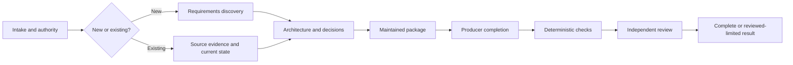

Architecture Design Flow produces a decision-ready, maintained architecture package for either a new system or an existing product. It combines scenario-appropriate discovery, evidence-backed decisions, quality attributes, crosscutting and operational concerns, limitations, deterministic package checks, and genuinely independent architecture review.

```bash
mcp__moira__start({ workflowId: "moira/architecture-design-flow", parentExecutionId: "none" })
```

## Use it when

Use this workflow when architecture documentation and decisions are the result. For an existing system it inspects the authorized source and distinguishes observed current state, inference, and target improvements. For a new system it derives an architecture from supplied requirements and constraints. Use Software Development Flow when product code, tests, and documentation must be implemented; use a research workflow when evidence discovery is the result; use a planning workflow when you need only an execution plan.

## Durable process

The workflow materializes an execution-correlated workspace containing the immutable architecture contract, universal architecture principles, scenario evidence, current-state analysis, architecture and decisions, package files, completion record, limitations, deterministic observations, independent findings, repair account, corrected-contract supplement, delivery evidence, and final report.



C4, DDD, arc42, Mermaid, ADRs, diagrams, and quality scenarios are used only where they improve the actual decision. Fixed counts of contexts, gaps, alternatives, files, or concerns do not establish semantic completeness.

## Repair, replan, and outcomes

Discovery, architecture, package, completion, and validation findings return to different owners and repeat every downstream gate made stale by the change. Invalid or unprovable criteria use a cumulative corrected-contract supplement that preserves the originating goal and authority and passes independent review before typed re-entry. A guarded process-revision teleport is for an invalid process or criterion, not an ordinary failed check or review finding.

Autonomous mode skips only final user acceptance. Interactive mode supports accept, abort, or one concrete discovery, architecture, package, validation, completion, or contract rework request. Outcomes distinguish complete, reviewed-limited, blocked before or after workspace creation, workspace failure, and aborted.

## Authority and delivery

Workspace delivery is always available. Project delivery copies the exact accepted package only to an explicitly authorized target and verifies source/destination identity. The workflow does not modify product code, tests, or infrastructure; commit, push, publish, notify, release, or deploy.
