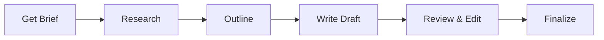

import { Aside } from '@astrojs/starlight/components';

Workflow for creating text content with structured research, validation loops, and user approval gates. Supports articles, blog posts, and technical documentation.

## Start

```bash
mcp__moira__start({ workflowId: "content-creation" })
```

## Process



## Steps

| Step | Action | Output |
|------|--------|--------|
| 1. Get Brief | Collect requirements: topic, format, audience, tone, constraints | Structured brief |
| 2. Research | Research topic from authoritative sources | Min 3 sources, 3 key facts |
| 3. Outline | Create content structure | User-approved outline |
| 4. Write Draft | Write following structure and tone | Draft matching brief |
| 5. Review & Edit | Edit for clarity and engagement | Polished content |
| 6. Finalize | Final approval and publication prep | Ready-to-publish content |

## Features

<Aside type="tip">
Research validation requires minimum 3 authoritative sources and 3 key facts before proceeding to outline.
</Aside>

### Content Formats

| Format | Description |
|--------|-------------|
| `article` | Long-form article |
| `post` | Blog post or social media |
| `documentation` | Technical documentation |
| `other` | Custom format |

### Tone Options

| Tone | Description |
|------|-------------|
| `formal` | Professional, formal language |
| `casual` | Conversational, friendly |
| `technical` | Technical, precise |
| `mixed` | Combination based on context |

### Validation Loops

- **Research validation**: Completeness check (min 3 sources, 3 facts)
- **Draft validation**: Structure and tone compliance check

### User Approval Gates

- **Outline approval**: Confirm structure before writing
- **Content approval**: Final content sign-off

## Example Node Configuration

```json
{
  "id": "research-topic",
  "type": "agent-directive",
  "directive": "Research the topic from authoritative sources. Find minimum 3 sources and extract 3 key facts.",
  "completionCondition": "Research complete with 3+ verified sources and 3+ key facts documented",
  "connections": {
    "next": "validate-research"
  }
}
```

## Related

- [Verified Research](/docs/reference/workflows/verified-research/) — For in-depth research with source verification
- [Robust Task](/docs/reference/workflows/robust-task/) — For multi-step task execution
- [Workflow Templates Overview](/docs/reference/workflow-templates/) — All available templates
