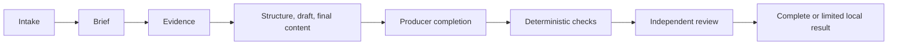

Content Creation produces one bounded text deliverable—article, post, documentation, script, email, landing copy, or another requested format—from an authorized brief.

```bash
mcp__moira__start({ workflowId: "moira/content-creation", parentExecutionId: "none" })
```

Use it when the result is the text itself. Use [Marketing Campaign](/docs/reference/workflows/marketing-campaign/) for campaign positioning and multi-channel materials, a research workflow when evidence discovery is the result, or Software Development Flow for repository implementation.

## Durable process

The workflow creates an execution-correlated workspace with an immutable content contract, cumulative independently reviewed corrections, content brief, evidence register, structure, draft, final content, limitations, validation observations, independent findings, repair account, and final report.


```mermaid
flowchart LR
  A[Intake] --> B[Brief]
  B --> C[Evidence]
  C --> D[Structure, draft, final content]
  D --> E[Producer completion]
  E --> F[Deterministic checks]
  F --> G[Independent review]
  G --> H[Complete or limited local result]
```

Evidence distinguishes sourced facts and quotations, supplied assertions, inference, assumptions, creative invention, and unavailable material. Fixed source, section, word, score, issue, or retry quotas do not determine semantic quality.

Content, evidence, and brief findings have source-specific repair owners and repeat every stale downstream responsibility. Invalid criteria use cumulative corrected-contract review. Autonomous mode skips only final user acceptance; interactive mode supports accept, abort, or one concrete brief/evidence/content/contract rework request.

## Optional effects

Local delivery is sufficient. Publication requires originating authority for a concrete destination and uses the exact accepted revision. Telegram requires separate originating authority. Outcomes remain `not_requested`, `declined`, `succeeded`/`sent`, or `failed`, and never reclassify complete versus reviewed-limited content.

The workflow does not commit, release, deploy, mutate product code, contact customers, or infer source/effect authority.
