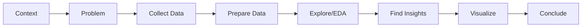

import { Aside } from '@astrojs/starlight/components';

Workflow for data analysis from problem definition to conclusions and visualization. Follows CRISP-DM methodology with validation loops for data quality and analysis completeness.

## Start

```bash
mcp__moira__start({ workflowId: "data-analysis" })
```

## Process



## Steps

| Step | Action | Output |
|------|--------|--------|
| 1. Get Context | Collect business question, context, data sources, constraints, audience | Context document |
| 2. Define Problem | Formulate research question, hypotheses, success criteria, scope | Problem definition |
| 3. Collect Data | Download, study structure, initial quality check | Raw dataset |
| 4. Prepare Data | Handle missing values, types, duplicates, outliers, transformations | Clean dataset |
| 5. Explore Data | Distributions, correlations, patterns, preliminary insights | EDA report |
| 6. Find Insights | Test hypotheses, answer research question, recommendations | Key insights |
| 7. Visualize | Create charts for key findings | Visualizations |
| 8. Conclude | Executive summary, findings, recommendations, limitations | Final report |

## Features

<Aside type="tip">
CRISP-DM methodology ensures systematic approach: understand task → understand data → prepare → explore → conclude → visualize.
</Aside>

### Validation Loops

| Loop | Purpose | Criteria |
|------|---------|----------|
| Data quality | Verify data readiness for EDA | No critical quality issues |
| EDA completeness | Verify research thoroughness | All hypotheses addressed |

### User Approval Gates

| Gate | Decision |
|------|----------|
| Problem definition | Confirm research question and scope |
| Conclusions | Approve final findings and recommendations |

<Aside type="caution">
Avoid common mistakes: analyzing without understanding the question, ignoring data quality issues, confirmation bias, assuming correlation equals causation.
</Aside>

### Quality Standards

| Standard | Description |
|----------|-------------|
| Reproducibility | Analysis can be repeated with same results |
| Validity | Methods appropriate for data and question |
| Relevance | Findings address the business question |
| Clarity | Results understandable by audience |
| Actionability | Recommendations are practical |

### Data Preparation Checklist

| Task | Action |
|------|--------|
| Missing values | Identify, understand, handle appropriately |
| Data types | Verify and correct column types |
| Duplicates | Detect and remove if necessary |
| Outliers | Identify, investigate, handle |
| Transformations | Apply needed transformations |

## Example Node Configuration

```json
{
  "id": "explore-data",
  "type": "agent-directive",
  "directive": "Perform exploratory data analysis. Examine distributions, correlations, and patterns. Document preliminary insights.",
  "completionCondition": "EDA complete with distributions, correlations analyzed and preliminary insights documented",
  "connections": {
    "next": "validate-eda"
  }
}
```

## Related

- [Verified Research Workflow](/docs/reference/workflows/verified-research/) — For qualitative research with sources
- [PRD Creation](/docs/reference/workflows/prd-creation/) — For data-driven product decisions
- [Workflow Templates Overview](/docs/reference/workflow-templates/) — All available templates
