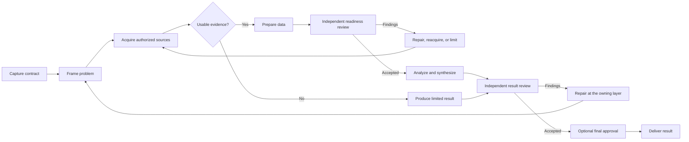

import { Aside } from '@astrojs/starlight/components';

`moira/data-analysis` turns one or more supplied or explicitly authorized datasets into a reviewed, decision-useful analysis. It preserves the user's source authority, records what was actually accessible, checks data readiness before analysis, and delivers either a complete result or an honest limited result when the evidence cannot support the requested conclusion.

## Start

```js
mcp__moira__start({
  workflowId: "moira/data-analysis",
  parentExecutionId: "none"
})
```

Provide the analytical question, the decision the result must inform, scope, audience, constraints, success criteria, expected deliverables, confidentiality rules, and at least one inline, file, or API source. For each source, state its sanitized identity, non-secret locator, authorization, initially known availability, data classification, and limitations.

## When to choose this workflow

| Need | Workflow |
| --- | --- |
| Analyze datasets that are already supplied or explicitly authorized | **Data Analysis** |
| Discover and verify external literature or web sources for a bounded answer | [Verified Research](/docs/reference/workflows/verified-research/) |
| Develop a research direction through repeated exploration and refinement | [Iterative Research](/docs/reference/workflows/iterative-research/) |
| Implement a product change, including its tests and documentation | [Software Development Flow](/docs/reference/workflow-templates/#software-development-flow) |

<Aside type="note">
Data Analysis does not grant access to a source merely because it appears in the request. Use it only for data the caller supplied or explicitly authorized. Use a research workflow when the primary task is finding external evidence rather than analyzing known datasets.
</Aside>

## Process


```mermaid
flowchart LR
    A[Capture contract] --> B[Frame problem]
    B --> C[Acquire authorized sources]
    C --> D{Usable evidence?}
    D -->|Yes| E[Prepare data]
    E --> F[Independent readiness review]
    F -->|Findings| G[Repair, reacquire, or limit]
    G --> C
    F -->|Accepted| H[Analyze and synthesize]
    D -->|No| I[Produce limited result]
    H --> J[Independent result review]
    I --> J
    J -->|Findings| K[Repair at the owning layer]
    K --> B
    J -->|Accepted| L[Optional final approval]
    L --> M[Deliver result]
```

The flow performs these connected responsibilities:

- captures a canonical analysis contract without broadening source access;
- frames the question around the stated decision, audience, scope, and success criteria;
- records a typed acquisition outcome for every source, including authorized-but-unavailable, not-authorized, and access-error states;
- prepares only usable data and documents provenance, transformations, missing-data handling, quality observations, sampling limits, lawful-use constraints, and reproducibility;
- applies methods appropriate to the question and evidence instead of forcing a fixed exploratory-data-analysis checklist;
- creates privacy-safe visualizations only when they materially improve understanding;
- traces findings, uncertainty, limitations, recommendations, and reproducibility to the source evidence;
- independently reviews readiness and the final result, then routes each confirmed defect to the layer that owns it.

## Source contract and acquisition evidence

The source contract is the user's original statement of authority. Acquisition does not overwrite it. Instead, the flow records separate evidence about what happened when the source was inspected.

| Field group | Meaning |
| --- | --- |
| Initial contract | Source identity, type, sanitized locator, authorization, initially known availability, classification, and limitation |
| Acquisition evidence | Actual availability, typed access outcome, sanitized provenance, and observed limitation |
| Final source projection | Both the initial contract and acquisition outcome, kept one-to-one by source ID |

Actual availability can remain `unknown`. A source marked `not_authorized` or `access_error` cannot be reported as known available merely to keep the analysis moving. Duplicate source IDs and unmatched terminal source records are rejected as contract defects.

## Delivery modes

| Mode | Result |
| --- | --- |
| `inline` | A self-contained report is returned in the final workflow output |
| `filesystem` | The workflow materializes a bounded local workspace and returns the reviewed report path and authorized artifact paths |

Filesystem paths remain inside the current canonical workspace. The flow does not upload, publish, commit, deploy, mutate production, or send substantive notifications.

## Reviews and repair guarantees

Readiness review checks whether the evidence and preparation can support the requested analysis. A confirmed finding can lead to:

- a contained preparation repair;
- reacquisition when source evidence or provenance is defective;
- a limited result when the evidence cannot responsibly support a full analysis.

Final review checks the current result against the canonical question, decision context, source outcomes, methods, evidence, uncertainty, privacy constraints, limitations, recommendations, and delivery contract. A finding is routed to contained result repair, data preparation, source acquisition, or the canonical analysis contract. Contract repair re-enters framing and reruns the affected downstream stages; it cannot silently replace user context inside an ordinary presentation fix.

Autonomous mode skips only human approval gates. Independent readiness and result reviews, typed validation, repair loops, and limited-result behavior remain active. Interactive mode additionally asks the user to accept the framed problem and final result; rejection must consume the supplied feedback before the flow can finish.

## Limited results

A limited result is a valid, reviewed terminal outcome, not a false success. The flow uses it when no authorized usable source remains or when readiness review confirms that the available evidence is insufficient. It states the access outcomes, unsupported conclusions, limitations, and the next evidence needed without fabricating findings.

## Authority and privacy limits

The flow minimizes sensitive data and keeps credentials and unnecessary raw records out of directives, reports, review artifacts, and logs. It honors supplied privacy, consent, retention, licensing, and confidentiality constraints. It never expands authorization, circumvents access controls, deploys models, or treats correlation as causation without supporting evidence.

## Final output

The terminal `analysis_result` records:

- `complete` or `limited` status;
- delivery mode and inline report or local report path;
- the decision context;
- the typed initial and actual state of every source;
- executive and evidence summaries;
- limitations and recommendations;
- visualization summary;
- reproducibility instructions.

## Related

- [Verified Research](/docs/reference/workflows/verified-research/) — bounded external-source research
- [Iterative Research](/docs/reference/workflows/iterative-research/) — exploratory research with repeated refinement
- [PRD Creation](/docs/reference/workflows/prd-creation/) — reviewed product requirements informed by evidence
- [Workflow Templates Overview](/docs/reference/workflow-templates/) — compare all public workflows
