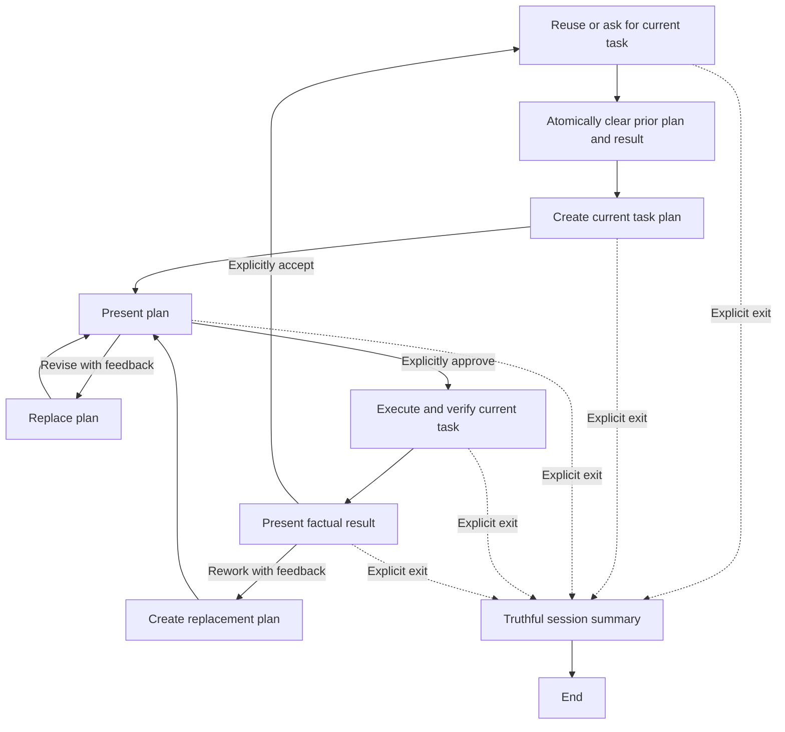

import { Aside } from '@astrojs/starlight/components';

`moira/infinite-task-loop` runs a human-guided sequence of tasks that are not known in advance. It accepts one current task, creates and presents a task-scoped plan, executes only after explicit approval, presents the factual result, and asks for the next task only after explicit acceptance.

## Start

```js
mcp__moira__start({
  workflowId: "moira/infinite-task-loop",
  parentExecutionId: "none"
})
```

The triggering request may already contain the first task. The workflow reuses that explicit task instead of asking for it again. Otherwise it waits for the user to supply the next concrete task. A request to stop, leave, finish, or exit is handled by the native exit teleport and is never recorded as task work.

## When to choose this workflow

Choose Infinite Task Loop when a person wants to remain in one interactive session and provide the next task only after seeing the previous result.

| Need | Workflow |
| --- | --- |
| Work through an open-ended stream of not-yet-known tasks with approval between tasks | **Infinite Task Loop** |
| Execute one bounded task with durable artifacts and independent review | [Quick Task](./quick-task/) |
| Add durable attempts, checkpoints, retries, and crash recovery | [Robust Task](./robust-task/) |
| Execute a finite checklist that is already known | [Todo List](./todo-list/) |
| Execute one current general plan with sequential evidence and zero-only review | [Simple Plan Execution](./simple-plan-execution/) |
| Implement software with tests, documentation, review, and authority-bound local VCS closure | [Software Development Flow](/docs/reference/workflow-templates/#software-development-flow) |

<Aside type="caution">
Infinite Task Loop is interactive and stores state only in the current execution context. It is not an unattended batch orchestrator, durable task ledger, recovery mechanism, or substitute for a complete software-development lifecycle.
</Aside>

## Process



Every current task passes through these gates:

- intake captures one non-empty task without planning or execution;
- an atomic reset clears the prior task's plan and result before any new-task reader;
- planning identifies applicable instructions, dependencies, authority, risks, success criteria, and verification;
- plan execution requires the user's actual `approve` decision;
- execution records a bounded factual summary that separates completed work, failures, and blockers;
- another task may begin only after the user explicitly accepts the result.

Silence and ordinary engagement are not approval or acceptance.

## Plan revision and result rework

Rejecting a plan requires non-empty feedback. The plan-revision responsibility uses that feedback to create a complete replacement plan for the same task and returns it to the same approval gate. It cannot execute work or expand task authority.

Rejecting a result also requires non-empty feedback. A separate result-replanning responsibility uses the observed result and feedback to replace the current plan. The replacement must be approved before any re-execution, so result rework cannot bypass plan review.

There is no automatic route that treats rejection, missing feedback, or an unknown decision value as success.

## State isolation between tasks

The runtime keeps four bounded global values:

- `task_description` — the exact current task;
- `execution_plan` — the current task plan;
- `execution_summary` — the current task result;
- `session_summary` — the terminal exit summary.

After a new task is accepted, the engine atomically sets the previous plan and result to empty before planning begins. If the user exits during that interval, the exit report names the new task and states that it has no plan or execution result. It cannot present the preceding task's plan or result as current.

Feedback and decisions are local to their plan or result gate. They are not shared as cross-task globals.

## Exit behavior and limitations

The native `teleport-exit` node is the only route to the terminal node and is available from every workflow step. It writes one bounded non-empty `session_summary` using only information observable in the current agent and execution context.

The workflow does not maintain durable history of every completed task. If an earlier result is no longer observable, the exit responsibility must disclose that limitation instead of reconstructing or inventing a complete history. Exiting performs no more task work and does not imply that the session can be recovered after a crash.

The terminal output contains only `session_summary`.

## Authority and guarantees

Plan approval authorizes work only within the original current task and applicable host or project instructions. It does not independently authorize credentials, destructive work, publication, deployment, notifications, production changes, financial actions, privacy-sensitive processing, or communication with another person. Any separate consent required for those effects still applies.

When required authority, information, or external state is missing, the executor records a verified blocker rather than performing or claiming the action.

Infinite Task Loop does not provide:

- filesystem-backed artifacts or a durable task ledger;
- retries, checkpoints, crash recovery, or resume guarantees;
- an independent reviewer or a zero-finding quality gate;
- unattended finite-list orchestration;
- software-specific implementation, testing, documentation, release, or deployment guarantees.

Choose the neighboring workflow whose guarantees match the whole task instead of splitting one connected lifecycle across several loop iterations.

## Related

- [Quick Task](./quick-task/) — one bounded task with durable artifacts and independent review
- [Robust Task](./robust-task/) — durable retries, checkpoints, and recovery
- [Todo List](./todo-list/) — a finite caller-supplied checklist
- [Simple Plan Execution](./simple-plan-execution/) — one current general plan with evidence and review
- [Software Development Flow](/docs/reference/workflow-templates/#software-development-flow) — a complete software-delivery lifecycle
- [Ready Workflows](./) — compare public workflows
