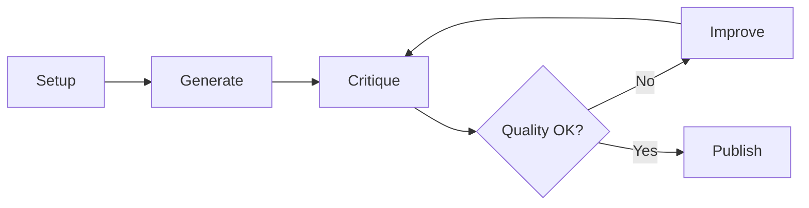

import { Aside } from '@astrojs/starlight/components';

Research workflow with iterative quality improvement through critique/improve cycles. A critic subagent evaluates results, suggests improvements, and the process repeats until quality gates are met.

## Start

```bash
mcp__moira__start({ workflowId: "moira/iterative-research", parentExecutionId: "none" })
```

## Process



## Steps

| Step | Action | Output |
|------|--------|--------|
| 1. Setup | Configure research parameters and workspace | Research config |
| 2. Generate | Generate initial research | Draft research |
| 3. Critique | Quality assessment with metrics | Critique report |
| 4. Quality Check | Evaluate against quality gates | Pass/Fail decision |
| 5. Improve | Address critique feedback | Improved research |
| 6. Publish | Prepare and publish final version | Published research |

## Features

### Depth Levels

| Level | Sources | Words | Focus |
|-------|---------|-------|-------|
| quick | 5-8 | 1500-2500 | Rapid overview |
| normal | 12-20 | 3000-5000 | Practical guidance |
| deep | 25-35 | 6000-10000 | Strategic analysis |
| scientific | 40+ | 10000+ | Academic rigor |

### Quality Gates

- Critical issues: 0
- Major issues: 0
- Formatting score: ≥ 8/10

### Iteration Limits

- Maximum 5 iterations
- Force completion option if limit reached
- User decision on forced completion

<Aside type="caution">
If quality gates are not met after 5 iterations, the workflow asks for user decision: publish as-is or stop.
</Aside>

### Issue Classification

| Severity | Description |
|----------|-------------|
| Critical | Fundamental flaws, factual inaccuracies |
| Major | Clarity problems, source attribution gaps |
| Moderate | Depth enhancement, alternative perspectives |
| Minor | Polish, formatting consistency |

## Example Node Configuration

```json
{
  "id": "critique-research",
  "type": "agent-directive",
  "directive": "Assess research quality using {{research_critique_prompt}}",
  "completionCondition": "Critique completed with numerical metrics",
  "inputSchema": {
    "type": "object",
    "properties": {
      "critical_issues_count": { "type": "number" },
      "major_issues_count": { "type": "number" },
      "formatting_score": { "type": "number" }
    }
  }
}
```

## Difference from Verified Research

| Workflow | Focus |
|----------|-------|
| `moira/verified-research` | Linear 8-step, source verification |
| `moira/iterative-research` | Iterative with quality improvement cycles |

Use `iterative-research` when you need high-quality output with multiple revision cycles.

## Related

- [Verified Research](/docs/reference/workflows/verified-research/) — For linear research with verified sources
- [Content Creation](/docs/reference/workflows/content-creation/) — For creating content from research
- [Workflow Templates Overview](/docs/reference/workflow-templates/) — All available templates
