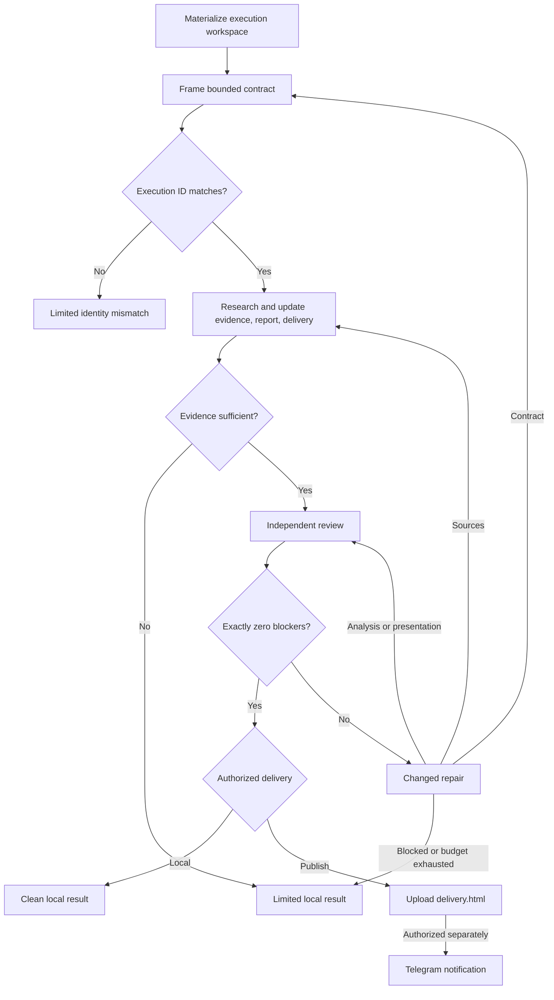

import { Aside } from '@astrojs/starlight/components';

`moira/iterative-research` is for an external-research question that needs a durable evidence record and may require several review-and-repair rounds. It captures a bounded contract, records source access and provenance, produces a report and self-contained delivery artifact, and treats the result as authoritative only after a genuinely independent reviewer reports exactly zero blocking issues.

Use it when the result needs repeated critique. Use [Verified Research](/docs/reference/workflows/verified-research/) for bounded one-pass verification, Deep Corpus Research for corpus-first collection, [Data Analysis](/docs/reference/workflows/data-analysis/) for supplied datasets, and a software-development workflow for repository changes.

## Start

```bash
mcp__moira__start({ workflowId: "moira/iterative-research", parentExecutionId: "none" })
```

The workflow resolves these decisions before research:

- the bounded question or topic, audience, output language, and requested depth (`quick`, `normal`, `deep`, or `scientific`);
- scope, exclusions, constraints, deliverable, source expectations, and success criteria;
- confidentiality, privacy, licensing, access, and data-minimization limits;
- interactive or autonomous operation;
- local delivery, publication, publication plus Telegram notification, or an undecided delivery choice.

Depth guides fitness and cost. It does not impose source counts, word counts, formatting scores, or a fixed tool or agent topology.

## Execution workspace

The workflow materializes six empty skeleton files under `./moira-ws/iterative-research-<executionId>/`:

| File | Purpose |
| --- | --- |
| `research-contract.md` | Current question, boundaries, success criteria, and delivery authority |
| `source-evidence.md` | Typed source identities, sanitized provenance, access outcomes, support, contradictions, uncertainty, and limitations |
| `research-report.md` | Current evidence-grounded answer |
| `research-review.md` | Complete current independent blocking findings |
| `repair-account.md` | Reproduced findings and changed artifacts, or the factual repair blocker |
| `delivery.html` | Minimized self-contained rendering without raw private evidence |

The contract returns the current engine execution UUID. An engine condition compares it with the engine-owned ID before research, preventing a schema-valid ID from selecting another execution workspace.

## Process


```mermaid
flowchart TD
    A[Materialize execution workspace] --> B[Frame bounded contract]
    B --> C{Execution ID matches?}
    C -->|No| X[Limited identity mismatch]
    C -->|Yes| D[Research and update evidence, report, delivery]
    D --> E{Evidence sufficient?}
    E -->|No| L[Limited local result]
    E -->|Yes| F[Independent review]
    F --> G{Exactly zero blockers?}
    G -->|Yes| H{Authorized delivery}
    G -->|No| I[Changed repair]
    I -->|Contract| B
    I -->|Sources| D
    I -->|Analysis or presentation| F
    I -->|Blocked or budget exhausted| L
    H -->|Local| J[Clean local result]
    H -->|Publish| K[Upload delivery.html]
    K -->|Authorized separately| N[Telegram notification]
```

The independent reviewer diagnoses but does not modify candidate artifacts. A nonzero review must lead to a real change or a factual blocked result. Repair re-enters at the earliest stale boundary: contract, sources, analysis, or presentation. The engine allows at most three nonzero review rounds; exhaustion cannot be converted into success or publication.

## Outcomes and external authority

- `clean_local` means the six local artifacts passed an exact zero-issue independent review and no external side effect occurred.
- `published` requires explicit publication authority and an observed successful static-artifact upload URL. Only `delivery.html` is uploaded.
- `notified` additionally requires separate Telegram authority and an observed successful notification.
- `delivery_failed` and `notification_failed` preserve the zero-reviewed local result while exposing the failed external step truthfully.
- `limited` covers insufficient evidence, blocked repair, exhausted review, unavailable workspace, or execution-identity mismatch. Limited results are non-authoritative and cannot be published or notified.
- `aborted` records an explicit interactive choice without claiming successful delivery.

<Aside type="caution">
Tool availability or configuration is not authority. Autonomous mode defaults an unresolved delivery choice to local; it never infers permission to publish or notify.
</Aside>

## Process revision

The `revise-process` teleport is only for an actually incorrect contract or agreed process. It rewrites the complete canonical contract, preserves explicit authority, rechecks the execution identity, and then re-enters normal research. It cannot bypass insufficient evidence, review findings, repair exhaustion, or a delivery failure.

## Related

- [Verified Research](/docs/reference/workflows/verified-research/) — bounded one-pass source verification
- [Data Analysis](/docs/reference/workflows/data-analysis/) — analysis of supplied datasets under an explicit source contract
- [Content Creation](/docs/reference/workflows/content-creation/) — drafting and reviewing content rather than conducting iterative external research
- [Ready Workflows](/docs/reference/workflows/) — workflow selection overview
