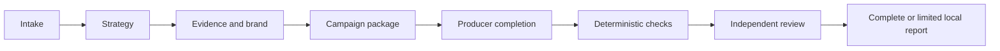

Marketing Campaign creates one channel-ready campaign package from an authorized product or offer. It combines audience and competitive context, positioning, proof or hypothesis mapping, brand and legal constraints, materials, calls to action, limitations, deterministic reference checks, and genuinely independent semantic review.

```bash
mcp__moira__start({ workflowId: "moira/marketing-campaign", parentExecutionId: "none" })
```

## Use it when

You need a campaign system—positioning, messages, proof mapping and channel materials—not one standalone article or post. Use [Content Creation](/docs/reference/workflows/content-creation/) for one text, a research workflow when evidence discovery is the result, and Software Development Flow for repository implementation.

## Durable process

The workflow materializes an execution-correlated local workspace containing the immutable campaign contract, strategy, evidence register, brand/legal constraints, campaign package, limitations, validation observations, independent findings, repair account, corrected-contract supplement and final report.

The clean route is:



Material claims are recorded as supported evidence, supplied assertions, hypotheses, or explicit omissions. Source-shaped text and checklist counts do not prove audience fit, differentiation, provenance, brand coherence, legal safety, or conversion usefulness; those properties remain independent judgments.

## Repair and outcomes

Package, evidence/provenance and strategy findings use different source-specific repair owners and re-enter every stale downstream responsibility. Invalid criteria use a cumulative corrected-contract supplement that preserves earlier accepted corrections unless a later reviewed correction explicitly supersedes them.

Autonomous mode skips only final user acceptance. Interactive mode supports accept, abort, or one concrete strategy, evidence, package or contract rework request. Outcomes distinguish complete, reviewed-limited, blocked before or after workspace creation, workspace failure, and aborted.

## Authority

The result is local. The workflow does not publish, notify, spend advertising budget, contact customers, launch a campaign, modify product code, commit, release or deploy.
