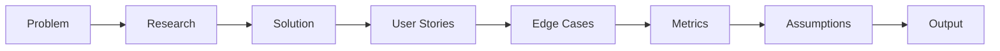

import { Aside } from '@astrojs/starlight/components';

PRD (Product Requirements Document) creation workflow with completeness guarantees through mandatory sections and data-backed decisions. Ensures problem-first approach with measurable outcomes.

## Start

```bash
mcp__moira__start({ workflowId: "prd-creation" })
```

## Process



## Steps

| Step | Action | Output |
|------|--------|--------|
| 1. Problem | Define problem statement, target users, urgency, cost of inaction | Concrete problem definition |
| 2. Research | Gather data from analytics, interviews, support tickets | Data-backed insights |
| 3. Solution | Describe solution, in/out of scope, constraints | Solution specification |
| 4. User Stories | Write stories with testable acceptance criteria (min 3 AC each) | Testable requirements |
| 5. Edge Cases | Document non-standard scenarios (min 5) | Edge case coverage |
| 6. Metrics | Define primary metric with target and measurement method | Measurable success criteria |
| 7. Assumptions | List assumptions with validation methods | Explicit assumptions |
| 8. Output | Final PRD document | Complete PRD |

## Features

<Aside type="tip">
Start with problem, not solution. Problem statement must be specific, measurable, and include cost of inaction.
</Aside>

### Problem-First Approach

| Element | Requirement |
|---------|-------------|
| Problem statement | Specific and measurable |
| Target users | Clearly defined segment |
| Urgency | Timeline and business impact |
| Cost of inaction | What happens if not solved |

### Data-Backed Decisions

Each statement requires a source:
- Analytics data
- User interviews
- Support tickets
- Competitor research

### Testable Acceptance Criteria

| Requirement | Description |
|-------------|-------------|
| Minimum count | 3 AC per user story |
| Verifiability | Each AC testable by autotest or manually |
| Specificity | No abstract "works correctly" |

<Aside type="caution">
Edge cases are mandatory. Document minimum 5 non-standard scenarios with expected behavior and recovery paths.
</Aside>

### Measurable Metrics

- **Primary metric** (north star) with specific target
- **Timeline** for achievement
- **Measurement method** defined and feasible

### Explicit Assumptions

| Element | Description |
|---------|-------------|
| Assumption | Clear statement of what is assumed |
| Validation method | How to verify the assumption |
| Impact if wrong | Consequences of invalid assumption |

## Example Node Configuration

```json
{
  "id": "define-problem",
  "type": "agent-directive",
  "directive": "Define the problem statement with target users, urgency, and cost of inaction. Be specific and measurable.",
  "completionCondition": "Problem statement includes specific target users, measurable impact, and cost of inaction",
  "connections": {
    "next": "research-data"
  }
}
```

## Related

- [UX Design](/docs/reference/workflows/ux-design/) — For designing the user experience
- [Test Planning](/docs/reference/workflows/test-planning/) — For creating test plans from PRD
- [Workflow Templates Overview](/docs/reference/workflow-templates/) — All available templates
