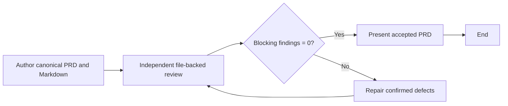

import { Aside } from '@astrojs/starlight/components';

PRD Creation produces a durable, evidence-grounded Product Requirements Document (PRD) for a
product problem, feature, change, API, page, module, or system. It records what is known, what is
not known, why a solution and scope were chosen, how requirements will be accepted, and whether
the result is ready for separately authorized follow-on work.

The workflow does not declare a PRD complete because headings or fixed record counts exist. A
strict JSON contract rejects structurally incomplete records, while an independent file-backed
review checks the current evidence, traceability, semantics, readiness, and exact agreement
between the canonical JSON and readable Markdown. Every blocking finding enters repair and the
same review repeats; only a zero-finding review can reach delivery.

## When to use it

Use PRD Creation when the required deliverable is reviewed product requirements rather than
implementation or a specialist design.

| Need | Choose |
| --- | --- |
| Evidence-grounded problem, scope, requirements, acceptance criteria, metrics, and readiness | **PRD Creation** |
| User journeys, interaction states, accessibility, or experience design | UX Design |
| Technical boundaries, interfaces, components, and architecture decisions | Architecture Design |
| Risk-based verification strategy and planned test cases | Test Planning |
| Executable tests derived from approved requirements | Test Generation |
| Implementation with its tests, documentation, review, and delivery gates | Software Development Flow |

<Aside type="caution">
Do not split one implementation task into separate PRD, coding, testing, and documentation runs
when Software Development Flow already owns the complete implementation lifecycle. Use PRD
Creation as an upstream workflow only when a reviewed PRD is itself a required deliverable.
</Aside>

## Start

Use the qualified public workflow identity:

```bash
mcp__moira__start({ workflowId: "moira/prd-creation" })
```

When an orchestration workflow starts PRD Creation as a child, it should also pass its own
execution ID as `parentExecutionId`. This preserves the parent-child execution relationship;
it does not grant the child additional authority.

## Inputs and evidence

Describe the product problem or requested change and identify the evidence the agent is authorized
to inspect. Depending on the task, primary evidence can include user input, project documents,
code, analytics, interviews, support material, research, or external sources.

The author must inspect discoverable evidence instead of guessing. Missing facts remain explicit
evidence gaps, assumptions, open questions, limitations, or a factual blocker. The workflow
forbids invented sources, quotes, analytics, baselines, targets, competitor behavior, and padding
added only to reach a count.

## Process


```mermaid
flowchart LR
    A[Author canonical PRD and Markdown] --> B[Independent file-backed review]
    B --> C{Blocking findings = 0?}
    C -- Yes --> D[Present accepted PRD]
    D --> E[End]
    C -- No --> F[Repair confirmed defects]
    F --> B
```

The workflow uses one traversal-safe relative workspace named
`./moira-ws/prd-creation-<suffix>`. The suffix starts with a letter or digit and contains only
letters, digits, underscores, or hyphens. Nested paths and traversal segments are rejected by the
engine before author data can reach review.

## Durable artifacts

| Artifact | Purpose |
| --- | --- |
| `prd-requirements.md` | Requested scope, evidence references, gaps, applicability decisions, assumptions, and material unknowns |
| `prd-standards.md` | Addressed standards used by author, reviewer, and repair |
| `prd.contract.json` | Canonical structured PRD and source of truth for overlapping fields |
| `prd.md` | Readable projection of the complete canonical contract plus rationale and limitations |
| `review.md` | Complete current reproducible blocking finding set |

The workflow result returns only the workspace path and a bounded summary that identifies the
accepted PRD, readiness, and limitations. The full PRD remains in files rather than being copied
through workflow state.

## PRD contract

The canonical contract covers:

- evidence sources and explicit evidence gaps;
- problem statement, target users, urgency, and cost of inaction;
- solution description, rationale, alternatives, in/out scope, constraints, dependencies, and
  previous attempts;
- prioritized requirements with evidence links and observable acceptance criteria;
- user stories linked to requirement and acceptance-criterion IDs;
- relevant edge, error, expected, and recovery behavior;
- a primary metric with baseline, target, measurement method, timeframe, evidence, and requirement
  links, plus optional secondary metrics;
- assumptions with validation and impact, and risks with likelihood, impact, and mitigation;
- applicability decisions, open questions, limitations, readiness, and readiness rationale.

Arrays are bounded but are not target quotas. Optional domains can be empty when they are genuinely
not applicable. Required core domains must contain supported material; when a material fact cannot
be obtained honestly, the author stops with the blocker instead of fabricating a record.

## Review and repair guarantee

The independent reviewer reads the complete current artifacts and relevant primary evidence
directly. It checks evidence support, honest gaps, applicability, stable and unique IDs, every
cross-link, problem/solution consistency, acceptance observability, edge and recovery relevance,
metric measurability, uncertainty, readiness, JSON-to-Markdown equality, and authority boundaries.

Unsupported claims, fabricated padding, dangling or duplicate IDs, lost structured content,
unjustified omissions, vague acceptance, unmeasurable success, hidden material uncertainty, or
authority expansion are blocking. A non-zero finding count routes to repair, which changes the
canonical source or explanatory evidence, regenerates the Markdown projection, and returns to the
same review. Repair can correct `prd-standards.md` only for a confirmed standards-artifact
defect and cannot weaken a standard to evade a finding.

<Aside type="note">
The guarantee is bounded to known findings in the evidence and artifacts that were actually
available and authorized. A zero-finding review is not proof that unavailable evidence exists or
that future implementation will be correct.
</Aside>

## Authority boundary

PRD Creation may inspect authorized evidence and write only its local PRD artifacts. It does not:

- implement the product or modify project code and documentation;
- execute tests or use version control;
- publish or upload artifacts;
- send notifications;
- deploy or administer systems.

Those actions require a separately authorized caller or workflow. The final summary may recommend
the appropriate next workflow, but does not execute it.

## Result

Successful completion returns:

- `workspace_path` — the safe workspace containing the accepted artifacts;
- `result_summary` — a bounded summary of the problem, chosen scope, readiness, primary
  success metric, durable PRD path, and remaining limitations.

The canonical contract and review count are deliberately absent from the terminal projection.

## Related

- [UX Design](/docs/reference/workflows/ux-design/) — design the user experience after requirements
  are sufficiently defined
- [Test Planning](/docs/reference/workflows/test-planning/) — create a reviewed, risk-based test
  plan without executing tests
- [Test Generation](/docs/reference/workflows/test-generation/) — generate executable tests from
  approved requirements
- [Software Development Lite](/docs/reference/workflows/software-development-lite/) — implement a
  bounded change when the full development lifecycle is not required
- [Workflow Templates Overview](/docs/reference/workflow-templates/) — compare all public templates
