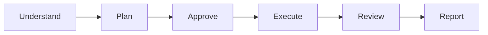

import { Aside } from '@astrojs/starlight/components';

Lightweight workflow for fast task execution without complex infrastructure. Plan → Approve → Execute → Review → Report.

<Aside type="tip">
This is the recommended workflow for most multi-step tasks. Use [Robust Task](/docs/reference/workflows/robust-task/) only for critical tasks requiring full infrastructure.
</Aside>

## Start

```bash
mcp__moira__start({ workflowId: "moira/quick-task", parentExecutionId: "none" })
```

## Process



## Steps

| Step | Action | Output |
|------|--------|--------|
| 1. Understand | Analyze task and gather context | Clear task definition |
| 2. Plan | Create 3-10 step plan | Numbered step list |
| 3. Approve | User confirms plan | Approved plan |
| 4. Execute | Execute all steps | Completed work |
| 5. Review | Check all criteria met | Verified completion |
| 6. Report | Summary with evidence | Final report |

## Features

### Lightweight Process

- No complex setup or configuration
- Fast start with minimal overhead
- Focus on getting work done

### Simple Validation

- Plan approval before execution
- Single review phase after completion
- Clear success criteria

### Evidence Required

Each completed step should have verifiable output:
- Modified files
- Test results
- Screenshots
- Descriptions

## When to Use

- Tasks with 2-10 concrete steps
- Standard development work
- Content creation
- Research tasks
- Any task that doesn't require retry/escalation infrastructure

## When to Use Robust Task Instead

- Critical tasks that cannot fail
- Multi-hour or multi-day tasks
- Tasks requiring session recovery
- Tasks requiring escalation workflow

## Example Node Configuration

```json
{
  "id": "execute-plan",
  "type": "agent-directive",
  "directive": "Execute the approved plan step by step. Provide evidence for each step.",
  "completionCondition": "All steps executed with evidence",
  "connections": {
    "success": "review-results"
  }
}
```

## Related

- [Robust Task](/docs/reference/workflows/robust-task/) — For complex tasks requiring full infrastructure
- [Content Creation](/docs/reference/workflows/content-creation/) — For text content creation
- [Workflow Templates Overview](/docs/reference/workflow-templates/) — All available templates
