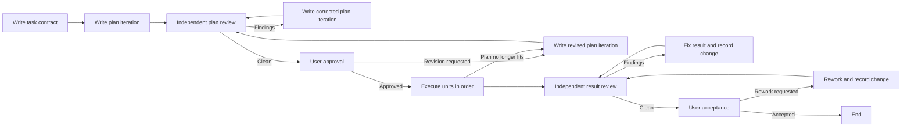

import { Aside } from '@astrojs/starlight/components';

Quick Task runs a bounded multi-step task as Plan → Approve → Execute → Review → Accept. It keeps complete task, plan, review, decision, change, and evidence records in an execution-specific filesystem workspace. Workflow context carries only bounded file references, the approved plan length, the execution cursor, and short values used for routing.

<Aside type="tip">
Use Quick Task when an agent has filesystem access and the work fits a plan of at most ten meaningful units. Use [Robust Task](/docs/reference/workflows/robust-task/) when the task needs a stronger recovery policy for partial execution or operational failures.
</Aside>

## Start

```bash
mcp__moira__start({ workflowId: "moira/quick-task", parentExecutionId: "none" })
```

## Process


```mermaid
flowchart LR
    A[Write task contract] --> B[Write plan iteration]
    B --> C[Independent plan review]
    C -->|Findings| D[Write corrected plan iteration]
    D --> C
    C -->|Clean| E[User approval]
    E -->|Revision requested| F[Write revised plan iteration]
    F --> C
    E -->|Approved| G[Execute units in order]
    G -->|Plan no longer fits| F
    G --> H[Independent result review]
    H -->|Findings| I[Fix result and record change]
    I --> H
    H -->|Clean| J[User acceptance]
    J -->|Rework requested| K[Rework and record change]
    K --> H
    J -->|Accepted| L[End]
```

## Workspace contract

The intake step derives the complete task contract from the triggering conversation, asking only for a material fact that cannot be discovered. It creates a workspace correlated with the Moira execution:

```text
./moira-ws/quick-task-<executionId>/
├── process-id.txt
├── task.md
├── execution.md
├── plans/
│   └── <iteration>/
│       ├── plan.md
│       ├── review.md
│       ├── decision.md
│       └── change.md
└── result-reviews/
    └── <iteration>/
        ├── review.md
        ├── decision.md
        └── change.md
```

Numeric iteration directories are published only after their record is complete. Existing completed iterations are not overwritten. A resumed node verifies and reuses its complete current record instead of duplicating it.

Returned paths are constrained by JSON Schema for shape and length. File existence, completeness, and correctness remain part of the creating node's directive and completion condition; a path-shaped string alone does not prove completion.

## Planning and approval

The planner writes between one and ten meaningful ordered work units. Each unit states its action, expected result, and a verification method appropriate to the work, and fixes that outcome rather than carrying the deliverable itself: after the plan is approved, work an intelligent executor still has to do remains. The rule matters most where the result is prose — a document, briefs for other agents, an investigation's answer — because there plan and result share a medium. The repair node that precedes approval answers for the whole plan; the revision node, which also runs mid-flight, answers for the units it shapes, because already executed units stay at their positions as they were executed. The plan body stays in `plan.md`; the workflow receives only its bounded path and exact item count.

An independent reviewer reads `task.md` and the current `plan.md` directly. It writes the complete reproducible blocking finding set to `review.md` and returns only the report path plus `issues_count`. A nonzero count routes to a separate repair node, which writes a new immutable plan iteration before returning to the same reviewer. Zero findings is valid and reaches the approval gate.

The user's exact decision and feedback are written to `decision.md`. Context receives only the decision-file path and `yes`/`no` routing value. Requested revisions read the exact feedback from disk, create a new plan iteration, and pass through independent review again.

The plan length becomes authoritative for execution only after the current plan has a clean review and explicit user approval.

## Operating mode

The first step resolves `operating_mode` as `autonomous` or `interactive`. The agent reuses a mode you already stated, infers an unambiguous one — including a run started by an already autonomous parent process — and asks once only when the mode is neither stated nor derivable.

In `interactive` mode nothing changes. In `autonomous` mode the plan-approval gate is bypassed and the final step presents the result without asking for acceptance. Both independent reviews and their repair loops are identical in either mode, and the delivery stays honest: unfinished or unverified work is reported as such rather than silently accepted.

## Execution and evidence

The engine owns a zero-based cursor. For each position, the agent reads the approved `plan.md`, executes only that work unit, applies technical judgment, and verifies the actual result. Before advancing, it writes exactly one concise evidence entry of at most 500 characters for that position to `execution.md`.

Evidence is not returned through workflow context. If work is incomplete or blocked, the agent reports the verified reason and remains at the current directive; the workflow does not convert failure into a status code or advance the cursor. Quick Task has no automatic retry counter or skip-as-success route.

### Replanning during execution

When the approved plan itself stops fitting reality — new facts appear, scope was missed, or an executed unit's outcome invalidates the remaining plan — the agent jumps to the replan entry instead of finishing a plan it knows is wrong:

```js
mcp__moira__step({ processId, teleportTo: "teleport-replan" })
```

No step leads into that node, so a replan is always a deliberate decision, and it is not a way around the other owners: a blocking plan-review finding belongs to the plan repair loop, a defect in the produced result to the result fix loop, a plan you reject at the approval gate to the ordinary revision route, and a unit that is merely hard or blocked to the rule above.

The jump states why the plan no longer fits; the same plan revision responsibility then publishes the next immutable plan iteration with its `change.md`. Units already executed keep their positions — the cursor is preserved, so finished work is not repeated and its evidence entries stay as written. The new plan goes back through the independent plan review and, in `interactive` mode, through your approval, before execution continues.

## Result review and acceptance

After all approved units, an independent reviewer reads the task, approved plan, plan decision, execution evidence, and actual artifacts. Each result state receives an immutable numeric review record. The reviewer writes all current blocking defects to `review.md` and returns only its path and `issues_count`.

A nonzero count routes to a separate fix node. The fix reads the complete report, reproduces and corrects confirmed defects, and writes `change.md`; the changed result then returns through the same independent review. A clean review reaches user presentation.

The user's exact acceptance or rework request is written to `decision.md`. Rework reads that file, changes the result, writes `change.md`, and returns through independent review. Only explicit acceptance reaches End.

## Guarantees and limits

- Complete plans, reviews, decisions, feedback, changes, and evidence have one durable source on disk instead of duplicated context payloads.
- Every returned dynamic path has a typed schema and a named downstream consumer.
- Review and mutation remain separate; every changed plan or result returns through the appropriate independent review.
- Automatic review loops advance only after a new artifact or result state exists. A non-reproducible or incomplete repair does not call `step()`.
- Mechanical checks prove only the properties they directly test; the executing and reviewing agents still judge the actual result.
- End has an empty terminal projection and does not expose internal file-backed records.
- Quick Task requires filesystem access. It does not provide Robust Task's stronger failure-recovery policy.

## Related

- [Robust Task](/docs/reference/workflows/robust-task/) — Durable execution with an explicit recovery policy
- [Workflow Templates Overview](/docs/reference/workflow-templates/) — All bundled workflows
