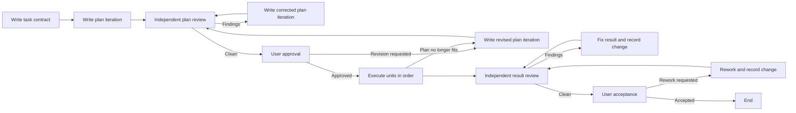

import { Aside } from '@astrojs/starlight/components';

Quick Task runs a bounded multi-step non-development task as Plan → Approve → Execute → Review → Accept; in autonomous mode the approval and acceptance steps are skipped (see [Operating mode](#operating-mode)). It keeps complete task, plan, review, decision, change, and evidence records in an execution-specific filesystem workspace. Workflow context carries only bounded file references, the plan's unit titles and length, the execution cursor, a one-line result, and short values used for routing.

<Aside type="tip">
Use Quick Task when an agent has filesystem access and bounded non-development work fits a plan of at most ten meaningful units. For software implementation, bug fixing, refactoring, migrations, or rollout, use [Software Development Flow](./software-development-flow/); its plan scales the lifecycle to the actual change. Use [Robust Task](/docs/reference/workflows/robust-task/) when a complex general task needs a stronger recovery policy for partial execution or operational failures.
</Aside>

## Start

```bash
mcp__moira__start({ action: "prepare", workflowId: "moira/quick-task", parentExecutionId: "none" })
mcp__moira__start({ action: "execute", startAttemptId: "<Start attempt ID from prepare>" })
```

## Process


```mermaid
flowchart LR
    A[Write task contract] --> B[Write plan iteration]
    B --> C[Independent plan review]
    C -->|Findings| D[Write corrected plan iteration]
    D --> C
    C -->|Clean| E[User approval]
    E -->|Revision requested| F[Write revised plan iteration]
    F --> C
    E -->|Approved| G[Execute units in order]
    G -->|Plan no longer fits| F
    G --> H[Independent result review]
    H -->|Findings| I[Fix result and record change]
    I --> H
    H -->|Clean| J[User acceptance]
    J -->|Rework requested| K[Rework and record change]
    K --> H
    J -->|Accepted| L[End]
```

## Workspace contract

The intake step derives the complete task contract from the triggering conversation, asking only for a material fact that cannot be discovered. It creates a workspace correlated with the Moira execution:

```text
./moira-ws/quick-task-<executionId>/
├── process-id.txt
├── task.md
├── execution.md
├── plans/
│   └── <iteration>/
│       ├── plan.md
│       ├── review.md
│       ├── decision.md
│       └── change.md
└── result-reviews/
    └── <iteration>/
        ├── review.md
        ├── decision.md
        └── change.md
```

Numeric iteration directories are published only after their record is complete. Existing completed iterations are not overwritten. A resumed node verifies and reuses its complete current record instead of duplicating it.

Returned paths are constrained by JSON Schema for shape and length. File existence, completeness, and correctness remain part of the creating node's directive and completion condition; a path-shaped string alone does not prove completion.

## Planning and approval

The planner writes between one and ten meaningful ordered work units. Each unit states its action, expected result, and a verification method appropriate to the work, and fixes that outcome rather than carrying the deliverable itself: after the plan is approved, work an intelligent executor still has to do remains. The rule matters most where the result is prose — a document, briefs for other agents, an investigation's answer — because there plan and result share a medium. The repair node that precedes approval answers for the whole plan; the revision node, which also runs mid-flight, answers for the units it shapes, because already executed units stay at their positions as they were executed. The plan body stays in `plan.md`; the workflow receives its bounded path and `plan_steps` — one short title per unit, in plan order — from which it derives the unit count. The titles are the plan list people see in notifications and on the run page.

An independent reviewer reads `task.md` and the current `plan.md` directly. It writes the complete reproducible blocking finding set to `review.md` and returns the report path and `issues_count` together with the bounded current planning-progress outcome required by the response schema. A nonzero count routes to a separate repair node, which writes a new immutable plan iteration before returning to the same reviewer. Zero findings is valid and reaches the approval gate.

The user's exact decision and feedback are written to `decision.md`. Context receives only the decision-file path and `yes`/`no` routing value. Requested revisions read the exact feedback from disk, create a new plan iteration, and pass through independent review again.

The plan length becomes authoritative for execution only after the current plan has a clean review and, in interactive mode, explicit user approval.

## Operating mode

The first step resolves `operating_mode` as `autonomous` or `interactive`. The agent reuses a mode you already stated, infers an unambiguous one — including a run started by an already autonomous parent process — and asks once only when the mode is neither stated nor derivable.

Before completing intake, the agent persists the actual [task name](/docs/concepts/workflows/#execution-task-name)
through guarded Progress/session metadata. The reusable naming contract is included in agent
presentations. Optional `execution_note` is arbitrary nonempty text of at most 120 characters,
independent of headings. Authorized scope changes at revision, rework or replan update the same
name; tactics, reordering and ordinary repair retain it without granting new authority.

In `interactive` mode nothing changes. In `autonomous` mode the plan-approval gate is bypassed and the final step presents the result without asking for acceptance. Both independent reviews and their repair loops are identical in either mode, and the delivery stays honest: unfinished or unverified work is reported as such rather than silently accepted.

## Execution progress

The execution card and exported progress image use the same seven-block process: Understand the task → Draft the plan → Independent plan review → Plan approval → Execute plan steps → Final review → Present the result. The task name is separate from the note and workflow name. Every node, including routing nodes and the jump-only replan entry, belongs to one of these blocks; every edge that leaves a block is labelled, and every return carries the cause of the loop and the condition that ends it, so the process view is derived from the executable graph and never adds routes or changes it.

Each stage shows its stable purpose, the exact current role, the latest confirmed outcome, and the next meaningful action. The node that owns a semantic result writes one bounded outcome: intake summarizes the resolved contract, planning roles replace the current plan synopsis, execution replaces the latest completed-unit outcome, review roles replace the current review disposition, and presentation or rework replaces the result disposition. Writers replace the value instead of appending history.

The Execute plan steps block binds the plan itself — `plan_steps` as the items with each `title`, `current_step` as the unit in progress, counted from `0`, and `total_steps` as the total — so the run and its notifications show every unit, which ones are done and which one is in progress.

Active labels and summaries describe work currently in progress without hiding the last confirmed outcome. If plan repair or mid-execution replanning creates a new plan revision, its synopsis atomically replaces obsolete current and future plan meaning while retaining only still-valid completed outcomes. These progress values are render-only: conditions, connections, the plan cursor, approvals, and authority continue to come from the primary workflow state.

## Execution and evidence

The engine owns a zero-based cursor. For each position, the agent reads the approved `plan.md`, executes only that work unit, applies technical judgment, and verifies the actual result. Before advancing, it writes exactly one concise evidence entry of at most 500 characters for that position to `execution.md`.

Evidence is not returned through workflow context. If work is incomplete or blocked, the agent reports the verified reason and remains at the current directive; the workflow does not convert failure into a status code or advance the cursor. Quick Task has no automatic retry counter or skip-as-success route.

### Replanning during execution

When the approved plan itself stops fitting reality — new facts appear, scope was missed, or an executed unit's outcome invalidates the remaining plan — the agent jumps to the replan entry instead of finishing a plan it knows is wrong:

```js
mcp__moira__step({ processId, attemptId, teleportTo: "teleport-replan" })
```

No step leads into that node, so a replan is always a deliberate decision, and it is not a way around the other owners: a blocking plan-review finding belongs to the plan repair loop, a defect in the produced result to the result fix loop, a plan you reject at the approval gate to the ordinary revision route, and a unit that is merely hard or blocked to the rule above.

The jump states why the plan no longer fits; the same plan revision responsibility then publishes the next immutable plan iteration with its `change.md`. Units already executed keep their positions — the cursor is preserved, so finished work is not repeated and its evidence entries stay as written. The new plan goes back through the independent plan review and, in `interactive` mode, through your approval, before execution continues.

## Result review and acceptance

After all approved units, an independent reviewer reads the task, approved plan, plan decision, execution evidence, and actual artifacts. Each result state receives an immutable numeric review record. The reviewer writes all current blocking defects to `review.md` and returns its path and `issues_count` together with the bounded current review-progress outcome required by the response schema, and `result_summary`: the result as it stands, in one sentence a person reads in a notification.

A nonzero count routes to a separate fix node. The fix reads the complete report, reproduces and corrects confirmed defects, and writes `change.md`; the changed result then returns through the same independent review. A clean review reaches user presentation.

The user's exact acceptance or rework request is written to `decision.md`. Rework reads that file, changes the result, writes `change.md`, and returns through independent review. Only explicit acceptance reaches End.

## Notifications

Quick Task notifies through the user's configured channels. Every message is headed by the flow
name and the run's task, linked to the run page; none carries a file path or an image.

| When | Interactive | Autonomous |
| --- | --- | --- |
| The reviewed plan is ready | "Plan ready for your approval" with the whole plan and the choices: approve it and the work goes ahead, or reject it with feedback to have it revised | "Plan approved — the work goes ahead" with the whole plan |
| The reviewed result is ready | "Result ready for your review": the result in one line; accept to finish, or ask for rework; how many units are done | — |
| The run finishes | "Finished": the result in one line and every unit marked `✓` | the same |

A rejected plan, and a plan revised mid-run after a replan, is announced again in its revised form
with the units already done kept as done; a rework is followed by a new result message. The
messages are in English. Nothing sent in an autonomous run asks for a decision. Because the flow notifies, starting
it for a user with no configured channel is refused with an instruction; an agent that wants to run
without notifications prepares the start again with `skipNotificationCheck: true`.

### Waiting for you

The plan approval and the result review are marked as steps that wait for you: while an interactive
run stands on one, the run page and the run's progress say **waiting for you** with what you are
asked, and the message that asks ends with `🙋 waiting for you`. The flow's own message is the first
notification about the wait; if nobody answers for a day, Moira sends one reminder with a link to the
run. Autonomous runs go around both steps and never wait for you.

## Guarantees and limits

- Complete plans, reviews, decisions, feedback, changes, and evidence have one durable source on disk instead of duplicated context payloads.
- Every returned dynamic path has a typed schema and a named downstream consumer.
- Review and mutation remain separate; every changed plan or result returns through the appropriate independent review.
- Automatic review loops advance only after a new artifact or result state exists. A non-reproducible or incomplete repair does not call `step()`.
- Mechanical checks prove only the properties they directly test; the executing and reviewing agents still judge the actual result.
- End has an empty terminal projection and does not expose internal file-backed records.
- Quick Task requires filesystem access. It does not provide Robust Task's stronger failure-recovery policy.

## Related

- [Robust Task](/docs/reference/workflows/robust-task/) — Durable execution with an explicit recovery policy
- [Workflow Templates Overview](/docs/reference/workflow-templates/) — All bundled workflows
