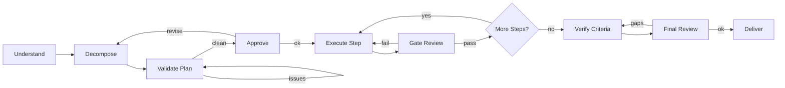

import { Aside, Steps } from '@astrojs/starlight/components';

Workflow for reliable execution of complex, multi-step tasks. It saves the plan and evidence to a disk workspace for context recovery, validates the plan and every step through an **independent reviewer subagent**, and routes failures through bounded retry loops with user escalation. Use for critical tasks where reliability matters.

For simpler tasks, consider [Quick Task](/docs/reference/workflows/quick-task/) instead.

## Start

```bash
mcp__moira__start({ workflowId: "moira/robust-task", parentExecutionId: "none" })
```

## Process

The flow runs seven phases: UNDERSTAND → DECOMPOSE → VALIDATE → APPROVE → EXECUTE → VERIFY → DELIVER.



## Phases

| Phase | Action | Output |
|-------|--------|--------|
| Understand | Collect task description, expected deliverable, constraints, success criteria | Frozen requirements |
| Decompose | Break the task into as many concrete steps as it genuinely needs, each with an `expected_output` | Self-contained plan |
| Validate | Independent reviewer subagent checks plan self-sufficiency, requirements coverage, and standards | Validated plan |
| Approve | User explicitly confirms the plan before execution begins | Approved plan |
| Execute | Execute the current step, produce evidence | Step artifact |
| Verify | Independent gate reviewer judges each step; an independent final review re-derives criteria coverage | Verified result |
| Deliver | Compile the deliverable, summary, and artifact list | Complete deliverable |

## File-Mode-First Workspace

The first step checks whether the agent has file-system access (`Read`/`Write`/`Edit` tools). The rest of the flow adapts to the answer.

**With file access** (preferred), the workflow creates a workspace and works from disk:

- Workspace folder: `./moira-ws/{task-name}-{YYYYMMDD}-{HHMM}/` (path ends with a trailing slash, stored in `workspace_path`).
- The plan lives in `{{workspace_path}}plan.md` (one numbered item per step).
- Requirements are frozen in `{{workspace_path}}task-requirements.md`; the planning standards in `{{workspace_path}}planning-standards.md`; the process ID in `{{workspace_path}}process-id.txt` for recovery after session archival.
- Per-step evidence is written to `{{workspace_path}}step-{{current_step}}/evidence.md`.
- The agent passes **paths, not payloads**: decompose returns `total_steps` and `plan_saved_to_file` — it does NOT echo the plan array back. Reviewers receive file paths and read the artifacts directly.

**Without file access**, the flow falls back to in-context state: the plan lives only in workflow memory. Decompose must return the full `steps[]` array plus `current_step_action` and `current_step_expected_output` for step 1, and each `complete-step` returns the next step's action and expected output.

<Aside type="tip">
Saving the process ID to `process-id.txt` lets a new session resume the same execution after the previous context is archived.
</Aside>

## Decomposition

Decompose produces as many steps as the task genuinely needs — small tasks may have a few, large tasks many. The plan is not padded or truncated to hit a target number; the task's real scope decides.

### Planning Standards (S1–S11)

The decompose and validate steps enforce a single canon of planning standards:

| # | Standard | Rule |
|---|----------|------|
| S1 | Step granularity | One logical unit of work per step; no micro- or mega-steps |
| S2 | Dependencies | Correct order; each step's output enables the next; no cycles |
| S3 | Verifiability | Every step has a measurable `expected_output` |
| S4 | Completeness | Every requirement is covered; each step names the artifacts it produces |
| S5 | Self-sufficiency | Each step carries all info to execute it; no "see previous step"; full paths |
| S6 | Resilience | A step is executable in isolation even if context is lost between steps |
| S7 | Structured reasoning | Chain-of-thought for complex steps; explicit methods and output formats |
| S8 | Success criteria & human-in-the-loop | Criteria defined up front and measurable; plan shown to user; escalation available |
| S9 | Atomicity & redundancy | No global scope — each item restates the nuances it needs and **duplicates** cross-cutting actions (progress report, tests, commit) into every item |
| S10 | Item structure | Each item: name, why, what-to-do with full paths, cross-cutting actions, measurable expected output |
| S11 | No tail degradation | The last items carry the same detail and quality as the first; context volume is no excuse to cut corners |

## Two-Level Independent Review

Verification never relies on the executing agent's own judgment. Two layers of independent review run, plus a light self pre-pass before the final one.

### Per-step gate review

After each step executes, `verify-step-execution` delegates a **gate review** to an independent reviewer subagent (the executor does not review its own work). The reviewer:

- Reads the full plan and the step's evidence directly — no trust in summaries.
- Judges the step for **plan integrity**: does it correctly build on the previous steps and set up the future steps, with no drift, regression, or quality degradation?
- Verifies the evidence fully matches the step's `expected_output` (partial match, no concrete evidence, or missing elements all count as NOT verified).
- Returns `step_verified` (`yes`/`no`), `issues_found`, and `verification_details`.

The reviewer's verdict is authoritative. On `no` (with file access), the issues are written to `{{workspace_path}}step-{{current_step}}/verification-issues.md`.

### Final independent review

When all steps are done, completion verification runs in two passes:

1. `verify-criteria` — a **light self pre-pass**. The agent re-checks every success criterion against the **real artifact** (code, files, command output, tests), one criterion at a time, requiring concrete evidence per criterion. "Looks done" / "should work" / "documented as complete" is a gap, not evidence.
2. `final-review` — an **independent final review**. A reviewer subagent **re-derives** success-criteria coverage from the **frozen requirements** and the **real artifacts** (not the executor's claims), one check per criterion, returning `final_issues_count` (`0` = fully covered) and a flat list of gaps.

If the final review finds gaps, the flow routes to `fix-gaps` and re-verifies.

## Bounded Loops

Every quality loop is bounded by a round counter and escalates to the user instead of looping forever. Each looping step's directive states that re-entry is **expected, not a bug** — the agent must not report a stuck flow.

| Loop | Counter | Limit | On limit |
|------|---------|-------|----------|
| Plan validation | `validation_round` | `max_validation_rounds` | Ask the user whether to continue or proceed |
| Criteria gaps | `criteria_round` | `max_criteria_rounds` | Ask the user whether to continue or proceed |
| Per-step retry | `step_retry` | `max_retries` | Escalate (skip / escalate / revise_plan / reset) |

<Aside type="note">
A looping step's directive opens with "this is a normal quality loop, expected to converge" — seeing the same step again is part of the design, not a fault to report.
</Aside>

## Retry and Escalation

When a step's gate review fails, the per-step retry loop increments `step_retry` and retries with reviewer feedback until `max_retries`. On exhaustion, a Telegram notification fires and the user is asked to choose:

| Decision | Effect |
|----------|--------|
| `skip` | Mark the step skipped, advance the cursor |
| `escalate` | User completes the step manually, then continue |
| `revise_plan` | Revise the plan from the execution problem and restart from step 1 |
| `reset` | Reset the retry counter and try the step again |

## Plan Approval and Revision

At the approval gate, `present-plan` waits for an explicit user `yes`/`no`. Anything other than a pure "yes" — including "Yes, but…" or "Good, just change…" — is treated as `plan_approved: no`, and the flow routes through the **revise-plan branch** (not teleport). The agent records the comments in `revision_feedback` and does not fix the plan itself; the workflow drives the revision.

<Aside type="caution">
Plan rejection uses the revise-plan branch. The `teleport-replan` jump is for mid-execution replanning only, never for rejecting a plan before execution.
</Aside>

## Step-Close Replan (mid-execution)

During execution, if the remaining plan no longer fits what has already been built, the agent uses the `teleport-replan` jump. It does **not** restart from step 1:

<Steps>
1. The current step is closed as-is — recorded honestly, even if partial.
2. Completed steps (1..current) are kept untouched.
3. Any unfinished part of the current step moves forward into a new next step.
4. Only the tail (steps after the current one) is reshaped or extended to fit the revision reason.
5. The steps are recounted and `total_steps` is refreshed.
6. The cursor advances and the revised plan is re-validated.
</Steps>

## Expression-Driven Step Cursor

The engine owns the step counter. Expression nodes advance `current_step` (`current_step = current_step + 1`) and reset `step_retry` to `0`; the agent never does the arithmetic and must not change `current_step` itself. The `check-all-steps-done` condition compares `current_step` against `total_steps` to decide whether to execute the next step or move to completion verification.

```json
{
  "type": "expression",
  "id": "expr-inc-current-step",
  "expressions": [
    "current_step = current_step + 1",
    "step_retry = 0"
  ],
  "connections": { "default": "check-all-steps-done" }
}
```

## Evidence

Each step must produce verifiable evidence, not a "done" claim.

| Evidence type | Example |
|---------------|---------|
| Screenshot | UI state verification |
| File | Created or modified files |
| Link | Published resource URL |
| Description | Detailed account of exactly what was done |

With file access the evidence is written to `{{workspace_path}}step-{{current_step}}/evidence.md`; reviewers read it directly.

## Telegram Notifications

The flow sends a Telegram notification at three points (and continues even if sending fails):

- **Plan ready** — the validated plan is ready for the user to confirm.
- **Escalation** — a step failed after `max_retries` and a decision is required.
- **Completion** — the task is finished and the deliverable is ready.

## Use Cases

- Implement a feature with tests and verification
- Write and publish an article
- Conduct research and produce a report
- Any multi-step task requiring verified completion and recovery after context loss

## Related

- [Quick Task](/docs/reference/workflows/quick-task/) — For simpler tasks
- [Content Creation](/docs/reference/workflows/content-creation/) — For text content creation
- [Verified Research](/docs/reference/workflows/verified-research/) — For research with verified sources
- [Workflow Templates Overview](/docs/reference/workflow-templates/) — All available templates
