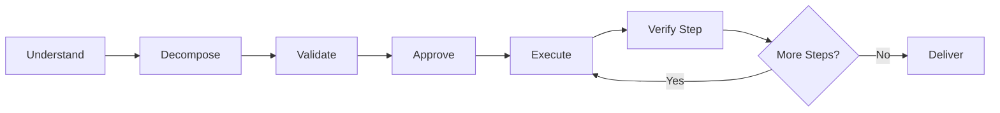

import { Aside } from '@astrojs/starlight/components';

Workflow for reliable execution of complex, multi-hour tasks with full infrastructure: context saving, retry with escalation, mandatory evidence requirements. Use for critical tasks requiring reliability.

For simpler tasks (2-10 steps), consider [Quick Task](/docs/reference/workflows/quick-task/) instead.

## Start

```bash
mcp__moira__start({ workflowId: "moira/robust-task", parentExecutionId: "none" })
```

## Process



## Steps

| Step | Action | Output |
|------|--------|--------|
| 1. Understand | Collect requirements: task, deliverable, constraints, success criteria | Clear task definition |
| 2. Decompose | Break into 3-10 concrete steps with expected_output | Self-sufficient step list |
| 3. Validate | Automatic check for step self-sufficiency | Validated plan |
| 4. Approve | User confirms plan before execution | Approved plan |
| 5. Execute | Execute each step with evidence | Step artifacts |
| 6. Verify Step | Verify each step against expected_output | Verified completion |
| 7. Deliver | Final result with all evidence | Complete deliverable |

## Features

<Aside type="tip">
Plan is saved to `./claude-temp-files/plan-{timestamp}.md` for session recovery.
</Aside>

### Self-Sufficient Steps

Each step contains all information needed for execution without full plan context:
- File paths and locations
- Specific actions to perform
- Expected output format

### Evidence Required

| Evidence Type | Example |
|--------------|---------|
| Screenshot | UI state verification |
| File | Created or modified files |
| Link | Published resource URL |
| Description | Detailed completion report |

### Retry with Escalation

- Up to 3 attempts per step
- On failure: user chooses `skip` / `escalate` / `revise_plan`
- `revise_plan` returns to planning phase with issue context

<Aside type="caution">
If user provides feedback instead of approval ("Yes, but..." or "OK, just change..."), agent responds with `plan_approved: no` and workflow routes through plan revision.
</Aside>

### User Approval Gates

- **Plan approval**: Required before execution begins
- **Escalation decisions**: User controls failure handling

## Example Node Configuration

```json
{
  "id": "execute-step",
  "type": "agent-directive",
  "directive": "Execute step {{current_step_number}}: {{current_step_description}}. Provide evidence of completion.",
  "completionCondition": "Step executed with verifiable evidence matching expected_output",
  "connections": {
    "next": "verify-step"
  }
}
```

## Use Cases

- Write and publish article
- Conduct research with report
- Implement feature with tests
- Prepare presentation
- Any task with 3+ steps requiring verified completion

## Related

- [Quick Task](/docs/reference/workflows/quick-task/) — For simpler tasks (2-10 steps)
- [Content Creation](/docs/reference/workflows/content-creation/) — For text content creation
- [Verified Research](/docs/reference/workflows/verified-research/) — For research with verified sources
- [Workflow Templates Overview](/docs/reference/workflow-templates/) — All available templates
