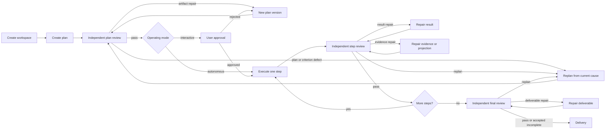

import { Aside, Steps } from '@astrojs/starlight/components';

Robust Task runs complex multi-step work from a durable filesystem workspace. The executor owns a complete coherent result; independent reviewers classify blocking findings by their earliest cause and route them to repair or replanning. Immutable plans, attempts, decisions, and reviews make the run recoverable after context loss, while bounded repair prevents unresolved work from being reported as complete.

The workflow requires an agent with filesystem access. For smaller bounded tasks, use [Quick Task](/docs/reference/workflows/quick-task/).

## Start

```bash
mcp__moira__start({ workflowId: "moira/robust-task", parentExecutionId: "none" })
```

## Process


```mermaid
flowchart LR
    A[Create workspace] --> B[Create plan]
    B --> C[Independent plan review]
    C -->|artifact repair| D[New plan version]
    C -->|plan or criterion defect| R[Replan from current cause]
    D --> C
    R --> C
    C -->|pass| M{Operating mode}
    M -->|interactive| E[User approval]
    M -->|autonomous| F
    E -->|rejected| D
    E -->|approved| F[Execute one step]
    F --> G[Independent step review]
    G -->|result repair| Q[Repair result]
    G -->|evidence repair| P[Repair evidence or projection]
    Q --> G
    P --> G
    G -->|replan| R
    G -->|pass| H{More steps?}
    H -->|yes| F
    H -->|no| J[Independent final review]
    J -->|deliverable repair| L[Repair deliverable]
    J -->|replan| R
    L --> J
    J -->|pass or accepted incomplete| K[Delivery]
```

## Durable workspace

The first directive creates or resumes one workspace whose path matches:

```text
./moira-ws/<task-name>-<YYYYMMDD>-<HHMM>/
```

The workspace is correlated with the execution by `process-id.txt`. It also contains:

- `task-requirements.md` — the frozen active request;
- `workflow-guide.md` — concise rules for recovery, planning, evidence, and review;
- `plans/NNN/plan.md` — complete immutable plan versions;
- `plans/NNN/review.md` — the independent review of that exact plan version;
- `plans/NNN/repair.md` — a repair-owner reassessment when the reviewed cause is not locally repairable;
- `plans/NNN/decision.md` — the user's exact approval or rejection;
- `steps/<step>/plans/<plan-version>/attempts/<attempt>/evidence.md` — evidence for one exact execution attempt;
- `verdict.md` beside each evidence file — its independent gate review;
- `repair.md` beside a failed attempt — the exact repair or reassessment record;
- `final/reviews/` — immutable final reviews, fix evidence, and reassessments;
- `final/delivery.md` — the truthful final result.

Directives pass paths and small routing values through workflow context. They do not relay file bodies that the agent can read from the workspace. When a directive refers to a file the agent just wrote, the path remains the authority; the agent can reuse its current context or read the file again after context recovery.

<Aside type="tip">
`process-id.txt` and the durable artifacts let a later agent session resume the same execution with `session({ action: "current_step", executionId })`.
</Aside>

## Planning and approval

Planning is goal-first: the plan contains as many substantive steps as the task needs. Each step gives an executor its purpose, relevant context, expected result, and a fitting acceptance gate without mechanically scripting intellectual work, and fixes that outcome rather than carrying the deliverable itself: after the plan is approved, work an intelligent executor still has to do remains. The rule matters most where the result is prose — a document, briefs for other agents, an investigation's answer — because there plan and result share a medium and nothing separates them by construction. The repair node that precedes approval answers for the whole plan; the four nodes that reshape a plan mid-run answer for the steps they shape, because completed steps stay as they were executed.

An independent peer reviews the complete current plan against the frozen requirements, primary sources, and real project context. For each blocker it identifies the earliest cause: workflow artifact, validation or test, insufficient evidence, documentation or projection, an invalid or unprovable criterion, or the upstream plan/process. It returns `pass`, `repair`, or `replan`. Local repair is allowed only when the plan artifact owns every blocker; other or mixed causes return to planning.

A repair never overwrites the reviewed plan. It first reproduces the problem, then returns `changed` with the next `plans/NNN/plan.md`, or `reassess` with `plans/NNN/repair.md` when the finding cannot honestly be repaired in place. Each direct review and repair reassessment has a separate replan consumer, so a historical reassessment cannot become the cause of a later transition merely because its file still exists.

The automatic plan-review cycle is bounded by `max_review_rounds` (default `5`). At the bound, the user or autonomous agent explicitly chooses another justified repair or truthful incomplete delivery; a blocked plan is never promoted by counter exhaustion. In interactive mode execution starts only after unconditional approval of the exact plan. Rejection creates another plan version and returns it to review.

## Operating mode

The first step resolves `operating_mode` as `autonomous` or `interactive`. The agent reuses a mode you already stated, infers an unambiguous one — including a run started by an already autonomous parent process — and asks once only when the mode is neither stated nor derivable.

In `interactive` mode everything above is unchanged. In `autonomous` mode the plan-approval gate is bypassed and every bounded decision is made by the agent on evidence: another repair pass only for findings that are reproducible and repairable now, a retry only when something material changed, a replan when the failure invalidates the plan rather than the attempt, and otherwise recorded incompleteness. The independent reviews, the retry and review bounds, the replan routes and the durable records are identical in both modes, and accepted gaps stay visible in the delivery — autonomy removes the waiting, not the honesty.

## Execution progress

The execution card and exported progress image share one six-stage presentation: Intake → Plan → Execute → Step Review → Final Review → Deliver. All 23 user-visible waiting responsibilities, including the jump-only replan entry and every repair, recovery, and replan role, map to one stage. The presentation adds no executable route, counter, authority decision, or proof mechanism.

Each stage shows its stable purpose, the exact current responsibility, the latest confirmed semantic outcome, and the next meaningful action. The role that owns a result replaces one bounded outcome instead of appending history: intake owns the resolved contract, plan roles own the current plan synopsis and disposition, execution owns the latest plan-qualified attempt, each review family owns its current disposition, and delivery owns the truthful terminal result. Active labels describe current work without hiding the last confirmed outcome.

Every directive that reasons about a plan reads the authoritative path `{{workspace_path}}{{current_plan_file}}`. When repair, user revision, teleport, or a cause-specific replan creates a replacement plan, that writer atomically replaces Plan, Execute, Step Review, and Final Review projections with only the completed prefix that is still true or a pending state. This prevents outcomes from different plan revisions from being mixed. Progress values remain render-only; primary conditions, connections, retry budgets, the execution cursor, approvals, and side-effect authority continue to come from ordinary workflow state.

## Step execution and review

The engine owns the one-based `current_step` cursor. For each plan step:

<Steps>
1. The executor reads the current plan, frozen requirements, and relevant earlier evidence or decisions.
2. It performs only the current step and writes a new plan-qualified `evidence.md`; earlier attempts remain intact.
3. An independent peer reads the primary result, evidence, requirements, and plan, then writes `verdict.md` beside that evidence. It returns `pass`, `repair`, or `replan`; a repair also names `result` or `evidence_projection` as its owner.
4. A result-owned repair reproduces the defect before changing the result and consumes retry budget only after a substantive changed attempt. An evidence/projection repair keeps an already-correct result intact and returns directly to the same reviewer without spending a product retry.
5. If repair discovers a plan, criterion, ownership, or evidence-method defect, it returns `reassess` and replans from that exact current cause. A repeated root requires stronger knowledge or replanning rather than another layer of the same mechanism.
6. A passed verdict advances the cursor.
</Steps>

`step_retry` controls the substantive result-repair budget; it is not the durable attempt directory number and evidence/projection corrections do not increment it. When `max_retries` changed result repairs have been consumed (default `3`), the user or autonomous agent chooses one of three outcomes:

| Decision | Effect |
|----------|--------|
| `retry` | Retry only with changed input, a new hypothesis, changed external state, or concrete new work/evidence |
| `replan` | Preserve completed steps and reshape the open step and unfinished tail |
| `finish_incomplete` | Stop further execution and automatic repair, then deliver the exact unresolved scope as incomplete |

The decision is stored under `steps/<step>/decisions/NNN.md`. A replan may change frozen requirements only when that same user decision explicitly names and authorizes the change and reason.

The `teleport-replan` node is also available when the agent discovers during execution that the current plan no longer fits the real work. It preserves completed steps and sends the new complete plan through review and approval.

## Final review

After all planned steps close, one independent `final-review` re-derives the active obligations from the frozen requirements, approved plan, real deliverable, primary artifacts, accepted step records, and authorized decisions. It does not rely on a producer-authored completeness claim or duplicate the same semantic gate. Mechanical checks support only properties they can distinguish; semantic completeness and architecture require judgment over the real artifacts.

The reviewer returns `pass`, `repair`, or `replan`. A local repair names either `deliverable` or `evidence_projection` ownership. The repair owner reproduces the current finding before mutation and returns `changed` to the same reviewer, or `reassess` when the plan, criterion, evidence method, or ownership must change. Direct final-review replans and reassessment replans consume separate current-cause paths.

The cycle uses `max_review_rounds`. At the bound, the user or autonomous agent may authorize another justified repair or explicitly accept the exact remaining scope as incomplete. Counter exhaustion never converts an unresolved finding into a pass.

## Result

`final/delivery.md` is derived from the frozen requirements, current approved plan, durable step records, reviews, authorized requirement changes, and incomplete-acceptance decisions. `delivery_status` is `complete` only when no active obligation remains unresolved; otherwise it is `incomplete` and the unresolved scope is disclosed.

The End node returns exactly:

```json
{
  "workspace_path": "./moira-ws/.../",
  "delivery_file": "final/delivery.md",
  "delivery_status": "complete | incomplete",
  "summary": "Concise truthful terminal summary"
}
```

Telegram notifications announce plan readiness, exhausted step retries, and completion. Notification failure does not stop the workflow.

## Use cases

- complex implementation or refactoring with several dependent stages;
- work that must survive agent-context loss;
- tasks requiring durable per-attempt evidence and independent gates;
- critical work where unresolved obligations must not be silently treated as complete.

## Related

- [Quick Task](/docs/reference/workflows/quick-task/) — smaller bounded tasks
- [Workflow Templates Overview](/docs/reference/workflow-templates/) — all bundled workflows
