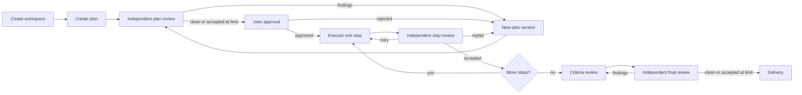

import { Aside, Steps } from '@astrojs/starlight/components';

Robust Task runs complex multi-step work from a durable filesystem workspace. It preserves every plan version and execution attempt, uses independent reviews before approval and after work, and asks the user for a decision when an automatic repair or retry budget is exhausted.

The workflow requires an agent with filesystem access. For smaller bounded tasks, use [Quick Task](/docs/reference/workflows/quick-task/).

## Start

```bash
mcp__moira__start({ workflowId: "moira/robust-task", parentExecutionId: "none" })
```

## Process


```mermaid
flowchart LR
    A[Create workspace] --> B[Create plan]
    B --> C[Independent plan review]
    C -->|findings| D[New plan version]
    D --> C
    C -->|clean or accepted at limit| E[User approval]
    E -->|rejected| D
    E -->|approved| F[Execute one step]
    F --> G[Independent step review]
    G -->|retry| F
    G -->|replan| D
    G -->|accepted| H{More steps?}
    H -->|yes| F
    H -->|no| I[Criteria review]
    I --> J[Independent final review]
    J -->|findings| I
    J -->|clean or accepted at limit| K[Delivery]
```

## Durable workspace

The first directive creates or resumes one workspace whose path matches:

```text
./moira-ws/<task-name>-<YYYYMMDD>-<HHMM>/
```

The workspace is correlated with the execution by `process-id.txt`. It also contains:

- `task-requirements.md` — the frozen active request;
- `workflow-guide.md` — concise rules for recovery, planning, evidence, and review;
- `plans/NNN/plan.md` — complete immutable plan versions;
- `plans/NNN/review.md` — the current independent review of that plan version;
- `plans/NNN/decision.md` — the user's exact approval or rejection;
- `steps/<step>/plans/<plan-version>/attempts/<attempt>/evidence.md` — evidence for one exact execution attempt;
- `verdict.md` beside each evidence file — its independent gate review;
- `final/criteria/` and `final/reviews/` — versioned completion reviews and repair records;
- `final/delivery.md` — the truthful final result.

Directives pass paths and small routing values through workflow context. They do not relay file bodies that the agent can read from the workspace. When a directive refers to a file the agent just wrote, the path remains the authority; the agent can reuse its current context or read the file again after context recovery.

<Aside type="tip">
`process-id.txt` and the durable artifacts let a later agent session resume the same execution with `session({ action: "current_step", executionId })`.
</Aside>

## Planning and approval

Planning is goal-first: the plan contains as many substantive steps as the task needs. Each step gives an executor its purpose, relevant context, expected result, and a fitting acceptance gate without mechanically scripting intellectual work.

An independent peer reviews the complete current plan against the frozen requirements and real project context. Only reproducible blocking defects count. A repair never overwrites the reviewed plan: it creates the next `plans/NNN/plan.md`, then the new version is reviewed.

The automatic plan-review cycle is bounded by `max_review_rounds` (default `5`). At the bound, the user explicitly chooses whether to continue repair or accept the reviewed plan for the separate approval gate. Execution starts only after the user unconditionally approves the exact plan. Rejection creates another plan version and returns it to review.

## Operating mode

The first step resolves `operating_mode` as `autonomous` or `interactive`. The agent reuses a mode you already stated, infers an unambiguous one — including a run started by an already autonomous parent process — and asks once only when the mode is neither stated nor derivable.

In `interactive` mode everything above is unchanged. In `autonomous` mode the plan-approval gate is bypassed and every bounded decision is made by the agent on evidence: another repair pass only for findings that are reproducible and repairable now, a retry only when something material changed, a replan when the failure invalidates the plan rather than the attempt, and otherwise recorded incompleteness. The independent reviews, the retry and review bounds, the replan routes and the durable records are identical in both modes, and accepted gaps stay visible in the delivery — autonomy removes the waiting, not the honesty.

## Step execution and review

The engine owns the one-based `current_step` cursor. For each plan step:

<Steps>
1. The executor reads the current plan, frozen requirements, and relevant earlier evidence or decisions.
2. It performs only the current step and writes a new plan-qualified `evidence.md`; earlier attempts remain intact.
3. An independent peer reads the evidence, real artifact, requirements, and plan, then writes `verdict.md` beside that evidence.
4. An accepted verdict advances the cursor. A rejected verdict either retries the same step or requests a new plan when the defect cannot be solved by retrying.
</Steps>

`step_retry` controls the escalation budget; it is not the durable attempt directory number. After `max_retries` failed gates (default `3`), the user chooses one of three outcomes:

| Decision | Effect |
|----------|--------|
| `retry` | Retry only with changed input, a new hypothesis, changed external state, or concrete new work/evidence |
| `replan` | Preserve completed steps and reshape the open step and unfinished tail |
| `finish_incomplete` | Stop further execution and automatic repair, then deliver the exact unresolved scope as incomplete |

The decision is stored under `steps/<step>/decisions/NNN.md`. A replan may change frozen requirements only when that same user decision explicitly names and authorizes the change and reason.

The `teleport-replan` node is also available when the agent discovers during execution that the current plan no longer fits the real work. It preserves completed steps and sends the new complete plan through review and approval.

## Completion reviews

After all planned steps close, Robust Task performs two different checks:

1. `verify-criteria` checks every active success criterion and goal facet against the real deliverable, using mechanical checks only for properties they actually prove. It writes the next `final/criteria/NNN-review.md`.
2. `final-review` delegates an independent re-derivation of completeness from the requirements, approved plan, real deliverable, step records, and latest criteria review. It writes the next `final/reviews/NNN-review.md`.

Confirmed findings are repaired in the real artifact and recorded in a new fix file. Criteria are checked again before the next independent final review, so delivery never relies on a report produced before the latest repair.

Criteria and final-review repair cycles use the same `max_review_rounds` bound. At a bound, the user explicitly chooses continued repair or acceptance of the exact remaining scope as incomplete. Accepted gaps stay visible in later reports and in delivery.

## Result

`final/delivery.md` is derived from the frozen requirements, current approved plan, durable step records, reviews, authorized requirement changes, and incomplete-acceptance decisions. `delivery_status` is `complete` only when no active obligation remains unresolved; otherwise it is `incomplete` and the unresolved scope is disclosed.

The End node returns exactly:

```json
{
  "workspace_path": "./moira-ws/.../",
  "delivery_file": "final/delivery.md",
  "delivery_status": "complete | incomplete",
  "summary": "Concise truthful terminal summary"
}
```

Telegram notifications announce plan readiness, exhausted step retries, and completion. Notification failure does not stop the workflow.

## Use cases

- complex implementation or refactoring with several dependent stages;
- work that must survive agent-context loss;
- tasks requiring durable per-attempt evidence and independent gates;
- critical work where unresolved obligations must not be silently treated as complete.

## Related

- [Quick Task](/docs/reference/workflows/quick-task/) — smaller bounded tasks
- [Workflow Templates Overview](/docs/reference/workflow-templates/) — all bundled workflows
