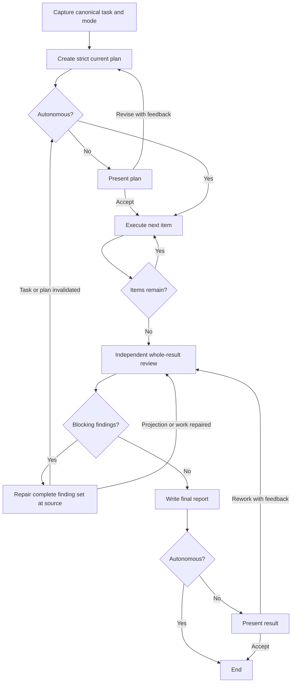

import { Aside } from '@astrojs/starlight/components';

`moira/simple-plan-execution` executes a bounded general-purpose task through one strict current plan. It is the smallest public workflow that combines plan creation, optional plan approval, sequential evidence-backed work, independent whole-result review, changed repair, and a final report without imposing a software-development-specific lifecycle.

## Start

```js
mcp__moira__start({
  workflowId: "moira/simple-plan-execution",
  parentExecutionId: "none"
})
```

The workflow resolves four inputs from the triggering conversation:

- a complete bounded task description;
- an observable whole-task expected result;
- `autonomous` or `interactive` operation;
- a traversal-safe workspace path derived from the execution ID.

Already supplied facts are reused. The agent asks only for a material unknown that cannot be discovered. The operating mode is fixed once for the complete run.

## When to choose this workflow

Choose Simple Plan Execution when you need a general plan-first executor and only the current accepted state must remain durable.

| Need | Workflow |
| --- | --- |
| Create and execute one current plan with evidence and independent review | **Simple Plan Execution** |
| Execute a checklist that the caller already supplied | [Todo List](./todo-list/) |
| Preserve immutable plan, review, and decision iterations | [Quick Task](./quick-task/) |
| Add durable attempts, checkpoints, retries, and recovery | [Robust Task](./robust-task/) |
| Implement a software change with its tests, documentation, review, and authority-bound local VCS closure | [Software Development Flow](/docs/reference/workflow-templates/#software-development-flow) |

<Aside type="note">
Do not split one software-development lifecycle into separate Simple Plan Execution runs for implementation, tests, documentation, and delivery. Use a development workflow that owns those connected responsibilities and their final guarantee.
</Aside>

## Process



The plan contains 1–100 ordered items. Every item has a pairwise-unique stable ID, a bounded action, and an observable expected result. `plan.json` is the exact durable projection of the canonical runtime plan; the engine derives its length and owns the zero-based execution cursor.

For each item, the execution responsibility:

- acts only on the current item;
- chooses tools and checks appropriate to the actual task and project;
- verifies the expected result with evidence that distinguishes success from a similar failure;
- appends one complete evidence record before returning success;
- cannot submit a schema-valid “failed but advance” response.

The engine advances the cursor exactly once after that closed success response. A blocked or unevidenced item remains current.

## Operating modes

Both modes retain the same plan, execution, review, repair, reporting, blocker, and authority guarantees.

| Mode | User waits |
| --- | --- |
| `autonomous` | Skips plan presentation and the final acceptance question |
| `interactive` | Requires explicit plan acceptance and final result acceptance; revision or rework requires non-empty feedback |

Autonomous mode is not weaker review and does not grant additional side-effect authority.

## Durable current-state artifacts

One safe workspace named `./moira-ws/simple-plan-execution-<execution-id>` contains fixed files:

| File | Role |
| --- | --- |
| `task.md` | Exact durable projection of the canonical task description and expected result |
| `plan.json` | Exact JSON projection of the current strict ordered plan |
| `execution-evidence.md` | Current one-to-one item evidence: action, expected and actual result, verification, and concrete evidence |
| `review.md` | Complete current independent blocking finding set |
| `final-report.md` | Truthful zero-reviewed result, evidence locations, and real limitations |

These are current-state artifacts. This workflow does not preserve immutable plan or decision history; choose Quick Task when that history is required.

## Safe plan revision during execution

A guarded teleport is available only when the plan becomes demonstrably wrong, incomplete, or obsolete during execution. It accepts one complete replacement plan and the existing resume cursor. Every completed item before the cursor must retain the same ID, content, order, and evidence correspondence; only the remaining suffix may change. The replacement returns through the mode gate before execution resumes.

The teleport is not an escape from a failed item, a review finding, missing evidence, approval, or authority. Review findings use the repair owner described below.

## Independent review and changed repair

After all current items, a reviewer in a separate host-supported context reads the canonical execution context, all current files, actual task result or project state, the originating request, and applicable primary instructions directly. The reviewer blocks:

- task or plan projection disagreement;
- duplicate plan IDs or ambiguous ID-to-evidence correspondence;
- incomplete task coverage;
- missing, stale, out-of-order, or non-discriminating evidence;
- an unmet item or whole-task expected result;
- expanded authority.

Only an exact zero finding count reaches reporting. A non-zero result enters one changed-repair owner, which reproduces and fixes the complete current finding set before reporting its actual reach:

- `projection` repairs files to unchanged canonical values and returns directly to review;
- `work` changes actual work and current evidence, repairs accompanying projection mismatch, and returns directly to review;
- `plan` changes the canonical plan and projection, invalidates stale evidence from the earliest affected item, resets the cursor there, and re-executes the affected suffix;
- `task` corrects canonical task capture to the unchanged originating request, regenerates the plan, invalidates affected evidence, resets the cursor, and re-enters plan and execution gates.

There is no fixed review-pass limit or route that converts known findings into successful delivery. An unchanged, non-reproducible, or unauthorized repair must stop with a factual blocker.

## Result and authority limits

After zero review, `final-report.md` records the verified result, inspection locations, and limitations. The terminal projection contains only:

- `workspace_path` — where the five current artifacts can be read;
- `result_summary` — a bounded discovery summary.

The workflow inherits authority from the originating request and applicable instructions. Plan acceptance and autonomous mode do not authorize destructive, external, production, publication, administrative, financial, privacy-sensitive, or materially different actions. Commits, tests, publication, deployment, and particular tools are used only when the actual authorized task and project require them.

## Related

- [Todo List](./todo-list/) — execute a caller-supplied checklist
- [Quick Task](./quick-task/) — preserve immutable plan and decision history
- [Robust Task](./robust-task/) — add retry, checkpoint, and recovery semantics
- [Software Development Flow](/docs/reference/workflow-templates/#software-development-flow) — own a complete implementation lifecycle
- [Ready Workflows](./) — compare public workflows
