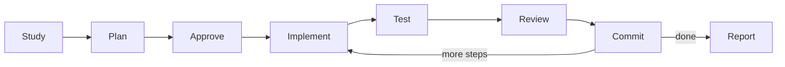

import { Aside } from '@astrojs/starlight/components';

Lightweight version of the full Software Development Flow. Designed for small features requiring 1-5 implementation steps with iterative plan-implement-test-review cycle.

<Aside type="tip">
Use this workflow for small features, quick fixes, and simple tasks that need structured development with tests. For larger features (5+ steps), use [Software Development Flow](/docs/reference/workflow-templates/#software-development-flow).
</Aside>

## Start

```bash
mcp__moira__start({ workflowId: "moira/software-development-flow-lite", parentExecutionId: "none" })
```

## Process



## Phases

| Phase | Action | Output |
|-------|--------|--------|
| 1. Project Study | Analyze project structure, codebase, patterns | Project context |
| 2. Task Requirements | Define scope, complexity, acceptance criteria | Task definition |
| 3. Development Plan | Create iterative plan with step-by-step breakdown | Approved plan |
| 4. Implementation Loop | For each step: implement → test → quality check → gate review → commit | Working code |
| 5. Final Report | Summary with evidence and documentation update | Delivered feature |

## Features

### Iterative Implementation

Each plan step goes through a validation cycle:
- Implement the step
- Run all tests
- Check code quality (15 standards)
- Gate review by subagent
- Commit with meaningful message

### Plan Review

Before implementation, a subagent reviewer validates the plan for:
- Completeness of task coverage
- Step granularity and independence
- Consistency with project patterns

### Numerical Checks

Evidence-based validation at each step:
- Test pass count (passed/failed)
- Quality standards met (out of 15)
- Gate review issues (blocking/non-blocking)

## When to Use

- Small features with 1-5 implementation steps
- Bug fixes requiring structured approach
- Quick enhancements with test coverage
- Tasks where full SDF overhead is unnecessary

## When to Use Full SDF Instead

- Features with 5+ implementation steps
- Complex multi-component changes
- Tasks requiring extensive project study phases
- Features with significant architectural impact

## Example Node Configuration

```json
{
  "id": "implement-step",
  "type": "agent-directive",
  "directive": "Implement current plan step completely and with quality.",
  "completionCondition": "Step implemented, working functionality created and tested",
  "connections": {
    "success": "run-all-tests"
  }
}
```

## Related

- [Software Development Flow](/docs/reference/workflow-templates/#software-development-flow) — Full development cycle for larger features
- [Quick Task](/docs/reference/workflows/quick-task/) — For non-development multi-step tasks
- [Workflow Templates Overview](/docs/reference/workflow-templates/) — All available templates
