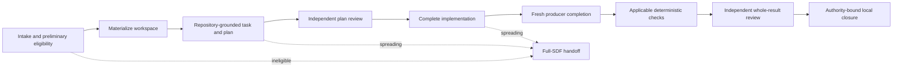

import { Aside } from '@astrojs/starlight/components';

`moira/software-development-flow-lite` delivers one coherent, bounded repository change with the applicable implementation, tests, documentation, integration consequences, validation, independent semantic review, repair, and local VCS closure. It reduces agent turns for genuinely lightweight work; it does not lower the product or evidence bar.

<Aside type="tip">
Choose Lite because the change has low uncertainty and bounded impact, not because it mentions few files. Use the full Software Development Flow when work affects security or privacy boundaries, persistent data or migrations, breaking public contracts, several independent vertical outcomes, cross-repository coordination, complex rollout/rollback, or unresolved architecture.
</Aside>

## Start

```typescript
mcp__moira__start({
  workflowId: "moira/software-development-flow-lite",
  parentExecutionId: "none",
});
```

The originating request remains the authority ceiling. Starting the workflow does not authorize a commit, push, pull request, release, deployment, notification, destructive operation, production mutation, administrative override, or access to additional data.

## Process


```mermaid
flowchart LR
    A[Intake and preliminary eligibility] --> B[Materialize workspace]
    B --> C[Repository-grounded task and plan]
    C --> D[Independent plan review]
    D --> E[Complete implementation]
    E --> F[Fresh producer completion]
    F --> G[Applicable deterministic checks]
    G --> H[Independent whole-result review]
    H --> I[Authority-bound local closure]
    A -. ineligible .-> J[Full-SDF handoff]
    C -. spreading .-> J
    E -. spreading .-> J
```

Autonomous mode skips the intermediate plan and result approval waits only. Interactive mode retains approve, revise, rework, and abort decisions. Both modes keep eligibility, validation, independent review, repair, reassessment, and authority boundaries.

## Lite eligibility

An eligible task has one coherent implementation outcome, known project policy, bounded dependencies, low architectural uncertainty, and a contained recovery surface. The workflow examines blast radius, independent outcomes, architecture, security/privacy/data risk, public compatibility, rollout, and recoverability.

If repository inspection or implementation reveals that the task no longer fits, Lite writes a durable handoff instead of claiming completion or automatically starting another workflow. The handoff preserves:

- the original goal and authority;
- repository evidence and current VCS state;
- completed safe work;
- unresolved obligations and risks;
- the concrete reason full SDF is required.

## Durable artifacts

The engine materializes one execution-correlated directory:

```text
./moira-ws/software-development-flow-lite-<executionId>/
```

It contains canonical files for the task contract, current plan and plan review, implementation and validation evidence, semantic findings, repair account, possible full-SDF handoff, and final report. Detailed bodies remain in those files rather than being copied through workflow context.

The terminal result exposes a validated `final-report.md` or `handoff.md` path beneath that directory, not an agent-selected workspace path.

## Planning and production

Planning is proportionate: a small task may have one item. The plan states the outcome, observable acceptance, dependencies, risks, applicable evidence, and authority without prescribing implementation files, commands, fixed item counts, time estimates, or a universal project layout.

An independent reviewer must clear the plan before mutation. One producer then owns the complete applicable result across code, tests, coverage, documentation, schemas/types, generated/configuration output, compatibility, and integrations. A fresh producer completion pass examines the actual full diff and closes ordinary omissions before any validation gate.

## Evidence, review, and repair

Deterministic checks are selected from the actual repository and changed behavior. Browser, service, performance, and full-suite checks remain conditional. Mechanical success proves only what the check observes; it does not prove architecture or semantic completeness.

The whole-result reviewer reads the original task, accepted plan, real diff, affected primary sources, implementation evidence, validation results, tests, and documentation. It classifies findings before mutation:

- product repair returns through producer completion;
- test, fixture, evidence, or projection repair returns through applicable validation;
- a stronger test that reveals a product defect returns to product ownership;
- an invalid task interpretation, eligibility decision, criterion, authority, or evidence model enters contract reassessment;
- spreading work becomes a full-SDF handoff;
- an irreducible prerequisite becomes blocked.

Repeated findings require changed source knowledge or a new discriminating hypothesis. The workflow does not use semantic scores, arbitrary retry ceilings, proof tokens, validator-for-validator machinery, or automatic notification loops.

## VCS and outcomes

A local commit is attempted only when the originating request already authorizes it and only after the current bytes pass independent review. Lite never implies push, PR, release, or deployment.

Terminal outcomes are distinct:

| Outcome | Meaning |
| --- | --- |
| `complete` | The bounded result and applicable evidence passed independent review; local VCS state is reported truthfully |
| `handoff` | Lite eligibility was lost and `handoff.md` is ready for a separately authorized full SDF run |
| `blocked` | A factual prerequisite, evidence, authority, repair, or required VCS closure remains unresolved |
| `aborted` | An interactive user explicitly stopped the run |

## Choose a neighboring workflow

- [Software Development Flow](/docs/reference/workflow-templates/#software-development-flow) — high-risk, spreading, multi-unit, migration, breaking-contract, or rollout-heavy software delivery.
- [Quick Task](/docs/reference/workflows/quick-task/) — bounded non-development work with immutable plan and review history.
- [Robust Task](/docs/reference/workflows/robust-task/) — complex general work needing durable retry and recovery rather than a software lifecycle.
- [Workflow Management Flow](/docs/reference/workflow-templates/#workflow-management-flow) — create or edit a Moira workflow definition itself.
