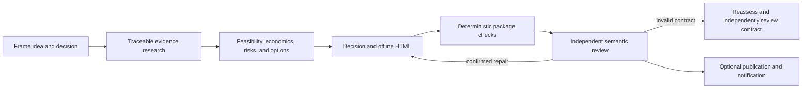

Startup Idea Validation turns a free-form startup idea into a durable decision package. It frames the decision, researches current evidence, evaluates feasibility and options, produces a self-contained offline HTML report, validates observable package properties, and requires genuinely independent semantic review.

Use it when the requested result is a decision about an idea—not implementation or a generic research report. The recommendation may be to proceed, proceed conditionally, run an experiment, reframe or pivot, pause, or stop.

## Start

```bash
mcp__moira__start({ workflowId: "moira/startup-idea-validation", parentExecutionId: "none" })
```

The input is the idea in free form. The first step reuses supplied scope, constraints, operating mode, and any publication or notification authority. It asks only when a missing fact materially changes the analysis and cannot be discovered safely.

## Process



Research covers problem and demand, market, alternatives and competitors, technical feasibility, delivery and operating economics, required capabilities, material regulation and risk, business-model alternatives, and practical experiments. Scope follows the idea and available evidence; the workflow does not force competitor counts, market thresholds, universal rates, budgets, timelines, or confidence scores.

Current claims are linked and dated. Calculations and estimates show inputs, method, range, relevant geography/currency/date, and uncertainty. Missing or contradictory evidence remains a limitation or blocker rather than invented precision. High-stakes questions are risk discovery that may require qualified review, not professional clearance.

## Workspace and output

Each execution materializes `./moira-ws/startup-idea-validation-<executionId>/` with canonical framing, source register, research, feasibility/options, decision, validation, independent-review, repair, HTML, and final-report files. Detailed bodies stay on disk instead of being duplicated through workflow context.

`report.html` embeds its assets and requires no CDN, network request, form submission, or hidden local runtime. It separates sourced facts, calculations, estimates, hypotheses, assumptions, uncertainty, contradictions, limitations, risks, blockers, and next experiments.

## Review and repair

Deterministic checks cover properties they can observe, such as required files, source-register shape, parsable HTML, and forbidden external runtime dependencies. They do not prove business provenance, feasibility, completeness, or recommendation fitness.

An independent reviewer reads the complete package and primary evidence. Findings are classified before mutation. Package repair returns through completion and all stale gates; evidence repair repeats every evidence-dependent analysis. Invalid criteria or mixed causes go through contract reassessment and an independent corrected-contract review. Unavailable genuine independence ends blocked without claiming review occurred.

## Modes and authority

- `autonomous` skips clarification and final acceptance waits only.
- `interactive` can request material clarification and route accepted-result feedback to the earliest stale owner.
- Publication and Telegram notification are separate optional effects. Tool availability is not authority.
- An undecided autonomous run stays local and sends no notification.
- Upload or notification failure preserves the accepted local package and is reported separately.

## Outcomes

- `complete`: the local package passed applicable checks and independent review; optional-effect states are reported truthfully.
- `blocked`: input, evidence, validation, review, or another prerequisite prevents responsible completion.
- `aborted`: the interactive user explicitly stops the run.

## Related

- [Verified Research](./verified-research/) — a bounded source-verified research report without startup decision synthesis.
- [PRD Creation](./prd-creation/) — requirements for a product after the decision to define it.
- [Robust Task](./robust-task/) — general complex work requiring durable recovery.
