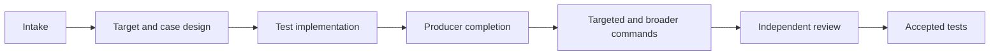

Test Generation adds or updates executable tests for one authorized target in an existing project.

```bash
mcp__moira__start({ workflowId: "moira/test-generation", parentExecutionId: "none" })
```

Use it when the deliverable is test code. Use [Test Planning](/docs/reference/workflows/test-planning/) for strategy without implementation, Test Suite Audit for evaluating an existing suite, or Software Development Flow when production code must change.

The workflow materializes a durable workspace, inspects real target behavior and project test patterns, designs behavioral/risk/boundary cases, writes accepted tests and necessary test-side fixtures/configuration into authorized project paths, performs producer completion before commands, runs targeted and broader project gates, and obtains genuinely independent semantic review.



Tests must protect observable behavior and plausible regressions. Existing project mutation tooling may be used when authorized; absence of it is not a defect. The workflow never edits production code or creates proof-only proxies, guards, metatests, adapters, or mutation harnesses merely to demonstrate failure sensitivity.

Test-code and evidence defects have separate repair owners. Production/testability implementation yields a durable Software Development Flow handoff. Invalid criteria use cumulative independently reviewed contract correction with typed target, design, tests, evidence, or completion re-entry.

Autonomous mode skips only final acceptance. Commit and push require separate originating authority and expose separate outcomes. The workflow does not publish, notify, release, deploy, or weaken project checks.
