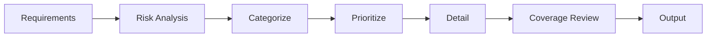

import { Aside } from '@astrojs/starlight/components';

Workflow for creating structured test plans with risk-based prioritization. Ensures comprehensive coverage across test categories with clear priority definitions.

## Start

```bash
mcp__moira__start({ workflowId: "test-planning" })
```

## Process



## Steps

| Step | Action | Output |
|------|--------|--------|
| 1. Requirements | Collect feature, acceptance criteria, user stories | Requirements doc |
| 2. Risk Analysis | Analyze what can break, impact, likelihood | Risk assessment |
| 3. Categorize | Assign tests to categories | Categorized tests |
| 4. Prioritize | Assign P0-P3 with justification | Prioritized tests |
| 5. Detail | Write title, preconditions, steps, expected result | Detailed test cases |
| 6. Coverage Review | Check AC and risk coverage, identify gaps | Coverage report |
| 7. Output | Final test plan | Complete plan |

## Features

<Aside type="tip">
Minimum 2 tests per category ensures balanced coverage across all test types.
</Aside>

### Mandatory Test Categories

| Category | Focus | Minimum |
|----------|-------|---------|
| Positive | Happy path scenarios | 2 tests |
| Negative | Invalid input, error handling | 2 tests |
| Edge cases | Boundaries, limits | 2 tests |
| Security | Auth, injection, access control | 2 tests |
| Performance | Load, response time (if applicable) | 2 tests |

### Priority Definitions

| Priority | Name | Description | Release Impact |
|----------|------|-------------|----------------|
| P0 | Blocker | Critical functionality | Cannot release |
| P1 | Critical | Core features | Must pass before release |
| P2 | Major | Important features | Should verify |
| P3 | Minor | Nice to have | Optional |

<Aside type="caution">
All P0 and P1 tests must pass before release. P0 failures block the release entirely.
</Aside>

### Coverage Check

| Verification | Question |
|--------------|----------|
| AC coverage | All acceptance criteria covered by tests? |
| Risk coverage | All high-impact risks covered by P0/P1? |
| Gap analysis | What areas lack test coverage? |

### Test Case Template

| Field | Description |
|-------|-------------|
| Title | Clear, descriptive test name |
| Priority | P0-P3 with justification |
| Preconditions | Required setup state |
| Steps | Numbered action sequence |
| Expected result | Specific, verifiable outcome |

## Example Node Configuration

```json
{
  "id": "prioritize-tests",
  "type": "agent-directive",
  "directive": "Assign priority P0-P3 to each test case. P0 for blockers, P1 for critical, P2 for major, P3 for minor. Justify each priority assignment.",
  "completionCondition": "All test cases have priority assigned with justification",
  "connections": {
    "next": "detail-tests"
  }
}
```

## Related

- [Test Generation](/docs/reference/workflows/test-generation/) — For generating test code from plans
- [PRD Creation](/docs/reference/workflows/prd-creation/) — For defining requirements to test
- [Workflow Templates Overview](/docs/reference/workflow-templates/) — All available templates
