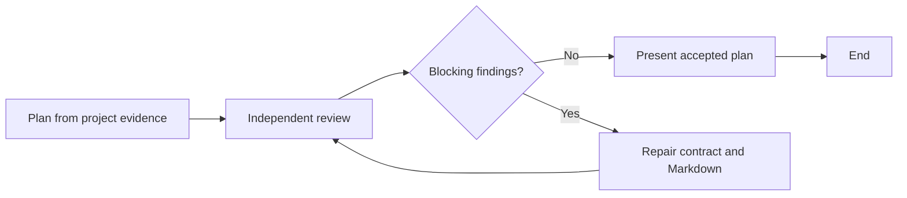

import { Aside } from '@astrojs/starlight/components';

`moira/test-planning` creates an independently reviewed test strategy and detailed case plan. It does not implement or execute tests. Use it when you need to decide what should be tested, why it matters, how to verify it, and whether the proposed plan covers the known requirements and risks.

## Start

```js
mcp__moira__start({
  workflowId: "moira/test-planning",
  parentExecutionId: "none"
})
```

The workflow accepts a feature, change, API, page, module, or system together with any available acceptance criteria, user scenarios, constraints, and known risks. The planning agent first inspects available task text, specifications, project documentation, and code. It asks for clarification only when a missing fact materially changes the strategy and cannot be discovered.

## When to choose this workflow

Choose Test Planning when the required result is a reviewed test plan rather than test code or a product change.

| Need | Workflow |
| --- | --- |
| Decide coverage, risks, priorities, cases, and expected results | **Test Planning** |
| Implement or generate executable tests from known requirements or a plan | [Test Generation](/docs/reference/workflows/test-generation/) |
| Implement a product change together with its tests, documentation, reviews, and delivery evidence | [Software Development Flow](/docs/reference/workflow-templates/#software-development-flow) |

<Aside type="note">
Do not split one software-development task into separate implementation, testing, and documentation workflow runs when the full development workflow already owns those connected responsibilities. Use Test Planning separately when its durable plan is itself the requested deliverable or an explicit input to later work.
</Aside>

## Process


```mermaid
flowchart LR
    A[Plan from project evidence] --> B[Independent review]
    B --> C{Blocking findings?}
    C -->|No| D[Present accepted plan]
    C -->|Yes| E[Repair contract and Markdown]
    E --> B
    D --> F[End]
```

The planning stage performs the connected work in one responsibility:

- records the tested scope, evidence, stable acceptance-criterion IDs, scenarios, constraints, assumptions, and unknowns;
- identifies applicable technical, business, security, data-integrity, compatibility, and operational risks, each with impact and likelihood;
- selects categories from the real scope and records why relevant categories are excluded;
- assigns every case a P0–P3 priority and rationale;
- writes executable steps, an observable expected result, and acceptance-criterion or risk links for every case;
- recommends automation without running tests.

## Durable artifacts

All files are fixed children of one traversal-safe local workspace named `./moira-ws/test-planning-<suffix>`:

| File | Role |
| --- | --- |
| `requirements.md` | Tested scope, evidence sources, acceptance criteria, scenarios, constraints, assumptions, and unknowns |
| `test-plan.contract.json` | Canonical schema-validated risks and case fields |
| `test-plan.md` | Ready-to-use Markdown projection plus narrative coverage, exclusions, limitations, and automation recommendations |
| `review.md` | Complete current independent blocking findings |

`test-plan.contract.json` is the source of truth for fields shared with the Markdown plan. The runtime validates the canonical object when it is created and whenever it is repaired. A risk without impact or likelihood, a case without required verifiable fields, an invalid priority, empty steps, or a case with no acceptance-criterion/risk link is rejected before the workflow advances.

## Categories and priorities

Categories are conditional, not a universal checklist. Positive, negative, boundary, security, integration, performance, accessibility, compatibility, recovery, and compliance coverage are included when the tested scope needs them. A relevant omission requires a reason; an irrelevant category is not forced merely to reach a test count.

| Priority | Meaning in the plan |
| --- | --- |
| P0 | Release-blocking behavior, data loss, critical security, or another failure that makes release unacceptable |
| P1 | Release-critical core flow or high-impact risk that must be covered before release |
| P2 | Important secondary behavior that should be verified |
| P3 | Lower-impact, cosmetic, or rare behavior that remains useful to record |

P0/P1 assignments must be tied to release-critical behavior or high-impact risks. The workflow plans those checks; it does not claim that they passed because it does not execute them.

## Independent review and repair guarantee

The reviewer runs in a separate host-supported context and reads the current files and primary project evidence directly. It checks:

- every acceptance criterion and identified risk has appropriate coverage;
- high-impact and release-critical risks have justified P0/P1 cases;
- steps and expected results are executable and observable;
- category exclusions and priority rationales are defensible;
- identifiers and links are valid;
- the Markdown projection matches the canonical JSON contract;
- the plan stays inside its local planning authority.

A non-zero finding count can only enter repair. Repair changes the canonical contract or narrative evidence, regenerates the Markdown projection, and returns to the same review. The presentation node is reachable only after a zero-finding review. There is no delivery bypass for known gaps.

## Authority limits

This workflow may inspect project evidence and create its four local planning files. It does not execute tests, modify product code, commit, push, publish, send notifications, or deploy. Test execution can only be recommended for a separately authorized caller or workflow.

## Current connection syntax

Agent directives use named `success` connections, and the review gate uses `true` and `false` branches:

```json
{
  "id": "review-gate",
  "type": "condition",
  "condition": {
    "operator": "eq",
    "left": { "contextPath": "issues_count" },
    "right": 0
  },
  "connections": {
    "true": "present",
    "false": "repair"
  }
}
```

## Related

- [Test Generation](/docs/reference/workflows/test-generation/) — implement test code
- [Software Development Flow](/docs/reference/workflow-templates/#software-development-flow) — implement and verify a complete software change
- [PRD Creation](/docs/reference/workflows/prd-creation/) — define product requirements and acceptance criteria
- [Workflow Templates Overview](/docs/reference/workflow-templates/) — compare all public workflows
