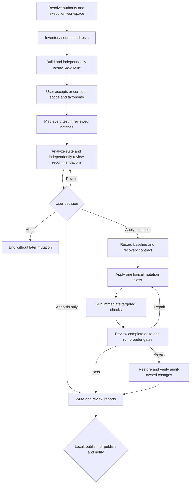

import { Aside } from '@astrojs/starlight/components';

`moira/test-suite-audit` evaluates an existing test suite against real production behavior. It inventories the complete authorized source and test corpus, builds a production-grounded feature taxonomy, maps every test and assertion in reviewed batches, and produces evidence-backed findings about coverage, redundancy, gaps, weak assertions, misplaced tests, infrastructure, and exact improvement opportunities.

The workflow is analysis-first. It changes the repository only when the user explicitly authorizes the exact independently reviewed recommendation set.

## Start

```js
mcp__moira__start({
  workflowId: "moira/test-suite-audit",
  parentExecutionId: "none"
})
```

The caller should identify the project and desired audit boundary. The workflow discovers applicable project instructions, languages, frameworks, runners, source and test roots, exclusions, dirty-work boundaries, available commands, and permitted operations. It asks only for a material fact or decision that cannot be discovered safely.

## When to choose this workflow

| Need | Workflow |
| --- | --- |
| Assess and optionally refactor an existing test suite against production behavior | **Test Suite Audit** |
| Design a test strategy before implementation without executing tests | [Test Planning](./test-planning/) |
| Add tests for a defined target | [Test Generation](./test-generation/) |
| Analyze supplied datasets rather than source and test code | [Data Analysis](./data-analysis/) |
| Deliver a complete software change with implementation, tests, documentation, release, and deployment gates | [Software Development Flow](/docs/reference/workflow-templates/#software-development-flow) |

<Aside type="caution">
Test Suite Audit is not a shortcut for a complete development lifecycle. It may apply only the exact reviewed test-suite recommendation set. A broader product change belongs in Software Development Flow.
</Aside>

## Process



The analysis phase does not mutate the audited repository:

- `scope.md` records authority, project instructions, boundaries, exclusions, commands, and unrelated work to preserve;
- `inventory.md` records the complete in-scope production and test corpus;
- `taxonomy.md` derives features, aspects, boundaries, infrastructure, orphan candidates, multi-behavior tests, incidental coverage, and parameterized paths from production sources;
- `batch-plan.md` assigns every inventory test to exactly one deterministic batch;
- `mappings.md` records assertion-level links from each test or case to production behavior and limitations;
- `analysis.md` contains reviewed findings and an ordered, exact recommendation set.

Taxonomy, every mapping batch, analysis, the actual changed delta, and the final report have independent review-and-repair gates. A nonzero review cannot flow directly to success. If a correction changes scope or taxonomy, every stale downstream artifact is regenerated instead of preserving invalid evidence.

## User decisions and authority

The workflow requires explicit closed decisions at material boundaries:

- accept or correct the resolved scope and taxonomy; a correction names `scope` or `taxonomy` and includes feedback;
- choose `analysis_only`, `apply`, `revise`, or `abort` for the current zero-reviewed recommendations;
- when evidence or a safe baseline is irreducibly incomplete, choose a limited non-mutating report or abort;
- after an audit-caused test failure, choose contained repair or scoped revert;
- after the local reports pass independent review, choose local delivery, static publication, or publication followed by Telegram notification.

Silence is never acceptance or mutation authority. `apply` authorizes only the exact current reviewed set. It does not authorize credentials, a wider project scope, destructive unrelated work, deployment, or external delivery that was not separately selected.

## Optional changes, tests, and recovery

Before any repository mutation, the workflow records the exact dirty state, unrelated changes, relevant existing test results, approved files and logical mutation classes, and a recovery method. If audit-caused effects cannot be distinguished or safely restored, mutation is closed and only a limited report may be selected.

Authorized work proceeds one logical mutation class at a time. The workflow runs the relevant targeted checks immediately after each class, before advancing the cursor. After all classes, an independent reviewer checks the complete actual delta against the authorized recommendation set, project instructions, documentation and coverage obligations, and preserved unrelated work. It then runs every applicable broader affected, package, integration, browser, or full-project gate in project and risk order.

An unresolved targeted or broader failure cannot be reported as success. The user may authorize a contained repair, which returns through review and verification, or a scoped revert. Revert is successful only after project-native diff, status, and relevant checks prove that audit-owned changes are absent and unrelated work remains intact. Failed recovery ends with `recovery_blocked`.

## Artifacts and outcomes

Each execution receives its own workspace:

```text
./moira-ws/test-suite-audit-<executionId>/
```

The directory contains the immutable registry-backed audit standard, intermediate evidence, review reports, baseline and verification records when applicable, `final-report.md`, and a self-contained `report.html`. These files remain local project artifacts and follow the host or project's retention rules; the workflow does not delete them automatically.

Report-producing outcomes are distinct:

- `analysis_only` — reviewed analysis with no repository mutation;
- `limited_analysis` — explicitly incomplete non-mutating analysis with unsupported conclusions excluded;
- `no_changes` — the reviewed set contains no logical mutation class;
- `changes_applied` — the exact authorized delta passed targeted and broader verification;
- `changes_reverted` — audit-owned changes were restored and the restoration was verified.

`aborted` ends without later file, repository, publication, or notification work. `recovery_blocked` is a separate terminal failure and is not a report-success outcome.

## Publication and privacy

Local delivery has no external side effect. Publication uploads only the independently reviewed self-contained `report.html` through the authorized Moira static-artifact file/archive API. Raw source files, workspace evidence, and sensitive records are not uploaded. The workflow returns a URL only after observing a real successful upload; upload failure leaves an empty URL and remains visible.

Telegram notification is attempted only after explicit `publish_notify` selection and a real report URL. The message states the factual outcome, limitations, and exact test summary. Notification failure does not invalidate the reviewed local report or successful upload, but remains visible in `notification_state`.

The final review checks privacy, licensing, minimization, publication safety, stale evidence, and unsupported success language. The workflow never discovers credentials or broadens access.

## Related

- [Test Planning](./test-planning/) — design a test strategy without test execution
- [Test Generation](./test-generation/) — add tests for a defined target
- [Data Analysis](./data-analysis/) — analyze supplied datasets
- [Software Development Flow](/docs/reference/workflow-templates/#software-development-flow) — complete software delivery
- [Ready Workflows](./) — compare public workflows
