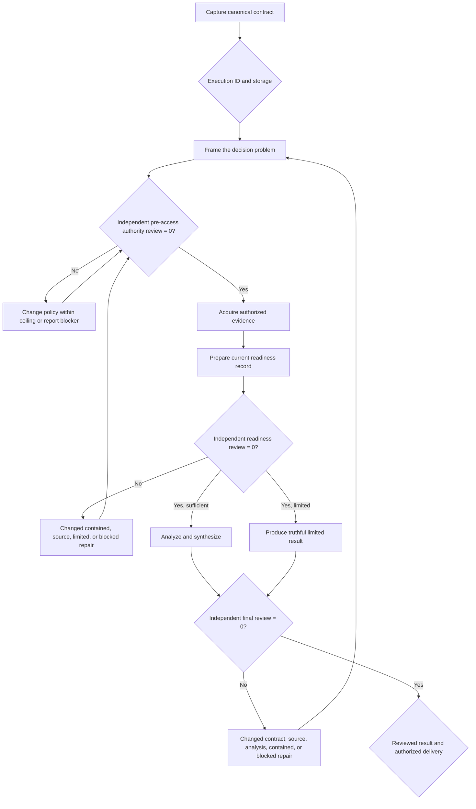

import { Aside } from '@astrojs/starlight/components';

`moira/universal-research-workflow` is the portable research workflow for a supplied question or decision when the appropriate sources, method, and output structure must adapt to the problem. It can keep six durable execution-bound files or operate with bounded self-contained memory state when filesystem access is unavailable. In both modes it preserves the same authority, evidence, review, repair, and delivery gates.

Choose it when storage capability is uncertain, the question may require different research methods, or you need explicit privacy and source-access boundaries before acquisition. Choose [Verified Research](/docs/reference/workflows/verified-research/) for bounded mostly linear verification, [Iterative Research](/docs/reference/workflows/iterative-research/) for filesystem-first repeated review cycles, Deep Corpus Research for separately authorized corpus-scale work, [Data Analysis](/docs/reference/workflows/data-analysis/) for supplied datasets, and a software-development workflow for repository changes.

## Start

```bash
mcp__moira__start({ workflowId: "moira/universal-research-workflow", parentExecutionId: "none" })
```

The intake captures one canonical contract:

- the question, decision context, included and excluded scope, audience, output language, advisory depth, constraints, success criteria, and deliverables;
- interactive or autonomous operation and filesystem or memory storage;
- an immutable confidentiality and authority ceiling covering allowed access, privacy, consent, retention, licensing, and minimization;
- current source expectations and data-handling policy, which may be corrected only within that ceiling;
- local, published, published-and-notified, or undecided delivery intent;
- separate explicit authority for static publication and Telegram notification.

Depth (`quick`, `normal`, `deep`, or `scientific`) guides fitness and cost. It is not a source count, word count, method, tool, agent, or formatting quota.

## Storage modes and artifacts

Filesystem mode materializes six empty skeletons under `./moira-ws/universal-research-<executionId>/`:

| File | Purpose |
| --- | --- |
| `research-contract.md` | Current canonical question, boundaries, policy, success criteria, and delivery authority |
| `source-evidence.json` | Typed sanitized provenance, access outcomes, claim support, contradictions, uncertainty, currency, and limitations |
| `research-report.md` | Current evidence-grounded answer |
| `research-review.md` | Exact current independent blocking findings |
| `repair-account.md` | Reproduced finding, actual changed reach, or factual repair blocker |
| `delivery.html` | Minimized self-contained external rendering without raw private evidence |

The returned execution UUID is compared with the engine-owned current execution before any workspace is used. Paths are fixed and traversal-safe. If materialization fails, the workflow changes to memory mode and records the storage limitation instead of pretending that durable files exist.

Memory mode keeps typed, size-bounded source evidence, readiness, repair, and result objects in the current execution. Its report is self-contained, but it makes no durable-recovery claim and cannot use external publication, which requires the reviewed filesystem `delivery.html`.

## Process and guarantees



The pre-access reviewer treats every “equal” or “narrower” label as untrusted and independently compares current policy with the immutable intake ceiling. Neither acquisition branch is reachable before a zero finding count.

Every source records its original and observed availability, actual access outcome, sanitized provenance, classification, relevance, supported claims, contradictions, uncertainty, currency, and limitations. Unavailable, unauthorized, or failed access cannot be rewritten as usable evidence. Sufficiency depends on the contracted question and deliverable, not an arbitrary count.

Readiness and final reviewers run in a separate host-supported context, diagnose without mutation, and accept only exactly zero current blockers. A nonzero result must lead to a real changed artifact at the earliest stale boundary or a truthful recovery blocker. Contract and source repairs repeat the pre-access gate; data repairs repeat readiness; result repairs repeat final review. A guarded process-revision teleport preserves immutable mode and authority fields and cannot bypass acquisition, evidence, review, repair, or delivery gates.

## Outcomes and authority

- `accepted_local` returns a complete independently reviewed local or memory result without an external side effect.
- `limited` is independently reviewed, names unsupported conclusions and missing evidence or authority, and can never publish or notify.
- `published` requires filesystem mode, explicit publication authority, and an observed HTTPS URL from a successful upload.
- `published_and_notified` additionally requires separate notification authority and an observed Telegram success.
- Publication unavailable, unauthorized, or failed and Telegram unauthorized, unsent, or errored are distinct terminal outcomes that preserve the accepted local result.
- `recovery_blocker`, execution-identity failure, and explicit interactive abort remain distinguishable and cannot claim research or delivery success.

<Aside type="caution">
Available credentials, tools, or server configuration do not grant authority. Autonomous mode skips only human waits and defaults an unresolved delivery choice to local; it cannot broaden source access, publish, or notify on its own.
</Aside>

## Related

- [Verified Research](/docs/reference/workflows/verified-research/) — bounded mostly linear source verification
- [Iterative Research](/docs/reference/workflows/iterative-research/) — filesystem-first research with repeated bounded review cycles
- [Data Analysis](/docs/reference/workflows/data-analysis/) — analysis of supplied datasets under an explicit source contract
- [Content Creation](/docs/reference/workflows/content-creation/) — drafting and reviewing content rather than conducting adaptive research
- [Ready Workflows](/docs/reference/workflows/) — workflow selection overview
