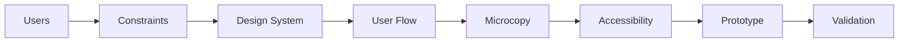

import { Aside } from '@astrojs/starlight/components';

Structured UX/UI design process with mandatory accessibility verification. Ensures user-centered design with documented rationale and WCAG AA compliance.

## Start

```bash
mcp__moira__start({ workflowId: "ux-design" })
```

## Process



## Steps

| Step | Action | Output |
|------|--------|--------|
| 1. Users | Collect target user info: personas, JTBD, pain points | User personas |
| 2. Constraints | Document technical and business constraints | Constraint list |
| 3. Design System | Check existing design system, identify reusable components | Component inventory |
| 4. User Flow | Design flow with rationale for each decision | Documented user flow |
| 5. Microcopy | Write UX copy with clarity check | Reviewed copy |
| 6. Accessibility | WCAG AA checklist verification | Compliance report |
| 7. Prototype | Screen-by-screen description | Prototype spec |
| 8. Validation | User testing plan | Test plan |

## Features

<Aside type="tip">
Define primary persona upfront. All design decisions must link back to user needs.
</Aside>

### User-Centered Design

| Element | Description |
|---------|-------------|
| Primary persona | Defined before design begins |
| Decision linking | All choices tied to user needs |
| Validation planning | Tests mapped to personas |

### Design Rationale

Each design decision documents:
- **Why**: Rationale for the decision
- **Alternatives**: Options considered
- **Rejection reasons**: Why alternatives were not chosen

### WCAG AA Checklist

<Aside type="caution">
Accessibility verification is mandatory. All items must pass before prototype phase.
</Aside>

| Criterion | Requirement |
|-----------|-------------|
| Color contrast | 4.5:1 minimum for text |
| Keyboard navigation | Full keyboard accessibility |
| Screen reader | Proper ARIA labels and structure |
| Touch targets | 44x44px minimum |
| Focus states | Visible focus indicators |
| Alt text | Descriptive alternative text |
| Form labels | Associated labels for all inputs |

### Microcopy Guidelines

| Principle | Description |
|-----------|-------------|
| Clarity over cleverness | Clear beats creative |
| Sentence length | 15-20 words maximum |
| Voice | Active voice preferred |
| CTAs | Specific, action-oriented |
| Error messages | Friendly, solution-focused |

## Example Node Configuration

```json
{
  "id": "accessibility-check",
  "type": "agent-directive",
  "directive": "Verify design against WCAG AA checklist. Check color contrast, keyboard navigation, screen reader support, touch targets, focus states, alt text, and form labels.",
  "completionCondition": "All WCAG AA criteria verified with pass/fail status for each item",
  "connections": {
    "next": "create-prototype"
  }
}
```

## Related

- [PRD Creation](/docs/reference/workflows/prd-creation/) — For defining product requirements
- [Test Planning](/docs/reference/workflows/test-planning/) — For testing the UX implementation
- [Workflow Templates Overview](/docs/reference/workflow-templates/) — All available templates
