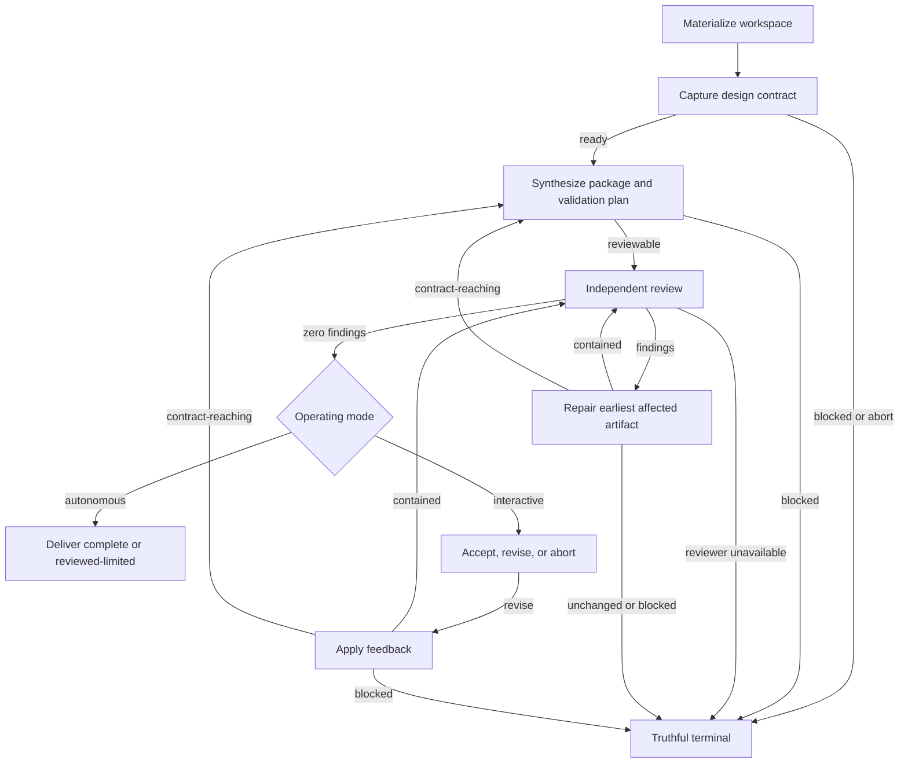

import { Aside } from '@astrojs/starlight/components';

UX Design turns supplied requirements and authorized project evidence into an implementation-ready
interaction and interface specification. It preserves the design contract, package, future
validation plan, independent review, and repair record in one execution-bound local workspace.

<Aside type="caution">
  This workflow specifies UX; it does not implement UI, create a graphical prototype, run user
  research or usability tests, certify WCAG conformance, change version control, publish, notify, or
  deploy.
</Aside>

## Start

```bash
mcp__moira__start({ workflowId: "moira/ux-design", parentExecutionId: "none" })
```

Use the calling execution ID instead of `none` when an orchestration workflow starts UX Design as a
child.

## When to choose it

Choose UX Design when the desired deliverable is a reviewed UX/UI specification: user flows,
information architecture, screen and state behavior, layout hierarchy, interactions, microcopy,
responsive behavior, accessibility intent, and a prototype specification.

Choose a neighboring workflow when the primary outcome differs:

| Need | Workflow |
| --- | --- |
| Define product scope and requirements | [PRD Creation](./prd-creation/) |
| Discover or verify external evidence | [Universal Research Workflow](./universal-research-workflow/) or [Iterative Research](./iterative-research/) |
| Produce standalone content | [Content Creation](./content-creation/) |
| Plan executable product tests | [Test Planning](./test-planning/) |
| Implement, test, document, review, or perform authorized local VCS closure | Software Development Flow |

## Inputs and contract

The workflow derives a bounded design contract from the triggering request and authorized primary
project sources. It records:

- the design goal, scope, exclusions, deliverables, and observable success criteria;
- the primary users and usage context, jobs to be done, pain points, and relevant edge cases;
- technical, business, brand, content, privacy, platform, localization, and accessibility
  constraints;
- supplied evidence and provenance, hypotheses, assumptions, unknowns, and limitations;
- known design-system components and patterns, plus the workflow's authority boundary;
- `autonomous` or `interactive` operating mode.

An agent asks only for a material unknown it cannot discover from authorized context. Starting the
workflow grants write access only to its own workspace; tool availability does not expand authority.

## Process and quality gates


```mermaid
flowchart TD
    A[Materialize workspace] --> B[Capture design contract]
    B -->|ready| C[Synthesize package and validation plan]
    B -->|blocked or abort| T[Truthful terminal]
    C -->|reviewable| D[Independent review]
    C -->|blocked| T
    D -->|zero findings| E{Operating mode}
    D -->|findings| F[Repair earliest affected artifact]
    D -->|reviewer unavailable| T
    F -->|contained| D
    F -->|contract-reaching| C
    F -->|unchanged or blocked| T
    E -->|autonomous| G[Deliver complete or reviewed-limited]
    E -->|interactive| H[Accept, revise, or abort]
    H -->|revise| I[Apply feedback]
    I -->|contained| D
    I -->|contract-reaching| C
    I -->|blocked| T
```

Synthesis covers every applicable state family: entry, success, empty, loading, validation, error,
recovery, permission, and responsive behavior. A state family may be omitted only with an
evidence-backed applicability reason. Every material decision traces to a user need, constraint,
evidence item, or explicit hypothesis and records meaningful alternatives.

Existing design-system components and universal project primitives are preferred. Each proposed
new component or pattern must document its demonstrated need, considered alternatives, integration
consequences, and why existing primitives are insufficient.

One genuinely independent reviewer context is recorded and reused for the initial review and every
rereview. Only an exact zero current blocking-finding count can proceed to delivery. A confirmed
finding is repaired at its earliest source; a contained package repair returns directly to the same
reviewer, while a changed contract reruns synthesis. An unchanged, unauthorized, or impossible
repair terminates truthfully instead of creating an unbounded loop.

## Durable artifacts

The workspace is `./moira-ws/ux-design-<execution-id>` and contains exactly these files:

| File | Purpose |
| --- | --- |
| `process-id.txt` | Correlates the directory with the current Moira execution |
| `design-standard.md` | Stable evidence, completeness, review, authority, and delivery rules |
| `design-contract.md` | Sole detailed authority for the design goal and constraints |
| `design-package.md` | Current complete UX specification and downstream handoff |
| `validation-plan.md` | Future evaluation methods, signals, decision criteria, and limits |
| `design-review.md` | Stable reviewer address and complete current blocking-finding set |
| `repair-account.md` | Reproduced findings or feedback, actual changes, checks, and repair reach |

The terminal output is bounded to the workspace path, truthful outcome, exact current-execution
paths for `design-package.md` and `validation-plan.md`, and a short result summary. The engine rejects
otherwise well-formed artifact paths that point to another execution.

## Operating modes and outcomes

`autonomous` mode skips only the final human acceptance wait. Contract capture, synthesis,
independent exact-zero review, repair, limitations, and authority gates remain unchanged.

`interactive` mode presents the clean reviewed package for an explicit `accept`, `revise`, or
`abort` decision. Applied feedback always returns through the same reviewer. Feedback that is
already satisfied, unsupported, unauthorized, or unsafe ends as `feedback-blocked` without claiming
a change.

Successful delivery distinguishes `accepted` from `reviewed-limited`. A limited result is usable
only when every remaining limitation is explicit, bounded, compatible with the contract, and has
passed independent review. Workspace, intake, synthesis, review-context, repair, and feedback
failures each have a distinct blocker outcome; explicit cancellation remains `aborted`.

## Validation-plan boundary

`validation-plan.md` maps actual package risks and hypotheses to future methods, participants or
data, tasks, observable signals, decision criteria, and limitations. It never claims that a study,
test, implementation, graphical prototype, accessibility verification, or certification already
occurred.

## Related

- [Ready Workflows](./) — compare all public workflows
- [Workflow Templates Overview](/docs/reference/workflow-templates/) — catalog reference
