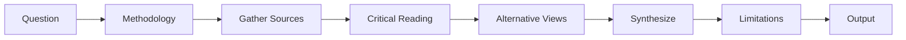

import { Aside } from '@astrojs/starlight/components';

Research workflow with verified and reproducible sources. Solves AI hallucination and fake source problems through mandatory URL verification and alternative viewpoint requirements.

## Start

```bash
mcp__moira__start({ workflowId: "moira/verified-research", parentExecutionId: "none" })
```

## Process



## Steps

| Step | Action | Output |
|------|--------|--------|
| 1. Question | Formulate research question, success criteria, scope | Clear research question |
| 2. Methodology | Define source types, time period, keywords, quality criteria | Research methodology |
| 3. Gather | Collect sources with URL verification | Verified source list |
| 4. Read | Critical reading with quotes, findings, methodology | Source analysis |
| 5. Alternative | Find opposing viewpoints (min 2) | Contrarian perspectives |
| 6. Synthesize | Synthesize findings, link conclusions to sources | Evidence-based synthesis |
| 7. Limitations | Document gaps, biases, methodology limitations | Explicit limitations |
| 8. Output | Final research report with verified sources | Complete report |

## Features

<Aside type="caution">
Every URL must be checked and working. Invented sources are not allowed.
</Aside>

### Verified Sources

| Requirement | Description |
|-------------|-------------|
| URL verification | Each URL must be accessible |
| Metadata | Title, author, date, type required |
| No fabrication | Sources must exist and be verifiable |

### Alternative Viewpoints Required

- Minimum 2 opposing opinions
- Protection from confirmation bias
- Document controversies in the field

### Citation Requirements

| Element | Format |
|---------|--------|
| Direct quotes | In quotation marks with source reference |
| Conclusions | Linked to specific source [1], [2], [3] |
| Bibliography | Numbered list at end |

### Explicit Limitations

- **Gaps**: What topics are not covered
- **Source biases**: Potential biases in sources
- **Methodology biases**: Limitations of research approach
- **Future research**: Recommendations for further investigation

## Example Node Configuration

```json
{
  "id": "gather-sources",
  "type": "agent-directive",
  "directive": "Gather sources matching methodology criteria. Verify each URL is accessible. Record title, author, date, and type.",
  "completionCondition": "Minimum 5 verified sources collected with complete metadata",
  "connections": {
    "next": "critical-reading"
  }
}
```

## Difference from Iterative Research

| Workflow | Focus |
|----------|-------|
| `moira/verified-research` | Linear 8-step, source verification, anti-hallucination |
| `moira/iterative-research` | Iterative with critique/improve cycle, quality gates |

Use `verified-research` when reproducibility and verified sources are critical.

## Related

- [Iterative Research](/docs/reference/workflows/iterative-research/) — For research with quality improvement cycles
- [Content Creation](/docs/reference/workflows/content-creation/) — For creating content from research
- [Data Analysis](/docs/reference/workflows/data-analysis/) — For data-driven research
- [Workflow Templates Overview](/docs/reference/workflow-templates/) — All available templates
