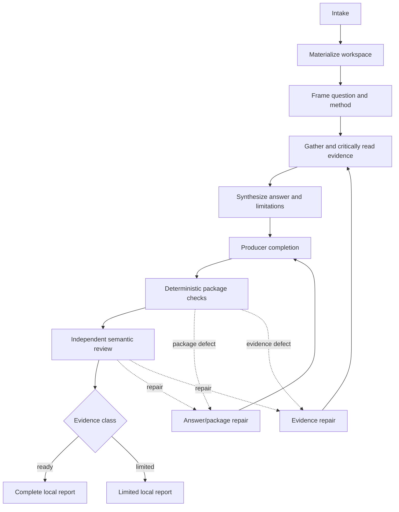

import { Aside } from '@astrojs/starlight/components';

Verified Research answers one specific question with a proportionate set of external sources and one durable local report. It records what the sources support, what is inferred, where evidence conflicts, and which limitations could change the answer. The workflow does not claim that opening a URL or calling a search tool proves source quality: an independent reviewer reads the evidence and the answer.

## Start

```bash
mcp__moira__start({ action: "prepare", workflowId: "moira/verified-research", parentExecutionId: "none" })
mcp__moira__start({ action: "execute", startAttemptId: "<Start attempt ID from prepare>" })
```

The workflow reuses an explicitly supplied operating mode. In `autonomous` mode it skips only user waits; material ambiguity becomes a blocked prerequisite rather than an invented question. In `interactive` mode it may ask one essential clarification and later offer accept, bounded rework, or abort.

## What it produces

An execution-correlated workspace contains the canonical package:

- question framing and evidence method;
- source register with resolvable links, authority/applicability assessment, and relevant publication and retrieval dates;
- critical readings and meaningful alternative views;
- a bounded answer that separates sourced facts and quotations, calculations, inference, assumptions, disagreement, uncertainty, and gaps;
- explicit limitations;
- deterministic validation observations;
- independent semantic findings;
- corrected-contract findings and repair notes when those routes apply;
- `final-report.md`.

The final result exposes only the local report path, bounded answer and limitation summaries, and a truthful terminal status. Detailed sources and findings remain in the workspace instead of being copied through workflow context.

## Process


```mermaid
flowchart TD
    A[Intake] --> B[Materialize workspace]
    B --> C[Frame question and method]
    C --> D[Gather and critically read evidence]
    D --> E[Synthesize answer and limitations]
    E --> F[Producer completion]
    F --> G[Deterministic package checks]
    G --> H[Independent semantic review]
    H --> I{Evidence class}
    I -->|ready| J[Complete local report]
    I -->|limited| K[Limited local report]
    G -. package defect .-> L[Answer/package repair]
    G -. evidence defect .-> M[Evidence repair]
    H -. repair .-> L
    H -. repair .-> M
    L --> F
    M --> D
```

Repair returns through every gate made stale by the change. An invalid or unprovable criterion enters contract reassessment and an independent corrected-contract review; a blocker cannot be converted into success by a retry limit.

## Evidence and outcome semantics

`evidence_status` is the single research classification:

| Status | Meaning |
| --- | --- |
| `ready` | The current evidence supports a complete reviewed answer. |
| `limited` | The remaining evidence supports a useful reviewed answer only with explicit limitations and decision impact. |
| `replan` | The interpretation, criterion, or evidence method is invalid and must be reassessed. |
| `blocked` | A required prerequisite or genuine independent review is unavailable. |

The same independently observed classification drives the final complete or limited route. Contradictory duplicate status fields are not used.

<Aside type="caution">
A working URL is necessary but does not prove that a source is authoritative, current, independent, applicable, or supportive of a claim. Those properties require direct reading and semantic judgment.
</Aside>

## Authority boundary

Completion is local, and the user is notified through their configured channels when the result is ready; a failed notification is reported and never replaces the result. Verified Research does not upload an artifact, commit code, deploy, or mutate production. Use a separate authorized task when external publication or delivery is required.

Before any source is acquired, an independent check confirms that the planned sources and access methods stay inside the confidentiality ceiling captured with the question. Repair rounds raised by independent review are bounded: when the budget is exhausted, an autonomous run finishes with an explicitly procedural limitation and an interactive run asks once whether to continue. When no workspace can be created, the run continues from memory and its result is limited with the storage limitation named.

## Choosing a research workflow

| Need | Workflow |
| --- | --- |
| One bounded question and one independently reviewed source-linked answer | `moira/verified-research` |
| Repeated independent critique bounded by a repair budget, and work without a writable workspace | `moira/verified-research` |
| Separately authorized exhaustive work over a large corpus | Deep Corpus Research |
| Analysis of datasets already supplied or authorized | [Data Analysis](/docs/reference/workflows/data-analysis/) |

## Related

- [Data Analysis](/docs/reference/workflows/data-analysis/)
- [Workflow Templates Overview](/docs/reference/workflow-templates/)
