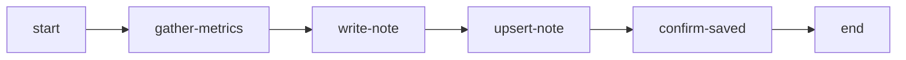
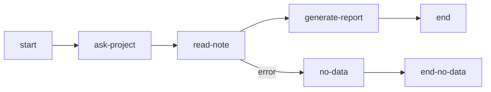

import { Aside, Steps } from "@astrojs/starlight/components";

Notes обеспечивают персистентное key-value хранилище, привязанное к каждому пользователю. Данные, сохранённые в notes, переживают перезапуски workflow, позволяя хранить настройки, накапливать результаты и организовывать конвейеры данных между workflow.

## Сценарии использования

- **Пользовательские настройки**: Хранение стиля коммитов, предпочтительного региона, соглашений по коду
- **Накопление данных**: Результаты еженедельного анализа для сравнения во времени
- **Межпроцессные конвейеры**: Workflow-коллектор сохраняет данные, workflow-репортёр их читает
- **Непрерывность сессии**: Промежуточные результаты переживают архивирование сессии

## MCP Tool

MCP tool `notes` предоставляет 6 действий для доступа агентов:

```json
notes({ action: "save", key: "commit-style", value: "conventional", tags: ["preferences"] })
notes({ action: "get", key: "commit-style" })
notes({ action: "list", tag: "preferences" })
notes({ action: "history", key: "commit-style" })
notes({ action: "delete", key: "commit-style" })
notes({ action: "stats" })
```

| Действие  | Назначение                                    |
| --------- | --------------------------------------------- |
| `save`    | Создание или обновление note                  |
| `get`     | Чтение содержимого note по ключу              |
| `list`    | Список notes с фильтрами по тегам/ключам      |
| `history` | Просмотр истории версий note                  |
| `delete`  | Мягкое удаление note                          |
| `stats`   | Статистика использования и информация о квоте |

### Формат ключа

Ключи принимают буквенно-цифровые символы, подчёркивание и дефис. Длина: 1-100 символов.

```
my-config          # допустимо
project_settings   # допустимо
2024-report        # допустимо
```

### Лимиты

| Лимит                 | Значение      |
| --------------------- | ------------- |
| Размер note           | 100 КБ        |
| Всего на пользователя | 1 МБ          |
| Тегов на note         | 10            |
| Длина тега            | 1-50 символов |
| Версий на note        | 50            |

## Автоматические типы нод

Три типа нод выполняют операции с notes без участия агента. Они выполняются на сервере и автоматически переходят к следующей ноде.

### read-note

Читает notes, соответствующие критериям фильтра, в контекстную переменную:

```json
{
  "type": "read-note",
  "id": "load-metrics",
  "outputVariable": "metricsNotes",
  "filter": {
    "tag": "metrics",
    "keyPattern": "metrics-"
  },
  "connections": {
    "default": "process-data",
    "error": "no-data-handler"
  }
}
```

| Свойство            | Обязательно | Описание                               |
| ------------------- | ----------- | -------------------------------------- |
| `outputVariable`    | Да          | Контекстная переменная для результатов |
| `filter.tag`        | Нет         | Фильтрация по точному тегу             |
| `filter.keyPattern` | Нет         | Фильтрация по префиксу ключа           |
| `filter.keySearch`  | Нет         | Поиск в ключе (содержит)               |
| `singleMode`        | Нет         | Возврат объекта вместо массива         |
| `connections.error` | Нет         | Нода обработки ошибок                  |

### write-note

Записывает данные из контекста в note:

```json
{
  "type": "write-note",
  "id": "save-results",
  "key": "results-{{projectName}}-{{date}}",
  "source": "{{analysisData}}",
  "tags": ["analysis", "{{projectName}}"],
  "connections": {
    "default": "next-step"
  }
}
```

| Свойство    | Обязательно | Описание                                       |
| ----------- | ----------- | ---------------------------------------------- |
| `key`       | Нет\*       | Ключ note (обязателен в single режиме)         |
| `source`    | Да          | Контекстная переменная или шаблон со значением |
| `tags`      | Нет         | Назначаемые теги                               |
| `batchMode` | Нет         | Обработка массива `[{key, value, tags}]`       |

Когда `source` разрешается в объект или массив, значение автоматически сериализуется в JSON-строку. Строки передаются без изменений, числа и булевы значения преобразуются в строковое представление.

### upsert-note

Находит существующую note по критериям поиска или создаёт новую:

```json
{
  "type": "upsert-note",
  "id": "update-latest",
  "search": { "tag": "latest-metrics" },
  "keyTemplate": "latest-metrics-{{projectName}}",
  "value": "{{metricsData}}",
  "tags": ["metrics", "latest-metrics"],
  "connections": {
    "default": "next-step"
  }
}
```

| Свойство            | Обязательно | Описание                                 |
| ------------------- | ----------- | ---------------------------------------- |
| `search.tag`        | Нет         | Поиск по тегу                            |
| `search.keyPattern` | Нет         | Поиск по префиксу ключа                  |
| `keyTemplate`       | Да          | Ключ для новой note, если не найдена     |
| `value`             | Да          | Контекстная переменная со значением note |
| `tags`              | Нет         | Назначаемые теги                         |
| `outputVariable`    | Нет         | Сохранение результата upsert в контексте |

Когда `value` разрешается в объект или массив, значение автоматически сериализуется в JSON-строку.

<Aside type="tip">
  Все параметры фильтров, ключей и тегов поддерживают шаблонные выражения `{"{{variable}}"}`,
  которые разрешаются из контекста выполнения.
</Aside>

## Синтаксис шаблонов

Ссылайтесь на содержимое notes в полях directive и completionCondition, используя синтаксис `{{note:KEY}}`:

```
Analyze the project using this configuration: {{note:project-config}}
```

Содержимое note инжектируется до того, как агент увидит директиву. Отсутствующие notes выдают `[NOTE NOT FOUND: KEY]`.

Шаблонные переменные внутри содержимого note разрешаются после инжекции:

```
// Note "greeting" содержит: "Hello, {{userName}}!"
// Директива: {{note:greeting}}
// Агент видит: "Hello, Alice!" (когда userName="Alice")
```

## Руководство: межпроцессный конвейер данных

Этот пример показывает два workflow, взаимодействующих через Notes: Коллектор сохраняет метрики проекта, Репортёр их читает и анализирует.

### Workflow 1: Коллектор метрик

Собирает метрики и сохраняет их как notes:



Ключевые ноды:

**write-note** сохраняет сырые метрики с ключом, содержащим временную метку. Поле `source` ссылается на вывод агента через dot-path синтаксис — объекты и массивы автоматически сериализуются в JSON:

```json
{
  "type": "write-note",
  "id": "write-metrics-note",
  "key": "metrics-{{gather-metrics.projectName}}-{{gather-metrics.collectionDate}}",
  "source": "{{gather-metrics.metrics}}",
  "tags": ["metrics", "{{gather-metrics.projectName}}", "raw-data"]
}
```

**upsert-note** поддерживает ссылку на «последнюю» версию:

```json
{
  "type": "upsert-note",
  "id": "upsert-latest-summary",
  "search": { "tag": "latest-metrics" },
  "keyTemplate": "latest-metrics-{{gather-metrics.projectName}}",
  "value": "{{gather-metrics.metrics}}",
  "tags": ["metrics", "{{gather-metrics.projectName}}", "latest-metrics"]
}
```

### Workflow 2: Репортёр метрик

Читает сохранённые метрики и генерирует отчёт:



**read-note** загружает все метрики по тегу и префиксу ключа:

```json
{
  "type": "read-note",
  "id": "load-all-metrics",
  "outputVariable": "metricsNotes",
  "filter": {
    "tag": "metrics",
    "keyPattern": "metrics-"
  }
}
```

Директива отчёта использует `{{note:KEY}}` для инжекции последнего снимка. Dot-path синтаксис ссылается на вывод агента из предыдущих нод:

```
Generate a metrics report.

Latest metrics snapshot:
{{note:latest-metrics-{{ask-project.projectName}}}}

All collected metrics:
{{metricsNotes}}
```

### Запуск конвейера

<Steps>
  1. Запустите workflow Коллектора метрик и предоставьте метрики проекта 2. Notes сохраняются
  автоматически через ноды write-note и upsert-note 3. Запустите workflow Репортёра метрик для того
  же проекта 4. read-note загружает все метрики, `{{ note: KEY }}` инжектирует последний снимок 5.
  Агент генерирует отчёт, сравнивая данные по датам сбора
</Steps>

Коллектор может запускаться многократно — каждый запуск добавляет новую note с временной меткой, в то время как upsert-note поддерживает ссылку на «последнюю» версию в актуальном состоянии.

## Веб-интерфейс

Notes управляются через веб-интерфейс на странице Notes (доступна из боковой навигации):

- Просмотр всех notes с ключом, тегами, размером и превью
- Фильтрация по тегу или поиск по имени ключа
- Создание, редактирование и удаление notes
- Просмотр истории версий и восстановление предыдущих
- Мониторинг использования квоты

## Связанное

- [Справочник MCP Tools](/ru/docs/reference/tools/) — tool `notes` со всеми 6 действиями
- [Ноды](/ru/docs/concepts/nodes/) — Конфигурация автоматических типов нод
- [Шаблоны](/ru/docs/concepts/templates/) — Синтаксис шаблонных переменных, включая `{{note:KEY}}`
