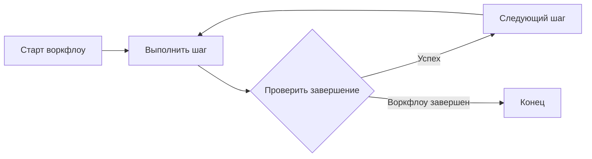

import { Aside, Card, CardGrid } from "@astrojs/starlight/components";

Moira — это Agent Workflow Engine, разработанный специально для AI-агентов. Он направляет агентов через многошаговые процессы, используя структурированные воркфлоу с четкими директивами и критериями успеха.

## Проблема

AI-агенты мощные, но нуждаются в структуре. Без направления они могут:

- Терять фокус на сложных многошаговых задачах
- Пропускать важные шаги или предварительные условия
- Выдавать непоследовательные результаты
- Упускать проверки качества и валидацию

<Aside type="caution">
  Даже самые способные AI-агенты выигрывают от структурированных воркфлоу. Moira обеспечивает
  последовательное выполнение и проверяемые результаты.
</Aside>

## Решение

Moira предоставляет систему воркфлоу на основе графов узлов, где каждый шаг имеет:

<CardGrid>
  <Card title="Директива" icon="pencil">
    Четкая инструкция, что нужно сделать
  </Card>
  <Card title="Условие завершения" icon="approve-check">
    Критерии успеха, которые должны быть выполнены
  </Card>
  <Card title="Схема входных данных" icon="document">
    Ожидаемая структура ответа (опционально)
  </Card>
  <Card title="Соединения" icon="right-arrow">
    Ссылки на следующие шаги в воркфлоу
  </Card>
</CardGrid>

Агент выполняет каждый шаг, проверяет завершение и переходит к следующему узлу на основе графа воркфлоу.

## Как это работает



### Процесс выполнения

1. Агент запускает воркфлоу через MCP инструмент
2. Получает директиву текущего шага и условие завершения
3. Выполняет директиву
4. Возвращает результат через инструмент `step()`
5. Движок проверяет и переходит к следующему шагу
6. Повторяет до завершения воркфлоу

<Aside type="tip">
  Состояние воркфлоу сохраняется на сервере. Если сессия прервана, агент может возобновить
  выполнение с того же шага, используя process ID.
</Aside>

## Ключевые концепции

### Воркфлоу

Воркфлоу — это направленный граф узлов. Каждый узел представляет шаг в процессе. Узлы могут ветвиться по условию, зацикливаться или делегировать подграфам.

```json
{
  "id": "my-workflow",
  "metadata": {
    "name": "Мой воркфлоу",
    "version": "1.0.0",
    "description": "Пример воркфлоу"
  },
  "nodes": [
    { "id": "start", "type": "start", "connections": { "default": "task-1" } },
    {
      "id": "task-1",
      "type": "agent-directive",
      "directive": "...",
      "connections": { "success": "end" }
    },
    { "id": "end", "type": "end" }
  ]
}
```

### Типы узлов

Moira поддерживает следующие типы узлов:

| Тип                     | Назначение                                               |
| ----------------------- | -------------------------------------------------------- |
| `start`                 | Точка входа для выполнения воркфлоу                      |
| `end`                   | Терминальный узел, отмечающий завершение                 |
| `agent-directive`       | Задача для агента с директивой и условием завершения     |
| `condition`             | Ветвление выполнения на основе структурированных условий |
| `expression`            | Вычисление значений с помощью арифметических выражений   |
| `subgraph`              | Делегирование другому воркфлоу                           |
| `telegram-notification` | Отправка уведомлений через Telegram                      |

### Шаблоны

Шаблоны позволяют использовать динамический контент в директивах и условиях через синтаксис `{{variable}}`:

```json
{
  "directive": "Проанализируй {{projectName}} и создай {{reportType}} отчёт"
}
```

Переменные могут ссылаться на:

- Начальные данные из start узла
- Результаты предыдущих шагов
- Параметры воркфлоу

### Выполнения

Выполнение — это работающий экземпляр воркфлоу. Оно поддерживает:

- **Текущая позиция** — Какой узел активен
- **Контекст** — Переменные и результаты шагов
- **История** — Завершенные шаги и их результаты

## MCP интеграция

Moira подключается к AI-агентам через [Model Context Protocol](https://modelcontextprotocol.io/). MCP сервер предоставляет инструменты для:

| Инструмент | Назначение                                                 |
| ---------- | ---------------------------------------------------------- |
| `list`     | Просмотр доступных воркфлоу                                |
| `start`    | Запуск выполнения воркфлоу                                 |
| `step`     | Выполнение текущего шага и переход                         |
| `manage`   | Создание, редактирование, получение воркфлоу               |
| `session`  | Получение информации о пользователе и активных выполнениях |

<Aside type="note">
  MCP — это открытый протокол. Moira работает с любым MCP-совместимым клиентом: Claude Code, Cursor
  и другими.
</Aside>

## Self-host или Cloud

Moira — open source (Apache-2.0). Движок, типы узлов и MCP-инструменты одинаковы, хостите ли вы её сами или используете управляемое облако:

<CardGrid>
  <Card title="Self-host" icon="seti:docker">
    Запустите весь движок, Web UI и MCP-сервер в одном Docker-контейнере на своей
    инфраструктуре — бесплатно, single-tenant, данные остаются у вас. Это режим по
    умолчанию (`DEPLOYMENT_MODE=self-host`). См. [руководство по self-hosting](/ru/docs/getting-started/self-hosting/).
  </Card>
  <Card title="Moira Cloud" icon="rocket">
    Управляемый инстанс без необходимости что-либо администрировать —
    [moira-mcp.com](https://moira-mcp.com). Добавляет многопользовательские аккаунты и
    SaaS-удобства (например, вход через соцсети).
  </Card>
</CardGrid>

<Aside type="note">
  SaaS-функции (открытая регистрация, верификация email, вход через соцсети) по умолчанию
  выключены в self-host. Детали режимов развёртывания — в [Self-hosting](/ru/docs/getting-started/self-hosting/).
</Aside>

## Следующие шаги

- [Быстрый старт](/ru/docs/getting-started/quickstart/) — Подключение Moira к AI-клиенту
- [Воркфлоу](/ru/docs/concepts/workflows/) — Глубокое погружение в структуру воркфлоу
- [Узлы](/ru/docs/concepts/nodes/) — Понимание типов узлов
