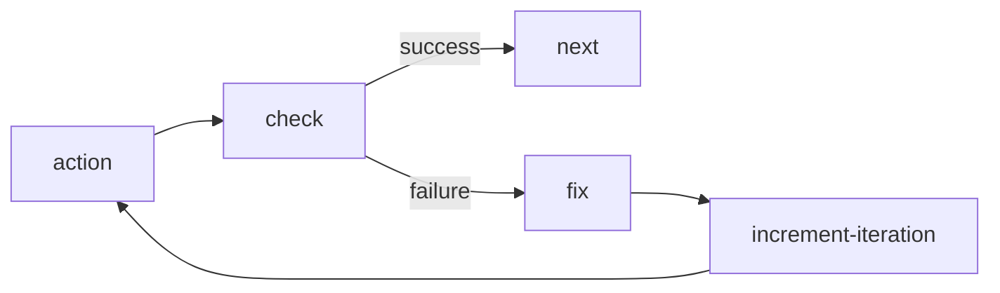
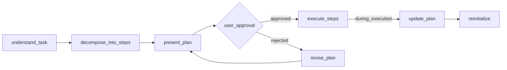
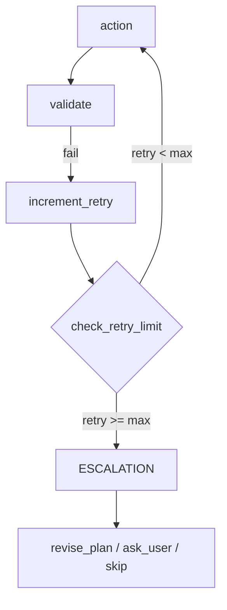
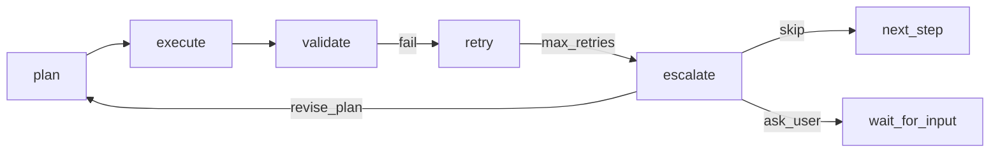

import { Aside, Steps, Tabs, TabItem } from "@astrojs/starlight/components";

Это руководство охватывает создание workflow с нуля, включая типовые паттерны, циклы валидации и лучшие практики.

## Быстрый старт

<Steps>
  1. Определите цель workflow и основные этапы 2. Спроектируйте структуру графа узлов 3. Создайте
  JSON с правильными определениями узлов 4. Проверьте связи и достижимость 5. Сохраните через MCP
  tools
</Steps>

## Структура Workflow

Каждый workflow должен содержать:

```json
{
  "id": "my-workflow",
  "metadata": {
    "name": "Читаемое название",
    "version": "1.0.0",
    "description": "Что делает этот workflow"
  },
  "nodes": [
    // start узел (ровно один)
    // action узлы
    // condition узлы (для ветвления)
    // end узел (минимум один)
  ]
}
```

## Типовые паттерны

### Цикл валидации

Используйте когда нужно проверить результат и повторить при ошибке:



```json
{
  "id": "do-work",
  "type": "agent-directive",
  "directive": "Выполни задачу",
  "completionCondition": "Задача выполнена",
  "inputSchema": {
    "type": "object",
    "properties": {
      "result_valid": { "type": "string", "enum": ["yes", "no"] }
    },
    "required": ["result_valid"]
  },
  "connections": { "success": "check-result" }
},
{
  "id": "check-result",
  "type": "condition",
  "condition": {
    "operator": "eq",
    "left": { "contextPath": "result_valid" },
    "right": "yes"
  },
  "connections": {
    "true": "next-step",
    "false": "fix-issues"
  }
},
{
  "id": "fix-issues",
  "type": "agent-directive",
  "directive": "Исправь найденные проблемы",
  "connections": { "success": "increment-iteration" }
},
{
  "id": "increment-iteration",
  "type": "agent-directive",
  "directive": "Увеличь счетчик итераций",
  "inputSchema": {
    "type": "object",
    "properties": {
      "iteration": { "type": "number" }
    },
    "required": ["iteration"]
  },
  "connections": { "success": "do-work" }
}
```

<Aside type="tip">
  Разделяйте ответственность: action узлы ВЫПОЛНЯЮТ работу, check узлы ТОЛЬКО проверяют, fix узлы
  ТОЛЬКО исправляют. Используйте счетчики итераций для предотвращения бесконечных циклов.
</Aside>

### Ветвление по типу действия

Используйте когда workflow имеет разные пути для разных сценариев:

```json
{
  "id": "get-action",
  "type": "agent-directive",
  "directive": "Спроси пользователя: создать новый или редактировать существующий?",
  "inputSchema": {
    "properties": {
      "action": { "type": "string", "enum": ["create", "edit"] }
    },
    "required": ["action"]
  },
  "connections": { "success": "route-action" }
},
{
  "id": "route-action",
  "type": "condition",
  "condition": {
    "operator": "eq",
    "left": { "contextPath": "action" },
    "right": "create"
  },
  "connections": {
    "true": "create-branch",
    "false": "edit-branch"
  }
}
```

### Gate подтверждения

Используйте для критических действий требующих подтверждения:

```json
{
  "id": "show-plan",
  "type": "agent-directive",
  "directive": "Представь план пользователю и спроси подтверждение",
  "inputSchema": {
    "properties": {
      "approved": { "type": "string", "enum": ["yes", "no"] },
      "feedback": { "type": "string" }
    },
    "required": ["approved"]
  },
  "connections": { "success": "check-approval" }
},
{
  "id": "check-approval",
  "type": "condition",
  "condition": {
    "operator": "eq",
    "left": { "contextPath": "approved" },
    "right": "yes"
  },
  "connections": {
    "true": "proceed",
    "false": "revise-plan"
  }
}
```

## Паттерны Input Schema

### Ответ Да/Нет

```json
{
  "inputSchema": {
    "type": "object",
    "properties": {
      "result": { "type": "string", "enum": ["yes", "no"] },
      "details": { "type": "string" }
    },
    "required": ["result"]
  }
}
```

### Числовой счетчик

```json
{
  "inputSchema": {
    "type": "object",
    "properties": {
      "count": { "type": "number", "minimum": 0 },
      "total": { "type": "number", "minimum": 1 }
    },
    "required": ["count", "total"]
  }
}
```

### Массив элементов

```json
{
  "inputSchema": {
    "type": "object",
    "properties": {
      "items": {
        "type": "array",
        "items": { "type": "string" },
        "minItems": 1
      }
    },
    "required": ["items"]
  }
}
```

### Выбор из нескольких вариантов

```json
{
  "inputSchema": {
    "type": "object",
    "properties": {
      "action": {
        "type": "string",
        "enum": ["create", "edit", "delete", "cancel"]
      },
      "reason": { "type": "string" }
    },
    "required": ["action"]
  }
}
```

### Путь к файлу с паттерном

```json
{
  "inputSchema": {
    "type": "object",
    "properties": {
      "file_path": {
        "type": "string",
        "pattern": "^[a-zA-Z0-9/_.-]+\\.(json|yaml|yml)$"
      }
    },
    "required": ["file_path"]
  }
}
```

## Операторы условий

| Оператор  | Описание              | Пример                |
| --------- | --------------------- | --------------------- |
| `eq`      | Равно                 | `"right": "value"`    |
| `neq`     | Не равно              | `"right": "value"`    |
| `lt`      | Меньше                | `"right": 10`         |
| `gt`      | Больше                | `"right": 0`          |
| `lte`     | Меньше или равно      | `"right": 100`        |
| `gte`     | Больше или равно      | `"right": 1`          |
| `and`     | Логическое И          | `"conditions": [...]` |
| `or`      | Логическое ИЛИ        | `"conditions": [...]` |
| `exists`  | Переменная существует | —                     |
| `isEmpty` | Массив/строка пусты   | —                     |

### Пример сложного условия

```json
{
  "condition": {
    "operator": "and",
    "conditions": [
      {
        "operator": "eq",
        "left": { "contextPath": "status" },
        "right": "ready"
      },
      {
        "operator": "gt",
        "left": { "contextPath": "count" },
        "right": 0
      }
    ]
  }
}
```

## Объявление знаний как глобальных переменных

Объявляйте переиспользуемые знания как глобальные переменные в `variableRegistry` workflow со значением `default`:

```json
{
  "variableRegistry": {
    "quality_rules": {
      "type": "string",
      "description": "Переиспользуемые правила качества, применяемые агентом на шагах",
      "default": "Правило 1: ... Правило 2: ..."
    },
    "validation_checklist": {
      "type": "string",
      "description": "Чеклист, который агент проверяет перед завершением шага",
      "default": "Проверка 1: ... Проверка 2: ..."
    }
  }
}
```

Обращение в директивах:

```json
{
  "directive": "Следуй этим правилам: {{quality_rules}}"
}
```

<Aside type="tip">
  Это делает workflow самодокументируемым. Все знания встроены, внешняя документация не нужна.
</Aside>

## Чеклист валидации

Перед сохранением проверьте:

1. **Структура**
   - Ровно один start узел
   - Минимум один end узел
   - Все ID узлов уникальны
   - Все connections указывают на существующие узлы

2. **Достижимость**
   - Все узлы достижимы от start
   - Нет orphan узлов
   - Все пути ведут к end

3. **Определения узлов**
   - `directive` не пустой
   - `completionCondition` определен
   - `connections.success` указан
   - `inputSchema` — валидный JSON Schema

4. **Условия**
   - `true` и `false` connections определены
   - Оператор валиден

## Сохранение Workflows

<Tabs>
  <TabItem label="Создать новый">
    ```typescript
    mcp__moira__manage({
      action: "create",
      workflow: {
        id: "my-workflow",
        metadata: { name: "...", version: "1.0.0", description: "..." },
        nodes: [...]
      }
    })
    ```
  </TabItem>
  <TabItem label="Редактировать">
    ```typescript
    mcp__moira__manage({
      action: "edit",
      workflowId: "my-workflow",
      changes: {
        metadata: { version: "1.1.0" },
        updateNodes: [
          { nodeId: "step-1", changes: { directive: "Новый текст" } }
        ]
      }
    })
    ```
  </TabItem>
  <TabItem label="Загрузить файл">
    ```typescript
    // Для агентов с доступом к файловой системе
    const { uploadUrl } = await mcp__moira__token({ action: "upload" });
    // Загрузите JSON файл по uploadUrl
    ```
  </TabItem>
</Tabs>

## Определение возможностей агента

Разные агенты имеют разные возможности. Проектируйте workflow для определения и адаптации:

### Категории возможностей

| Возможность      | Примеры                      | Метод определения           |
| ---------------- | ---------------------------- | --------------------------- |
| Файловая система | Read, Write, создание файлов | Спросить агента             |
| Web доступ       | Fetch URL, поиск             | Проверить наличие web tools |
| Только MCP       | Только инструменты Moira     | Предположение по умолчанию  |

### Паттерн определения

```json
{
  "id": "detect-capabilities",
  "type": "agent-directive",
  "directive": "Сообщи свои возможности: есть ли доступ к файловой системе? можешь ли получать URL?",
  "inputSchema": {
    "type": "object",
    "properties": {
      "has_file_access": { "type": "boolean" },
      "has_web_access": { "type": "boolean" }
    },
    "required": ["has_file_access", "has_web_access"]
  },
  "connections": { "success": "route-by-capabilities" }
}
```

### Условное ветвление

```json
{
  "id": "route-by-capabilities",
  "type": "condition",
  "condition": {
    "operator": "eq",
    "left": { "contextPath": "has_file_access" },
    "right": true
  },
  "connections": {
    "true": "file-based-flow",
    "false": "mcp-only-flow"
  }
}
```

<Aside type="tip">
  Всегда предоставляйте fallback пути для агентов с ограниченными возможностями. MCP tools доступны
  всегда.
</Aside>

## Паттерн планирования

Используйте когда workflow должен создать и выполнить план с подтверждением пользователя и возможностью пересмотра.

### Проблема

Workflow часто требуют этапа планирования, но:

- Планы создаются один раз и не пересматриваются
- Требования к качеству плана не формализованы
- Нет возможности адаптировать план по ходу выполнения
- Агент теряет контекст в длинных сессиях

### Структура паттерна



### Ключевые компоненты

1. **variableRegistry.plan_writing_requirements** — правила написания планов (агент видит при создании)
2. **decompose_into_steps** — директива с `{{plan_writing_requirements}}` для создания плана
3. **user_approval_branch** — approved → execute, rejected → revise_plan → present_plan
4. **update_during_execution** — возможность адаптировать план по ходу выполнения

### Требования к написанию плана

Главная проблема: агент теряет контекст (архивация сессии, простое забывание). Планы должны быть написаны так, чтобы любой шаг можно было выдать агенту БЕЗ остального плана — и он смог бы выполнить.

| Требование              | Почему важно                      | Пример                                                         |
| ----------------------- | --------------------------------- | -------------------------------------------------------------- |
| Плоский линейный список | Легче отслеживать без иерархии    | 1, 2, 3... не 1.1, 1.2, 1.2.1                                  |
| Самодостаточные шаги    | Любой шаг выполним без контекста  | "Шаг 3: Создать файл X.ts с функцией Y" не "Продолжить работу" |
| Явные действия          | Не "как обычно", а конкретно      | "Сделать коммит" в каждом шаге где нужен                       |
| Измеримый результат     | Легко проверить выполнение        | "expected_output: файл X.ts создан и содержит функцию Y"       |
| Независимость           | Минимум зависимостей между шагами | Шаг 4 не должен требовать знания деталей шага 2                |
| Полные пути к файлам    | Агент не должен угадывать         | `/full/path/to/file.json`, не "в соответствующей папке"        |
| Избыточность разрешена  | Лучше повторить чем забыть        | Повторять "сделать коммит" в каждом шаге если нужно            |

### Атомарность пункта (S9)

Каждый пункт плана или задачи должен быть самодостаточным. Агент часто получает директиву ОДНОГО пункта изолированно — без остального плана — поэтому пункт должен нести всё необходимое для его выполнения:

- Повторить нюансы, от которых зависит пункт.
- Повторить релевантное исходное требование внутри пункта.
- Дублировать сквозные действия (отчёт о прогрессе, запуск тестов, коммит) в КАЖДЫЙ пункт, которому они нужны.

Нет общего или глобального scope между пунктами. Избыточность обязательна, а не недостаток: повторение сквозного действия в каждом пункте корректно, потому что агент не может рассчитывать на то, что видел его в другом пункте.

```json
{
  "id": "execute-plan-item",
  "type": "agent-directive",
  "directive": "Execute one plan item.\n\nThe item text is self-contained: it states the original requirement, the files to read/modify with full paths, and the cross-cutting actions (run tests, make commit) that apply to THIS item.\n\nDo NOT assume any context from other items.",
  "completionCondition": "Item executed, tests run, and commit made as stated in the item",
  "connections": { "success": "next-item" }
}
```

<Aside type="tip">
  Два связанных паттерна развивают это руководство: [паттерн
  Replan](/ru/docs/patterns/replan/) пересматривает многошаговый план по ходу выполнения, а [паттерн
  Completeness Self-Review](/ru/docs/patterns/self-review/) проверяет каждое требование против
  реального артефакта перед выдачей.
</Aside>

### Пример реализации

```json
{
  "variableRegistry": {
    "plan_writing_requirements": {
      "type": "string",
      "description": "Правила, которым агент следует при написании плана",
      "default": "ТРЕБОВАНИЯ К НАПИСАНИЮ ПЛАНА:\n\n- Плоский линейный список — без иерархии, без вложенных подпунктов, просто 1, 2, 3...\n- Один пункт = одна задача — не микрошаг ('скачать файл'), а законченная задача ('обновить workflow до v2.1.0')\n- Полная самодостаточность — содержит ВСЁ для выполнения: зачем делать, что делать, какие файлы читать/менять, куда сохранять, что коммитить\n- НЕТ отдельных 'глобальных правил' — всё нужное для пункта должно быть В пункте\n- Явные действия — не 'как обычно', а конкретно: 'загрузить на moira-local через token', 'сделать коммит'\n- Избыточность разрешена — лучше повторить 'сделать коммит' в каждом пункте, чем забыть\n- Полные пути к файлам — не 'в соответствующей папке', а /full/path/to/file.json\n- Измеримый результат — легко проверить выполнение пункта"
    }
  },
  "nodes": [
    {
      "type": "start",
      "id": "start",
      "connections": { "default": "analyze-task" }
    },
    {
      "id": "decompose-into-steps",
      "type": "agent-directive",
      "directive": "Создай план выполнения задачи.\n\nСледуй требованиям: {{plan_writing_requirements}}\n\nДля каждого шага укажи:\n- Что делать (action)\n- Ожидаемый результат (expected_output)",
      "inputSchema": {
        "type": "object",
        "properties": {
          "steps": {
            "type": "array",
            "items": {
              "type": "object",
              "properties": {
                "action": { "type": "string" },
                "expected_output": { "type": "string" }
              },
              "required": ["action", "expected_output"]
            }
          }
        },
        "required": ["steps"]
      },
      "connections": { "success": "present-plan" }
    },
    {
      "id": "present-plan",
      "type": "agent-directive",
      "directive": "Покажи план пользователю.\n\n⚠️ ОБЯЗАТЕЛЬНО: ДОЖДИСЬ ОТВЕТА ПОЛЬЗОВАТЕЛЯ\n- Спроси: 'Подтверждаете план? (да/нет)'\n- ОСТАНОВИСЬ и жди пока пользователь напишет ответ",
      "inputSchema": {
        "type": "object",
        "properties": {
          "plan_approved": { "type": "string", "enum": ["да", "нет"] },
          "user_feedback": { "type": "string" }
        },
        "required": ["plan_approved"]
      },
      "connections": { "success": "check-plan-approval" }
    },
    {
      "id": "check-plan-approval",
      "type": "condition",
      "condition": {
        "operator": "eq",
        "left": { "contextPath": "plan_approved" },
        "right": "да"
      },
      "connections": {
        "true": "execute-steps",
        "false": "revise-plan"
      }
    },
    {
      "id": "revise-plan",
      "type": "agent-directive",
      "directive": "Пользователь не одобрил план. Фидбек: {{user_feedback}}\n\nДоработай план на основе фидбека.\nСледуй: {{plan_writing_requirements}}",
      "connections": { "success": "present-plan" }
    }
  ]
}
```

### Обновление плана по ходу выполнения

Для длинных workflows добавьте возможность обновить план в процессе:

```json
{
  "id": "update-plan-during-execution",
  "type": "agent-directive",
  "directive": "Обнови план по ходу выполнения.\n\nТекущий шаг: {{current_step_index}}\nПричина обновления: {{update_reason}}\n\n1. Проанализируй текущий прогресс\n2. Обнови оставшиеся шаги (не меняй завершённые)\n3. Сохрани историю в ./plan-changes-history.md\n\nСледуй: {{plan_writing_requirements}}",
  "connections": { "success": "reinitialize-tracking" }
},
{
  "id": "reinitialize-tracking",
  "type": "agent-directive",
  "directive": "Реинициализируй tracking после обновления плана.\n\n1. Обнови tracking.json с новым total_steps\n2. Скорректируй current_step_index если нужно\n3. Продолжи выполнение",
  "connections": { "success": "execute-current-step" }
}
```

<Aside type="tip">
  Храните план в файле (например, `./plan.md`) вместо контекста для больших планов. Это
  предотвращает переполнение контекста и позволяет восстановиться после архивации сессии.
</Aside>

## Паттерн эскалации

Используйте когда workflow имеет циклы валидации которые могут застрять. Предоставляет механизм выхода после повторных неудач.

### Проблема

Когда агент застревает в цикле валидации:

- Бесконечные повторы без прогресса
- Одни и те же ошибки повторяются
- Нет способа выйти из цикла
- Пользователь ждёт бесконечно

### Структура паттерна



### Когда применять

- Workflows с планированием (robust-task, development)
- Workflows с валидацией результатов (workflow-management, test-generation)
- Любые циклы "сделай → проверь → повтори"

### Варианты эскалации

| Вариант       | Когда использовать     | Пример                                   |
| ------------- | ---------------------- | ---------------------------------------- |
| `revise_plan` | Текущий план неверен   | Тесты падают из-за неправильного дизайна |
| `ask_user`    | Нужно решение человека | Неясные требования                       |
| `skip`        | Шаг не критичен        | Опциональное улучшение                   |

### Пример реализации

```json
{
  "id": "increment-retry",
  "type": "agent-directive",
  "directive": "Увеличь счётчик повторов. Текущий: {{step_retry}}",
  "inputSchema": {
    "type": "object",
    "properties": {
      "step_retry": { "type": "number", "minimum": 1 }
    },
    "required": ["step_retry"]
  },
  "connections": { "success": "check-retry-limit" }
},
{
  "id": "check-retry-limit",
  "type": "condition",
  "condition": {
    "operator": "gte",
    "left": { "contextPath": "step_retry" },
    "right": 3
  },
  "connections": {
    "true": "notify-escalation",
    "false": "retry-action"
  }
},
{
  "id": "notify-escalation",
  "type": "telegram-notification",
  "message": "⚠️ *Требуется эскалация*\n\nШаг не удался после {{step_retry}} попыток.\n\nВарианты:\n- revise_plan\n- ask_user\n- skip",
  "parseMode": "Markdown",
  "connections": { "default": "ask-escalation-decision", "error": "ask-escalation-decision" }
},
{
  "id": "ask-escalation-decision",
  "type": "agent-directive",
  "directive": "Шаг не удался после {{step_retry}} попыток.\n\nСпроси пользователя:\n1. **revise_plan** — вернуться к планированию и пересмотреть подход\n2. **ask_user** — запросить помощь человека с конкретной проблемой\n3. **skip** — пропустить этот шаг и продолжить\n\n⚠️ ДОЖДИСЬ ОТВЕТА ПОЛЬЗОВАТЕЛЯ",
  "inputSchema": {
    "type": "object",
    "properties": {
      "escalation_decision": {
        "type": "string",
        "enum": ["revise_plan", "ask_user", "skip"]
      },
      "user_input": { "type": "string" }
    },
    "required": ["escalation_decision"]
  },
  "connections": { "success": "route-escalation" }
},
{
  "id": "route-escalation",
  "type": "condition",
  "condition": {
    "operator": "eq",
    "left": { "contextPath": "escalation_decision" },
    "right": "revise_plan"
  },
  "connections": {
    "true": "revise-plan",
    "false": "route-escalation-skip"
  }
},
{
  "id": "route-escalation-skip",
  "type": "condition",
  "condition": {
    "operator": "eq",
    "left": { "contextPath": "escalation_decision" },
    "right": "skip"
  },
  "connections": {
    "true": "mark-step-skipped",
    "false": "handle-user-help"
  }
}
```

### Комбинация с паттерном планирования

При использовании обоих паттернов — Planning и Escalation:



Вариант `revise_plan` возвращает к фазе Planning, позволяя агенту пересмотреть подход на основе того, что он узнал из неудач.

<Aside type="tip">
  Устанавливайте `max_retries` в зависимости от сложности задачи. Простые задачи: 2-3 повтора.
  Сложные задачи: 3-5 повторов. Всегда предоставляйте вариант `skip` для некритичных шагов.
</Aside>

## Production паттерны

Реальные паттерны из production workflows (development-flow, 104 ноды).

### Express/Full Mode ветвление

Маршрутизация в упрощённый или полный flow в зависимости от сложности:

```
[get-requirements] → [check-mode] → express=true → [express-flow]
                                  → express=false → [full-flow]
```

```json
{
  "id": "check-development-mode",
  "type": "condition",
  "condition": {
    "operator": "eq",
    "left": { "contextPath": "development_mode" },
    "right": "express"
  },
  "connections": {
    "true": "express-implementation",
    "false": "analyze-and-plan"
  }
}
```

### Цикл уточнения плана

Представить план → получить фидбек → уточнить → подтвердить:

```
[present-plan] → [check-approval] → approved → [continue]
                                  → rejected → [refine] → [confirm] → [continue]
```

### Паттерн числовой валидации (рекомендуемый)

<Aside type="caution">
  **Проблема boolean валидации:** Агенты склонны к оптимизму. На вопрос "Результат валиден? да/нет"
  они могут ответить "да" даже когда нашли проблемы. Это обесценивает validation loops.
</Aside>

**Решение:** Используйте числовой счётчик проблем вместо boolean. Движок механически проверяет равен ли счётчик нулю — нет места для интерпретации.

```json
{
  "id": "validate-result",
  "type": "agent-directive",
  "directive": "ТОЛЬКО ПРОВЕРЬ результат. Подсчитай найденные проблемы.",
  "inputSchema": {
    "type": "object",
    "properties": {
      "issues_count": {
        "type": "number",
        "minimum": 0,
        "description": "Количество найденных проблем (0 = валидно)"
      },
      "issues": {
        "type": "array",
        "items": { "type": "string" },
        "description": "Список проблем если есть"
      }
    },
    "required": ["issues_count"]
  },
  "connections": { "success": "route-validation" }
},
{
  "id": "route-validation",
  "type": "condition",
  "condition": {
    "operator": "eq",
    "left": { "contextPath": "issues_count" },
    "right": 0
  },
  "connections": {
    "true": "next-step",
    "false": "fix-issues"
  }
}
```

**Почему это работает:**

- Агент не может соврать про число (количество объективно)
- Условие `issues_count == 0` проверяется механически движком
- Нет места для "почти готово" или "незначительные проблемы"

**Когда использовать:** ВСЕ validation loops должны использовать этот паттерн. Замените существующие `is_valid: enum["да","нет"]` на `issues_count: number`.

### Числовая валидация с результатами тестов

Валидация с числовыми проверками вместо да/нет:

```json
{
  "id": "run-tests",
  "type": "agent-directive",
  "directive": "Запусти тесты и сообщи результаты",
  "inputSchema": {
    "type": "object",
    "properties": {
      "tests_passed": { "type": "number" },
      "tests_failed": { "type": "number" }
    },
    "required": ["tests_passed", "tests_failed"]
  },
  "connections": { "success": "check-tests" }
},
{
  "id": "check-tests",
  "type": "condition",
  "condition": {
    "operator": "eq",
    "left": { "contextPath": "tests_failed" },
    "right": 0
  },
  "connections": {
    "true": "continue",
    "false": "fix-tests"
  }
}
```

### Telegram уведомления

Уведомления держат пользователя в курсе во время долгих workflows. Используйте их стратегически — слишком много уведомлений становятся шумом.

#### Когда использовать уведомления

| Сценарий                         | Зачем уведомлять                                     |
| -------------------------------- | ---------------------------------------------------- |
| **Начало этапа** (долгие задачи) | Пользователь видит прогресс, может планировать время |
| **Требуется ввод пользователя**  | Пользователь знает что нужно ответить                |
| **Критические ошибки**           | Немедленное информирование о блокерах                |
| **Завершение задачи**            | Пользователь может проверить результаты              |

#### Когда НЕ использовать

- Короткие workflows (< 5 минут)
- Между каждым мелким шагом
- Для внутренних validation loops
- Когда ошибка авто-восстанавливаема

#### Паттерн: Уведомление о начале этапа

Для многошаговых задач уведомляйте на каждом крупном этапе:

```json
{
  "id": "notify-step-start",
  "type": "telegram-notification",
  "message": "🚀 *Шаг {{current_step}}/{{total_steps}}*\n\n{{current_step_description}}",
  "parseMode": "Markdown",
  "connections": {
    "default": "execute-step",
    "error": "execute-step"
  }
}
```

#### Паттерн: Требуется ввод пользователя

Оповещение когда workflow заблокирован ожиданием пользователя:

```json
{
  "id": "notify-approval-needed",
  "type": "telegram-notification",
  "message": "⏳ *Ожидаю подтверждения*\n\nПлан готов к ревью. Подтвердите для продолжения.",
  "parseMode": "Markdown",
  "connections": {
    "default": "present-plan-to-user",
    "error": "present-plan-to-user"
  }
}
```

#### Паттерн: Оповещение об эскалации

Когда автоматические retry не помогли и нужно решение человека:

```json
{
  "id": "notify-escalation",
  "type": "telegram-notification",
  "message": "⚠️ *Требуется действие*\n\nШаг {{current_step}} не удался после {{max_retries}} попыток.\n\nВарианты:\n- Пропустить этот шаг\n- Выполнить вручную",
  "parseMode": "Markdown",
  "connections": {
    "default": "ask-user-decision",
    "error": "ask-user-decision"
  }
}
```

#### Паттерн: Итоговое уведомление

Уведомление при завершении задачи:

```json
{
  "id": "notify-completion",
  "type": "telegram-notification",
  "message": "✅ *Задача выполнена*\n\n{{task_name}}\n\nРезультат: {{deliverable_summary}}",
  "parseMode": "Markdown",
  "connections": {
    "default": "end",
    "error": "end"
  }
}
```

<Aside type="tip">
  Всегда устанавливайте `connections.error` → то же что `default` для graceful degradation при
  ошибках Telegram.
</Aside>

<Aside type="note">
  Для очень долгих задач (часы) рассмотрите периодические heartbeat уведомления "всё ещё работаю",
  чтобы пользователь знал что процесс жив.
</Aside>

## Паттерны файловой персистенции

Для агентов с доступом к файловой системе используйте файлы для:

- Выгрузки больших данных из контекста workflow
- Отслеживания прогресса выполнения между итерациями
- Восстановления после прерываний
- Создания аудит-лога

<Aside type="note">
  Эти паттерны работают только для агентов с файловым доступом. Предусмотрите fallback для MCP-only
  агентов.
</Aside>

### Структура директорий

Используйте шаблоны для организации файлов:

```
./{{task_name}}/
├── process-id.txt              # ID выполнения workflow
├── plan.md                     # Текущий план
├── step-{{step_index}}/
│   ├── iteration-{{iteration}}/
│   │   ├── result.md           # Результат шага
│   │   └── artifacts/          # Сгенерированные файлы
│   └── summary.md              # Сводка по шагу
└── final-report.md             # Финальный отчёт
```

### Отслеживание прогресса

Сохраняйте process ID для восстановления:

```json
{
  "id": "save-process-id",
  "type": "agent-directive",
  "directive": "Сохрани process ID в ./{{task_name}}/process-id.txt для восстановления",
  "completionCondition": "Файл создан с process ID",
  "connections": { "success": "next-step" }
}
```

### Снимки итераций

Сохраняйте результаты итераций в файлы вместо контекста:

```json
{
  "id": "save-iteration-result",
  "type": "agent-directive",
  "directive": "Сохрани результат итерации {{current_iteration}} в ./{{task_name}}/step-{{step_index}}/iteration-{{current_iteration}}/result.md",
  "completionCondition": "Результат сохранён в файл",
  "inputSchema": {
    "type": "object",
    "properties": {
      "file_path": { "type": "string" }
    },
    "required": ["file_path"]
  },
  "connections": { "success": "next-iteration" }
}
```

### Выгрузка контекста

Ссылайтесь на файлы вместо хранения больших данных в контексте:

```json
{
  "id": "analyze-with-file-reference",
  "type": "agent-directive",
  "directive": "Прочитай анализ из {{analysis_file_path}} и продолжи обработку",
  "completionCondition": "Анализ загружен и обработан"
}
```

### Когда использовать файловую персистенцию

| Сценарий                | Файловый подход             | Контекстный подход      |
| ----------------------- | --------------------------- | ----------------------- |
| Большой анализ кода     | Сохранить в файл, ссылаться | Не рекомендуется        |
| История итераций        | Сохранять каждую итерацию   | Хранить только текущую  |
| Данные восстановления   | process-id.txt обязателен   | Теряется при прерывании |
| Аудит-лог               | Дописывать в лог-файл       | Недоступно              |
| Маленькие флаги статуса | Оба подхода                 | Проще                   |

<Aside type="tip">
  Сначала определите возможности агента (см. Определение возможностей агента) и предусмотрите оба
  пути — файловый и контекстный.
</Aside>

## Проблема получения ответа от пользователя

Когда workflow требует подтверждения от пользователя, агент может "оптимизировать" — заполнить поля inputSchema не дожидаясь реального ответа.

### Проблема

```json
{
  "id": "approve-plan",
  "directive": "Покажи план пользователю. Спроси: 'Подтверждаете? (да/нет)'",
  "inputSchema": {
    "properties": {
      "approved": { "type": "string", "enum": ["да", "нет"] }
    }
  }
}
```

**Что происходит:** Агент показывает план, затем сразу заполняет `approved: "да"` не дожидаясь ответа пользователя.

**Почему:** Агент видит что может заполнить поле самостоятельно и "оптимизирует" не останавливаясь.

### Решение: явные инструкции ожидания

Добавьте явные инструкции которые ЗАСТАВЛЯЮТ агента ждать:

```json
{
  "id": "approve-plan",
  "directive": "Покажи план пользователю.\n\n⚠️ ОБЯЗАТЕЛЬНО: ДОЖДИСЬ ОТВЕТА ПОЛЬЗОВАТЕЛЯ\n- Спроси: 'Подтверждаете? (да/нет)'\n- ОСТАНОВИСЬ и жди пока пользователь напишет ответ\n- НЕ заполняй поле 'approved' пока пользователь явно не скажет да или нет\n- Показать информацию ≠ получить подтверждение",
  "completionCondition": "Пользователь явно ответил да или нет (не предполагаемый ответ)",
  "inputSchema": {
    "properties": {
      "approved": { "type": "string", "enum": ["да", "нет"] },
      "user_response_text": {
        "type": "string",
        "description": "Точный текст ответа пользователя"
      }
    },
    "required": ["approved", "user_response_text"]
  }
}
```

### Ключевые техники

1. **Добавить "ДОЖДИСЬ ОТВЕТА ПОЛЬЗОВАТЕЛЯ"** — явная инструкция остановиться
2. **Требовать user_response_text** — заставляет агента фиксировать реальный ответ
3. **Указать что НЕ делать** — "НЕ заполняй поле пока..."
4. **Разъяснить разницу** — "Показать ≠ получить подтверждение"

### Разделение на две ноды (альтернатива)

Для критичных подтверждений разделите на отдельные ноды:

```
[show-information] → [get-user-confirmation] → [route-decision]
```

Первая нода только показывает, вторая только получает ответ:

```json
{
  "id": "show-plan",
  "directive": "Покажи план пользователю. Объясни каждый этап.",
  "inputSchema": {
    "properties": {
      "plan_shown": { "type": "string", "enum": ["да"] }
    }
  },
  "connections": { "success": "get-plan-approval" }
},
{
  "id": "get-plan-approval",
  "directive": "Пользователь видит план выше. Спроси: 'Подтверждаете план? (да/нет)'\n\nЖДИ ответа пользователя. НЕ продолжай пока пользователь не напишет да или нет.",
  "inputSchema": {
    "properties": {
      "approved": { "type": "string", "enum": ["да", "нет"] }
    }
  },
  "connections": { "success": "route-approval" }
}
```

<Aside type="caution">
  Это известное ограничение workflows выполняемых агентами. Всегда тестируйте ноды с
  пользовательским вводом вручную перед деплоем.
</Aside>

## Лучшие практики

1. **Один узел = одна ответственность** — не смешивайте проверку и исправление
2. **Ясные директивы** — начинайте с глагола: Создай, Проверь, Исправь
3. **Явные отрицания** — "НЕ исправляй, ТОЛЬКО проверь"
4. **Используйте inputSchema** — всегда определяйте ожидаемую структуру ответа
5. **Числовая валидация** — используйте счётчики вместо да/нет для точных проверок
6. **Счетчики итераций** — предотвращайте бесконечные циклы
7. **Gate подтверждения** — для критических действий
8. **Самодокументирование** — объявляйте знания как значения по умолчанию в variableRegistry
9. **Graceful уведомления** — ошибки Telegram не должны блокировать workflow

## Связанное

- [Узлы](/docs/ru/concepts/nodes/) — Справочник типов узлов
- [Шаблоны](/docs/ru/concepts/templates/) — Динамический контент
- [Инструменты](/docs/ru/reference/tools/) — Справочник MCP tools
- [Паттерн Replan](/ru/docs/patterns/replan/) — Пересмотр многошагового плана по ходу выполнения
- [Completeness Self-Review](/ru/docs/patterns/self-review/) — Проверка каждого требования перед выдачей
