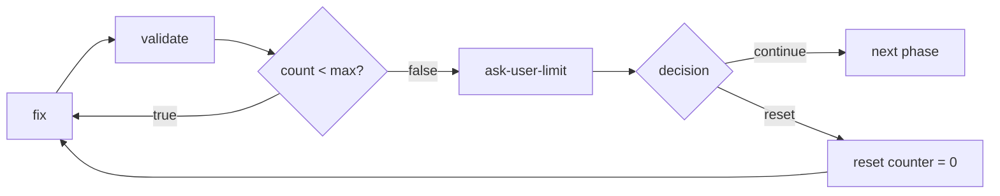

import { Aside } from "@astrojs/starlight/components";

## Назначение

Когда автоматические повторные попытки не дают результата, эскалация пользователю для ручного вмешательства. Предотвращает бесконечные циклы и позволяет использовать человеческое суждение при сложных сбоях.

## Эскалация при достижении лимита ограниченного цикла

Когда ограниченный цикл ([цикл валидации](/ru/docs/patterns/validation-loop/) или цикл исправления/повтора) достигает лимита итераций, ветвь лимита направляет к узлу запроса у пользователя. Она никогда не пропускает молча к следующей фазе — это скрывает неустранённые проблемы от пользователя.

Узел запроса у пользователя предлагает два решения:

- **continue** — принять текущий результат и продолжить, несмотря на оставшиеся проблемы
- **reset** — обнулить счётчик через узел expression и вернуться к шагу исправления



Решение фиксируется enum из двух вариантов:

```json
{
  "type": "agent-directive",
  "id": "ask-user-limit",
  "directive": "Validation reached its limit of {{max_validation_rounds}} rounds with {{issues_count}} issues remaining.\n\nAsk the user how to proceed:\n- continue: accept the current result and move on\n- reset: keep fixing (the round counter resets to 0)",
  "completionCondition": "User chose continue or reset",
  "inputSchema": {
    "type": "object",
    "properties": {
      "decision": { "type": "string", "enum": ["continue", "reset"] }
    },
    "required": ["decision"]
  },
  "connections": { "success": "route-limit-decision" }
}
```

Маршрутизация решения: `continue` переходит к следующей фазе, `reset` запускает узел expression сброса счётчика и возвращается обратно.

```json
{
  "type": "condition",
  "id": "route-limit-decision",
  "condition": {
    "operator": "eq",
    "left": { "contextPath": "decision" },
    "right": "reset"
  },
  "connections": {
    "true": "reset-validation-counter",
    "false": "next-phase"
  }
}
```

```json
{
  "type": "expression",
  "id": "reset-validation-counter",
  "expressions": ["validation_round = 0"],
  "connections": { "default": "fix-step" }
}
```

<Aside type="caution">
  Направление ветви лимита прямо к следующей фазе — это антипаттерн молчаливого пропуска. Всегда
  направляйте её через узел запроса у пользователя, чтобы пользователь сохранял контроль над
  неустранёнными проблемами.
</Aside>

## Структура

```
[action] → [verify] → failure → [check-retries] → retries<max → [retry]
                                               → retries>=max → [escalate-to-user]
```

## Реализация

### Проверка лимита повторов

```json
{
  "type": "condition",
  "id": "check-retry-limit",
  "condition": {
    "operator": "lt",
    "left": { "contextPath": "current_iteration" },
    "right": 3
  },
  "connections": {
    "true": "fix-and-retry",
    "false": "escalate-to-user"
  }
}
```

### Узел эскалации

```json
{
  "type": "agent-directive",
  "id": "escalate-to-user",
  "directive": "Automated resolution failed after {{current_iteration}} attempts.\n\nProblem: {{last_error}}\nAttempted fixes: {{attempted_fixes}}\n\nAsk user how to proceed:\n- Provide manual fix instructions?\n- Skip this step?\n- Abort workflow?",
  "inputSchema": {
    "type": "object",
    "properties": {
      "user_decision": { "type": "string", "enum": ["fix", "skip", "abort"] },
      "user_instructions": { "type": "string" }
    },
    "required": ["user_decision"]
  },
  "connections": { "success": "route-user-decision" }
}
```

<Aside type="tip">
  Всегда предоставляйте контекст пользователю: что не удалось, сколько попыток было, что пробовали.
  Это помогает ему принять обоснованное решение.
</Aside>

### Маршрутизация решения пользователя

```json
{
  "type": "condition",
  "id": "check-abort",
  "condition": {
    "operator": "eq",
    "left": { "contextPath": "user_decision" },
    "right": "abort"
  },
  "connections": {
    "true": "workflow-aborted",
    "false": "check-skip"
  }
}
```

```json
{
  "type": "condition",
  "id": "check-skip",
  "condition": {
    "operator": "eq",
    "left": { "contextPath": "user_decision" },
    "right": "skip"
  },
  "connections": {
    "true": "proceed-to-next",
    "false": "apply-user-fix"
  }
}
```

## Сбор контекста ошибок

Отслеживание ошибок во время повторных попыток:

```json
{
  "id": "handle-error",
  "directive": "Record error details for escalation context.\n\nCurrent iteration: {{current_iteration}}\nError encountered: [describe error]",
  "inputSchema": {
    "properties": {
      "last_error": { "type": "string" },
      "attempted_fix": { "type": "string" }
    },
    "required": ["last_error"]
  }
}
```

## Корректное прерывание

```json
{
  "type": "agent-directive",
  "id": "workflow-aborted",
  "directive": "User chose to abort workflow.\n\nCleanup tasks:\n- Save partial progress\n- Document what was completed\n- Note why abort was necessary",
  "inputSchema": {
    "properties": {
      "cleanup_completed": { "type": "boolean" },
      "progress_summary": { "type": "string" }
    },
    "required": ["cleanup_completed"]
  },
  "connections": { "success": "end-aborted" }
}
```

## Уровни эскалации

Для сложных workflow рассмотрите несколько уровней эскалации:

1. **Автоматический повтор**: Первые 3 попытки
2. **Анализ агентом**: Более глубокое исследование
3. **Уведомление пользователя**: Информировать, но продолжить
4. **Вмешательство пользователя**: Требуется решение
5. **Полное прерывание**: Остановить workflow

## Реальный пример

Из `development-flow.json`:

```json
{
  "id": "collect-user-feedback",
  "directive": "Verification failed {{current_iteration}} times.\n\nAsk user:\n- Provide guidance for resolution?\n- Skip this step?\n- Modify the plan?\n\nSummarize the problem and what has been attempted.",
  "inputSchema": {
    "properties": {
      "user_guidance": { "type": "string" },
      "decision": { "type": "string", "enum": ["continue", "skip", "modify"] }
    },
    "required": ["decision"]
  }
}
```

## Связанные паттерны

- [Цикл валидации](/ru/docs/patterns/validation-loop/) - Автоматический повтор перед эскалацией
- [Верификация шагов](/ru/docs/patterns/step-verification/) - Что запускает эскалацию
