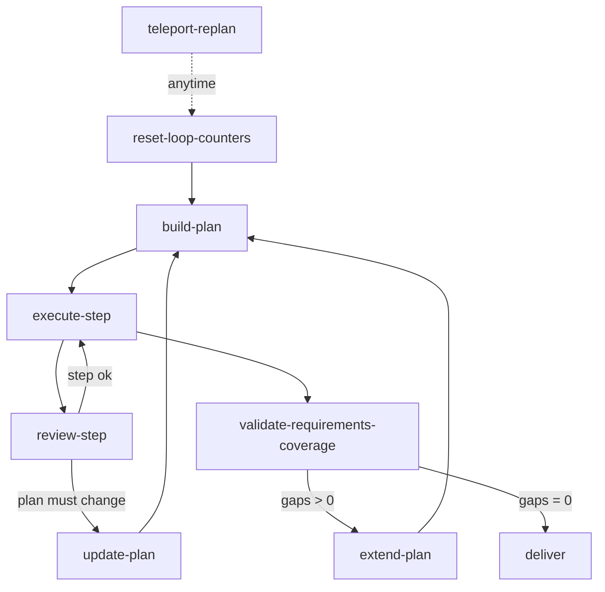

import { Aside } from "@astrojs/starlight/components";

Workflow, который строит многошаговый план и затем выполняет его пункты, нуждается в способе изменить этот план уже после старта выполнения. Три механизма покрывают все случаи: переход назад в любой момент, ветвление на обновление плана, когда ревью шага показывает что ошибочен сам план, и расширение плана, когда финальная проверка покрытия находит пробелы.

## Три способа пересмотреть план



## Реестр переменных

Объявите счётчики циклов и диспетчер с числовыми или строковыми значениями по умолчанию:

```json
{
  "variableRegistry": {
    "validation_round": { "type": "number", "description": "Re-validation pass counter", "default": 0 },
    "max_validation_rounds": { "type": "number", "description": "Re-validation bound", "default": 5 },
    "requirements_gaps_count": { "type": "number", "description": "Unmet requirements at coverage check", "default": 0 },
    "plan_change_target": { "type": "string", "description": "Dispatcher: refine | extend | update", "default": "" }
  }
}
```

## 1. Teleport (в любой момент)

Нода `teleport` достижима в любой точке выполнения через `step({ processId, teleportTo: "teleport-replan" })`. У неё НЕТ входящих связей — она исключена из предупреждений о недостижимых нодах и не может быть достигнута обычной маршрутизацией.

```json
{
  "type": "teleport",
  "id": "teleport-replan",
  "hint": "Use when the whole plan needs restructuring, not just the current step",
  "directive": "Capture why the plan must change, then a new plan will be built.\n\nReason for replanning: state what changed and what the plan must now cover.",
  "completionCondition": "Reason for replanning captured",
  "inputSchema": {
    "type": "object",
    "properties": {
      "replan_reason": { "type": "string" }
    },
    "required": ["replan_reason"]
  },
  "connections": { "success": "reset-loop-counters" }
}
```

Исходящая цепочка teleport сбрасывает счётчики циклов перед переходом к ноде построения плана, чтобы новый план начинал свои циклы валидации с нуля:

```json
{
  "type": "expression",
  "id": "reset-loop-counters",
  "expressions": ["validation_round = 0", "requirements_gaps_count = 0"],
  "connections": { "default": "build-plan" }
}
```

<Aside type="caution">
  НЕ передавайте `input` при телепортации. Нода teleport показывает собственную директиву, как
  только переход выполнен. Контекст выполнения (все переменные) сохраняется при переходе.
</Aside>

## 2. Перепланирование по валидации шага

Когда ревью отдельного шага приходит к выводу, что должен измениться ПЛАН, а не только текущий шаг, маршрутизируйте на ветку обновления плана вместо повтора шага. Нода ревью записывает глобальную переменную, помечающую масштаб проблемы:

```json
{
  "type": "agent-directive",
  "id": "review-step",
  "directive": "Review the completed step. Decide whether the failure is local to this step or means the plan itself is wrong.\n\nIf the plan structure must change, set plan_change_target to \"update\".",
  "completionCondition": "Step reviewed and scope of any problem classified",
  "inputSchema": {
    "type": "object",
    "globalInputs": ["plan_change_target"],
    "properties": {
      "step_ok": { "type": "string", "enum": ["yes", "no"] }
    },
    "required": ["plan_change_target", "step_ok"]
  },
  "connections": { "success": "route-plan-change" }
}
```

```json
{
  "type": "condition",
  "id": "route-plan-change",
  "condition": {
    "operator": "eq",
    "left": { "contextPath": "plan_change_target" },
    "right": "update"
  },
  "connections": {
    "true": "update-plan",
    "false": "execute-step"
  }
}
```

Нода `update-plan` пересматривает план и маршрутизирует обратно на `build-plan` (или прямо к следующему пункту), как только структура исправлена.

## 3. Расширение перед финалом

Перед финальной выдачей проверка покрытия считает требования, которые ещё не выполнены. Пробелы маршрутизируются на ветку расширения/исправления; ноль пробелов — на выдачу.

```json
{
  "type": "agent-directive",
  "id": "validate-requirements-coverage",
  "directive": "Compare the produced work against every original requirement. Count the requirements with no concrete evidence of completion.",
  "completionCondition": "Every requirement checked against the artifact and gap count reported",
  "inputSchema": {
    "type": "object",
    "globalInputs": ["requirements_gaps_count"],
    "properties": {
      "coverage_notes": { "type": "string" }
    },
    "required": ["requirements_gaps_count"]
  },
  "connections": { "success": "check-requirements-gaps" }
}
```

```json
{
  "type": "condition",
  "id": "check-requirements-gaps",
  "condition": {
    "operator": "eq",
    "left": { "contextPath": "requirements_gaps_count" },
    "right": 0
  },
  "connections": {
    "true": "deliver",
    "false": "extend-plan"
  }
}
```

`extend-plan` добавляет пункты для недостающих требований и маршрутизирует обратно на `build-plan`, повторно входя в выполнение, пока покрытие не достигнет нуля пробелов.

## Переменная-диспетчер

Одна глобальная переменная `plan_change_target` может выбирать между тремя видами пересмотра, когда они используют одну ноду обновления. Значение (`refine`, `extend` или `update`) записывает нода, обнаружившая необходимость, а нода condition маршрутизирует по нему. Значение по умолчанию `""` означает, что пересмотр не запланирован.

## Связанные паттерны

- [Цикл валидации](/ru/docs/patterns/validation-loop/) - Ограниченная ре-валидация вокруг одной ноды
- [Самопроверка полноты](/ru/docs/patterns/self-review/) - Проверка покрытия перед выдачей
- [Эскалация](/ru/docs/patterns/escalation/) - Маршрутизация предела цикла к пользователю
- [Создание workflow](/ru/docs/guides/workflow-creation/) - Правила атомарности пунктов плана
