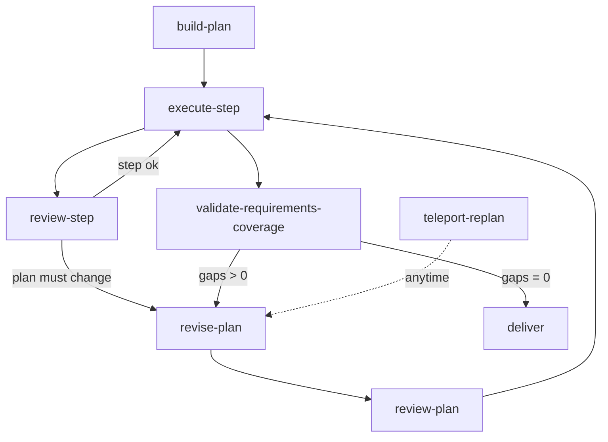

import { Aside } from "@astrojs/starlight/components";

Workflow, который строит многошаговый план и затем выполняет его пункты, нуждается в способе
изменить этот план уже после старта выполнения. Это случай плана в общем паттерне
[Пересмотр процесса](/ru/docs/patterns/process-revision/): те же три части — вход-прыжок, владелец
пересмотра, возврат в обычный цикл — применённые к плану. К пересмотру ведут три ситуации: агент
видит во время выполнения, что план неверен; ревью шага заключает, что сбой не локален для этого
шага; проверка покрытия перед сдачей находит требования, которые план вообще не закрывал.

## Маршруты


```mermaid
flowchart TD
    A[build-plan] --> B[execute-step]
    B --> R[review-step]
    R -->|step ok| B
    R -->|plan must change| U[revise-plan]
    B --> F[validate-requirements-coverage]
    F -->|gaps > 0| U
    F -->|gaps = 0| D[deliver]
    T[teleport-replan] -.anytime.-> U
    U --> V[review-plan] --> B
```

Один владелец пересмотра обслуживает все три маршрута. Вторая нода пересмотра или переменная-диспетчер,
выбирающая между несколькими такими нодами, дублируют один и тот же контракт и позволяют копиям
разойтись.

## 1. Teleport в любой момент выполнения

Нода `teleport` достижима вызовом `step({ processId, teleportTo: "teleport-replan" })`. У неё нет
входящих связей — она исключена из предупреждений о недостижимых нодах и не может быть достигнута
обычной маршрутизацией. Её `hint` доходит до агента на каждом шаге, поэтому в нём названы и законный
повод, и случаи, принадлежащие другим владельцам:

```json
{
  "type": "teleport",
  "id": "teleport-replan",
  "hint": "Jump here during execution when the approved plan itself no longer fits reality: new facts, scope that was missed, or the outcome of an executed unit invalidates the remaining plan. Not for a blocking review finding, not for a defect in the produced result, and not for a unit that is merely hard or blocked.",
  "directive": "You jumped here because the approved plan no longer fits the real work. State plainly what changed and what the plan must become: which units are obsolete, which must be added or reordered, and which completed outcomes stay valid.\n\nKeep every unit already executed at its position: the cursor is unchanged, so preserved positions are what let the run continue instead of repeating finished work. Their evidence entries stay as written.",
  "completionCondition": "The reason the plan no longer fits and the required plan change are stated, with executed units preserved at their positions and their recorded execution evidence left as written",
  "inputSchema": { "type": "object", "properties": {} },
  "connections": { "success": "revise-plan" }
}
```

<Aside type="caution">
  НЕ передавайте `input` при прыжке. Teleport покажет собственную директиву, когда переход
  выполнится. Контекст запуска, включая курсор по плану, сохраняется.
</Aside>

## 2. Ревью шага, обнаружившее неверный план

Когда ревью шага заключает, что менять нужно план, а не только текущий шаг, оно ведёт к тому же
владельцу пересмотра, а не к повтору шага:

```json
{
  "type": "condition",
  "id": "route-plan-change",
  "condition": {
    "operator": "eq",
    "left": { "contextPath": "step_scope" },
    "right": "plan"
  },
  "connections": {
    "true": "revise-plan",
    "false": "execute-step"
  }
}
```

Нода ревью записывает `step_scope` через `inputSchema.globalInputs`, а сама переменная объявлена в
`variableRegistry` с теми значениями, которые обрабатывают маршруты.

## 3. Проверка покрытия перед сдачей

Перед финальной выдачей проверка покрытия считает требования, по которым нет конкретных доказательств
выполнения. Пробелы ведут к владельцу пересмотра, который расширяет план; ноль пробелов — к сдаче:

```json
{
  "type": "agent-directive",
  "id": "validate-requirements-coverage",
  "directive": "Compare the produced work against every original requirement. Count the requirements with no concrete evidence of completion.",
  "completionCondition": "Every requirement checked against the artifact and gap count reported",
  "inputSchema": {
    "type": "object",
    "globalInputs": ["requirements_gaps_count"],
    "properties": {
      "coverage_notes": { "type": "string" }
    },
    "required": ["requirements_gaps_count"]
  },
  "connections": { "success": "check-requirements-gaps" }
}
```

```json
{
  "type": "condition",
  "id": "check-requirements-gaps",
  "condition": {
    "operator": "eq",
    "left": { "contextPath": "requirements_gaps_count" },
    "right": 0
  },
  "connections": {
    "true": "deliver",
    "false": "revise-plan"
  }
}
```

## Что владелец пересмотра обязан сохранить

Владелец публикует новый план и держит истинными две вещи, ровно как требует общий паттерн. Уже
выполненные пункты остаются на своих позициях, поэтому курсор выполнения сохраняет смысл, а сделанная
работа не повторяется; записанные доказательства остаются как есть. Длина плана выводится из только
что опубликованного плана, а не утверждается отдельно, и становится авторитетной для выполнения лишь
после того, как новый план прошёл независимое ревью — и, в режиме interactive, согласование
пользователем.

## Связанное

- [Пересмотр процесса](/ru/docs/patterns/process-revision/) — общий паттерн за этими маршрутами
- [Цикл валидации](/ru/docs/patterns/validation-loop/) — ограниченная ре-валидация вокруг одной ноды
- [Самопроверка полноты](/ru/docs/patterns/self-review/) — проверка покрытия перед сдачей
- [Эскалация](/ru/docs/patterns/escalation/) — доведение границы цикла до пользователя
- [Создание workflow](/ru/docs/guides/workflow-creation/) — правила атомарности пунктов плана
