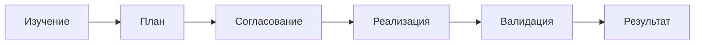
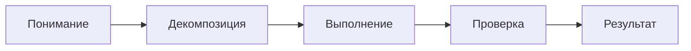
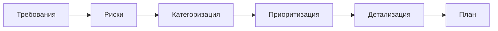
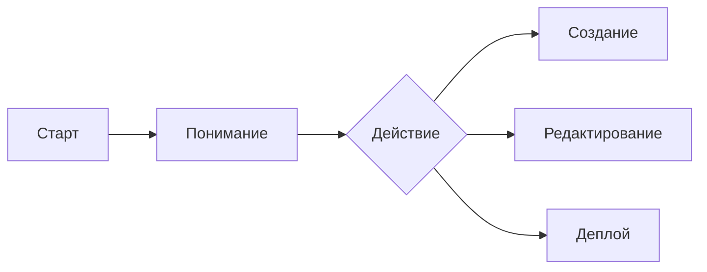

import { Aside } from '@astrojs/starlight/components';

Moira включает шаблоны workflows для типовых структурированных задач. Шаблоны обеспечивают стабильное качество выполнения через domain knowledge, циклы валидации и точки подтверждения.

## Запуск Workflow

```bash
mcp__moira__start({ workflowId: "<workflow-id>" })
```

---

## Разработка ПО

### software-development-flow

Полный цикл разработки фичи с планированием, итеративной реализацией и валидацией.



| Особенность | Описание |
|-------------|----------|
| Полный цикл | От требований до валидированной поставки |
| Итеративная реализация | Пошагово с gate-валидацией |
| Ревью плана | Субагент проверяет план перед выполнением |
| Числовые проверки | Верификация на основе доказательств |

**Применение:** Разработка фич, исправление багов, задачи кодинга, требующие структурного планирования и валидации.

```bash
mcp__moira__start({ workflowId: "moira/software-development-flow", parentExecutionId: "none" })
```

### software-development-flow-lite

Упрощённый цикл разработки для небольших фич (1-5 шагов). Основной цикл: план → реализация → тесты → ревью → коммит.


| Особенность | Описание |
|-------------|----------|
| Итеративная реализация | Пошагово с циклом валидации |
| Ревью плана | Субагент проверяет план перед выполнением |
| Числовые проверки | Количество тестов, стандарты качества, gate-ревью |
| Облегчённый | 42 ноды против 153 в полном SDF |

**Применение:** Небольшие фичи (1-5 шагов), исправление багов, быстрые улучшения, требующие структурной разработки с тестами.

```bash
mcp__moira__start({ workflowId: "moira/software-development-flow-lite", parentExecutionId: "none" })
```

[Подробнее →](/ru/docs/reference/workflows/software-development-lite/)

---

## Управление задачами

### quick-task (Рекомендуется)

Быстрое выполнение задач из 2-10 шагов без сложной инфраструктуры.


| Особенность | Описание |
|-------------|----------|
| Лёгкий процесс | Быстрый старт с минимальными накладными расходами |
| Простая валидация | Согласование плана + одна фаза ревью |
| Обязательные доказательства | Проверяемый результат для каждого шага |

**Применение:** Большинство многошаговых задач. Рекомендуемый workflow по умолчанию.

```bash
mcp__moira__start({ workflowId: "moira/quick-task", parentExecutionId: "none" })
```

[Подробнее →](/ru/docs/reference/workflows/quick-task/)

### robust-task

Надёжное выполнение сложных критичных задач с полной инфраструктурой.



| Особенность | Описание |
|-------------|----------|
| Самодостаточные шаги | Каждый шаг выполним без контекста плана |
| Обязательные доказательства | Proof of completion для каждого шага |
| Механизм retry | До 3 попыток с эскалацией |
| Сохранение плана | В `./claude-temp-files/plan-{timestamp}.md` |

**Применение:** Любая задача из 3+ шагов, требующая подтверждённого выполнения.

```bash
mcp__moira__start({ workflowId: "robust-task" })
```

[Подробнее →](/ru/docs/reference/workflows/robust-task/)

---

## Контент и исследования

### content-creation

Создание текстового контента: статьи, посты, документация.


| Особенность | Описание |
|-------------|----------|
| Валидация исследования | Мин. 3 источника, 3 факта |
| Валидация черновика | Соответствие структуре и тональности |
| Форматы | article, post, documentation |
| Тональности | formal, casual, technical, mixed |

```bash
mcp__moira__start({ workflowId: "content-creation" })
```

[Подробнее →](/ru/docs/reference/workflows/content-creation/)

### verified-research

Исследование с верифицированными и воспроизводимыми источниками. Решает проблему AI галлюцинаций и фейковых источников.


| Особенность | Описание |
|-------------|----------|
| Верификация URL | Все источники должны быть доступны |
| Альтернативные viewpoints | Минимум 2 противоположных мнения |
| Цитирование | Каждый вывод связан с источником |
| Limitations | Явная секция gaps и biases |

```bash
mcp__moira__start({ workflowId: "moira/verified-research" })
```

[Подробнее →](/ru/docs/reference/workflows/verified-research/)

---

## Разработка продукта

### prd-creation

Создание PRD (Product Requirements Document) с гарантией полноты.


| Особенность | Описание |
|-------------|----------|
| Problem-first | Начинаем с проблемы, не с решения |
| Data-backed | Analytics, interviews, support tickets |
| Testable AC | Мин. 3 acceptance criteria на story |
| Edge cases | Мин. 5 нестандартных сценариев |

```bash
mcp__moira__start({ workflowId: "prd-creation" })
```

[Подробнее →](/ru/docs/reference/workflows/prd-creation/)

### ux-design

Процесс UX/UI дизайна с обязательной проверкой accessibility.


| Особенность | Описание |
|-------------|----------|
| Primary persona | Определяется до начала дизайна |
| Design rationale | Документирование альтернатив |
| WCAG AA | Обязательный чеклист accessibility |
| Microcopy | Clarity-focused guidelines |

```bash
mcp__moira__start({ workflowId: "ux-design" })
```

[Подробнее →](/ru/docs/reference/workflows/ux-design/)

---

## Quality Assurance

### test-generation

Генерация кода автотестов (unit, integration, e2e).


| Особенность | Описание |
|-------------|----------|
| Анализ проекта | Существующие тесты, определение фреймворка |
| Типы тестов | unit, integration, e2e |
| Категории кейсов | happy path, edge cases, error cases |
| Валидация | Проверка синтаксиса перед сохранением |

```bash
mcp__moira__start({ workflowId: "test-generation" })
```

[Подробнее →](/ru/docs/reference/workflows/test-generation/)

### test-planning

Создание тест-плана с приоритизацией P0-P3.



| Особенность | Описание |
|-------------|----------|
| Категории | positive, negative, edge, security, performance |
| Приоритеты | P0 (blocker) до P3 (nice to have) |
| Покрытие | AC и high-risk сценарии |
| Минимум | 2 теста на категорию |

```bash
mcp__moira__start({ workflowId: "test-planning" })
```

[Подробнее →](/ru/docs/reference/workflows/test-planning/)

---

## Данные и аналитика

### data-analysis

Анализ данных от постановки задачи до выводов и визуализации.


| Особенность | Описание |
|-------------|----------|
| CRISP-DM | Стандартная методология |
| Валидация | Качество данных и полнота EDA |
| Точки согласования | Постановка задачи, выводы |

```bash
mcp__moira__start({ workflowId: "data-analysis" })
```

[Подробнее →](/ru/docs/reference/workflows/data-analysis/)

---

## Маркетинг

### marketing-campaign

Создание маркетинговых материалов с фокусом на дифференциацию и конверсию.


| Особенность | Описание |
|-------------|----------|
| Без buzzwords | USPs должны быть конкретными |
| Конкурентный анализ | Обязательный поиск gaps |
| Proof points | Data, testimonial или case study |
| Legal check | Проверка compliance |

```bash
mcp__moira__start({ workflowId: "marketing-campaign" })
```

[Подробнее →](/ru/docs/reference/workflows/marketing-campaign/)

---

## Мета

### workflow-management-flow

Создание, редактирование и деплой workflows.



<Aside type="tip">
Используй этот workflow для создания custom workflows или модификации существующих шаблонов.
</Aside>

| Особенность | Описание |
|-------------|----------|
| Типы нод | start, end, agent-directive, condition, notification |
| Операторы | eq, ne, lt, gt, in, contains, exists, and, or, not |
| Шаблоны | Variable substitution с валидацией |
| Валидация | Schema и connection verification |

```bash
mcp__moira__start({ workflowId: "workflow-management-flow" })
```
