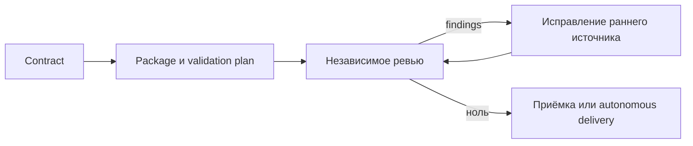
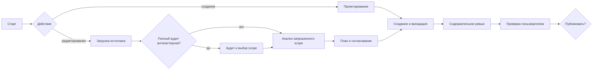

import { Aside } from '@astrojs/starlight/components';

Moira включает шаблоны workflows для типовых структурированных задач. Шаблоны обеспечивают стабильное качество выполнения через domain knowledge, циклы валидации и точки подтверждения.

## Запуск Workflow

```bash
mcp__moira__start({ workflowId: "<workflow-id>" })
```

---

## Разработка ПО

### software-development-flow

Файловый цикл разработки фичи с планированием по первичным источникам, полными единицами реализации, независимыми содержательными gates, валидацией по влиянию, checkpoint-коммитами принятых единиц и явной авторизацией side effects.


```mermaid
flowchart LR
    A[Требования] --> B[План и согласование] --> C[Единица реализации]
    C --> D[Достаточность тестов и архитектура]
    D --> E[Валидация по влиянию]
    E --> G[Условная приёмка и checkpoint]
    G -->|есть ещё единицы| C
    G --> F[Документация, итоговое покрытие и отчёт]
    F --> H[Финальная приёмка]
    H --> I[Условный VCS reconciliation]
```

| Особенность | Описание |
|-------------|----------|
| Долговечные артефакты | Требования, ревизии плана, доказательства реализации, ревью, feedback и итоговое покрытие остаются в одном связанном workspace |
| Планирование по источникам | Назначенные тикеты, PR, спецификации и документы сохраняются до извлечения требований; начальные VCS- и discovery-доказательства защищают постороннюю работу |
| Полные единицы реализации | Каждая согласованная единица включает зависимости, тесты, применимую постоянную документацию и сфокусированные доказательства |
| Слоистое ревью | Достаточность тестов и архитектуру агент оценивает сам по диффу и первоисточникам; затем один делегированный ревьюер судит готовую единицу на полноту и качество и не перезапускает линтеры, типы и наборы тестов |
| Реплан по решению агента | Телепорт позволяет вернуться к планированию в тот момент, когда стало ясно, что неверен сам план, а не ждать, пока это заметит гейт |
| Валидация по влиянию | Runtime, browser, security, performance, широкие сборки и полные suites запускаются только когда этого требуют правила проекта или фактический риск |
| Условные визуальные доказательства | Единица плана явно включает проверку скриншотов и переносимый self-contained HTML-отчёт; случайное изменение UI не включает их автоматически |
| Промежуточная история | При согласованном VCS-разрешении каждая принятая единица коммитит только собственные изменения до начала следующей; посторонняя работа и артефакты workflow исключены |
| Явная авторизация | Checkpoint-коммиты и финальный project-native VCS reconciliation условны; финальная пользовательская приёмка предшествует reconciliation, а наличие инструмента не даёт разрешения на side effect |
| Режим работы | На первом шаге определяется `autonomous` или `interactive`. Автономный запуск пропускает согласования требований, плана, единицы и результата и вместо них выдаёт финальный отчёт; независимые ревью, gates валидации и VCS-полномочия не меняются, а внешние блокеры решаются по перепроверенным доказательствам, а не ожиданием человека |

**Применение:** Разработка фич, исправление багов, задачи кодинга, требующие структурного планирования и валидации.

```bash
mcp__moira__start({ workflowId: "moira/software-development-flow", parentExecutionId: "none" })
```

### software-development-flow-lite

Упрощённый цикл разработки для небольших фич (1-5 шагов). Основной цикл: план → реализация → тесты → ревью → коммит.


```mermaid
flowchart LR
    A[Изучение] --> B[План] --> C[Согласование] --> D[Реализация] --> E[Тесты] --> F[Ревью] --> G[Коммит]
    G -->|ещё шаги| D
    G -->|готово| H[Отчёт]
```

| Особенность | Описание |
|-------------|----------|
| Итеративная реализация | Пошагово с циклом валидации |
| Ревью плана | Субагент проверяет план перед выполнением |
| Числовые проверки | Количество тестов, стандарты качества, gate-ревью |
| Облегчённый | 42 ноды против 153 в полном SDF |

**Применение:** Небольшие фичи (1-5 шагов), исправление багов, быстрые улучшения, требующие структурной разработки с тестами.

```bash
mcp__moira__start({ workflowId: "moira/software-development-flow-lite", parentExecutionId: "none" })
```

[Подробнее →](/ru/docs/reference/workflows/software-development-lite/)

---

## Управление задачами

### quick-task (Рекомендуется)

Файловое выполнение ограниченного плана из 1-10 содержательных пунктов.


```mermaid
flowchart LR
    A[Понимание] --> B[План] --> C[Согласование] --> D[Выполнение] --> E[Проверка] --> F[Отчёт]
```

| Особенность | Описание |
|-------------|----------|
| Долговечный workspace | Неизменяемые записи задачи, плана, ревью, решений, изменений и доказательств |
| Независимые gates | Ревью плана до согласования и ревью результата после выполнения |
| Минимальный контекст | Только типизированные пути, длина плана, курсор и значения маршрутизации |

**Применение:** Большинство ограниченных многошаговых задач, которые выполняет агент с доступом к файловой системе. Рекомендуемый workflow по умолчанию.

```bash
mcp__moira__start({ workflowId: "moira/quick-task", parentExecutionId: "none" })
```

[Подробнее →](/ru/docs/reference/workflows/quick-task/)

### robust-task

Файловое выполнение сложных критичных задач с долговечным восстановлением.


```mermaid
flowchart LR
    A[Понимание] --> B[Декомпозиция] --> C[Выполнение] --> D[Проверка] --> E[Результат]
```

| Особенность | Описание |
|-------------|----------|
| Долговечный workspace | Зафиксированные требования, неизменяемые версии плана, доказательства попыток, ревью, решения и delivery хранятся под `./moira-ws/` |
| Независимые gates | План, попытки шагов, покрытие критериев и итоговый результат проходят подходящее независимое ревью |
| Ограниченное восстановление | Лимиты ревью и повторов шага заканчиваются явным решением пользователя, а не молчаливым успехом |
| Правдивый delivery | End возвращает workspace, файл результата, статус complete/incomplete и краткое summary |

**Применение:** Сложная многошаговая работа, которая должна переживать потерю контекста и сохранять доказательства каждой попытки.

```bash
mcp__moira__start({ workflowId: "moira/robust-task", parentExecutionId: "none" })
```

[Подробнее →](/ru/docs/reference/workflows/robust-task/)

---

## Контент и исследования

### content-creation

Создание текстового контента: статьи, посты, документация.


```mermaid
flowchart LR
    A[Бриф] --> B[Исследование] --> C[Структура] --> D[Написание] --> E[Редактирование] --> F[Финализация]
```

| Особенность | Описание |
|-------------|----------|
| Валидация исследования | Мин. 3 источника, 3 факта |
| Валидация черновика | Соответствие структуре и тональности |
| Форматы | article, post, documentation |
| Тональности | formal, casual, technical, mixed |

```bash
mcp__moira__start({ workflowId: "content-creation" })
```

[Подробнее →](/ru/docs/reference/workflows/content-creation/)

### verified-research

Исследование с верифицированными и воспроизводимыми источниками. Решает проблему AI галлюцинаций и фейковых источников.


```mermaid
flowchart LR
    A[Вопрос] --> B[Методология] --> C[Сбор] --> D[Чтение] --> E[Синтез] --> F[Отчёт]
```

| Особенность | Описание |
|-------------|----------|
| Верификация URL | Все источники должны быть доступны |
| Альтернативные viewpoints | Минимум 2 противоположных мнения |
| Цитирование | Каждый вывод связан с источником |
| Limitations | Явная секция gaps и biases |

```bash
mcp__moira__start({ workflowId: "moira/verified-research" })
```

[Подробнее →](/ru/docs/reference/workflows/verified-research/)

---

## Разработка продукта

### prd-creation

Создание PRD (Product Requirements Document) с гарантией полноты.


```mermaid
flowchart LR
    A[Проблема] --> B[Исследование] --> C[Решение] --> D[Stories] --> E[Метрики] --> F[PRD]
```

| Особенность | Описание |
|-------------|----------|
| Problem-first | Начинаем с проблемы, не с решения |
| Data-backed | Analytics, interviews, support tickets |
| Testable AC | Мин. 3 acceptance criteria на story |
| Edge cases | Мин. 5 нестандартных сценариев |

```bash
mcp__moira__start({ workflowId: "prd-creation" })
```

[Подробнее →](/ru/docs/reference/workflows/prd-creation/)

### ux-design

Привязанная к запуску UX/UI-спецификация с трассируемыми решениями, accessibility intent,
независимым ревью и обязательным repair.


```mermaid
flowchart LR
    A[Contract] --> B[Package и validation plan] --> C[Независимое ревью]
    C -->|findings| D[Исправление раннего источника]
    D --> C
    C -->|ноль| E[Приёмка или autonomous delivery]
```

| Особенность | Описание |
|-------------|----------|
| Долговечный workspace | Contract, design package, будущий validation plan, review и repair account привязаны к текущему execution |
| Полный design scope | Пользователи, jobs, pains, ограничения, применимые состояния, flows, layout, microcopy, responsive behavior, accessibility intent, риски и handoff |
| Переиспользование и rationale | Существующие примитивы имеют приоритет; новый компонент требует evidence, альтернатив и последствий интеграции |
| Независимый gate | Один и тот же отдельный reviewer должен вернуть ровно ноль текущих blockers после каждого изменения |
| Честная граница | Создаёт спецификацию и план, но не реализует UI, не проводит исследование, не сертифицирует WCAG, не публикует и не деплоит |

```bash
mcp__moira__start({ workflowId: "moira/ux-design", parentExecutionId: "none" })
```

[Подробнее →](/ru/docs/reference/workflows/ux-design/)

---

## Quality Assurance

### test-generation

Генерация кода автотестов (unit, integration, e2e).


```mermaid
flowchart LR
    A[Код] --> B[Анализ] --> C[План] --> D[Генерация] --> E[Ревью] --> F[Сохранение]
```

| Особенность | Описание |
|-------------|----------|
| Анализ проекта | Существующие тесты, определение фреймворка |
| Типы тестов | unit, integration, e2e |
| Категории кейсов | happy path, edge cases, error cases |
| Валидация | Проверка синтаксиса перед сохранением |

```bash
mcp__moira__start({ workflowId: "test-generation" })
```

[Подробнее →](/ru/docs/reference/workflows/test-generation/)

### test-planning

Создание тест-плана с приоритизацией P0-P3.


```mermaid
flowchart LR
    A[Требования] --> B[Риски] --> C[Категоризация] --> D[Приоритизация] --> E[Детализация] --> F[План]
```

| Особенность | Описание |
|-------------|----------|
| Категории | positive, negative, edge, security, performance |
| Приоритеты | P0 (blocker) до P3 (nice to have) |
| Покрытие | AC и high-risk сценарии |
| Минимум | 2 теста на категорию |

```bash
mcp__moira__start({ workflowId: "test-planning" })
```

[Подробнее →](/ru/docs/reference/workflows/test-planning/)

---

## Данные и аналитика

### data-analysis

Анализ данных от постановки задачи до выводов и визуализации.


```mermaid
flowchart LR
    A[Контекст] --> B[Проблема] --> C[Данные] --> D[EDA] --> E[Инсайты] --> F[Выводы]
```

| Особенность | Описание |
|-------------|----------|
| CRISP-DM | Стандартная методология |
| Валидация | Качество данных и полнота EDA |
| Точки согласования | Постановка задачи, выводы |

```bash
mcp__moira__start({ workflowId: "data-analysis" })
```

[Подробнее →](/ru/docs/reference/workflows/data-analysis/)

---

## Маркетинг

### marketing-campaign

Создание маркетинговых материалов с фокусом на дифференциацию и конверсию.


```mermaid
flowchart LR
    A[Продукт] --> B[Аудитория] --> C[Конкуренты] --> D[Позиционирование] --> E[Создание] --> F[Ревью]
```

| Особенность | Описание |
|-------------|----------|
| Без buzzwords | USPs должны быть конкретными |
| Конкурентный анализ | Обязательный поиск gaps |
| Proof points | Data, testimonial или case study |
| Legal check | Проверка compliance |

```bash
mcp__moira__start({ workflowId: "marketing-campaign" })
```

[Подробнее →](/ru/docs/reference/workflows/marketing-campaign/)

---

## Мета

### workflow-management-flow

Создание, редактирование, ревью и опциональная публикация workflows.


```mermaid
flowchart LR
    A[Старт] --> B{Действие}
    B -->|создание| C[Проектирование]
    B -->|редактирование| D[Загрузка источника]
    D --> E{Полный аудит антипаттернов?}
    E -->|да| F[Аудит и выбор scope]
    E -->|нет| G[Анализ запрошенного scope]
    F --> G
    C --> H[Создание и валидация]
    G --> I[План и согласование]
    I --> H
    H --> J[Содержательное ревью]
    J --> K[Проверка пользователем]
    K --> L{Публиковать?}
```

<Aside type="tip">
Используй этот workflow для создания custom workflows или модификации существующих шаблонов.
</Aside>

| Особенность | Описание |
|-------------|----------|
| Файловые артефакты | Требования, анализ, планы и отчёты ревью остаются в workspace |
| Встроенная справка по авторингу | Правила движка, паттерны, антипаттерны, критерии ревью, порядок проверок по стоимости и правила полномочий находятся внутри workflow |
| Редактирование с учётом идентичности | Edit-ветка сверяет происхождение локальной и серверной версий до содержательного планирования |
| Опциональный аудит источника | Полный аудит антипаттернов запускается только с согласия пользователя |
| План по результатам | План сохраняет свободу исполнителя, фиксируя scope и критерии приёмки |
| Простые review-loop | Отчёты остаются на диске; через граф передаётся только число замечаний |
| Валидация | Нода создания или редактирования запускает официальный validator графа и schema |
| Context-aware handoff | Workflow ссылается на стабильные пути, не заставляя повторно читать неизменённые файлы и не копируя их содержимое через state |
| Gate публикации | Семантики standard, copy-new и admin-override требуют явного решения пользователя; существующий локальный target синхронизируется отдельно |

```bash
mcp__moira__start({ workflowId: "workflow-management-flow" })
```
