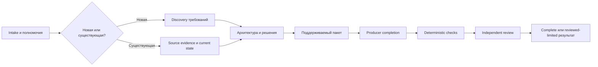

Architecture Design Flow создаёт decision-ready поддерживаемый пакет архитектуры для новой системы или существующего продукта. Он объединяет подходящий сценарию discovery, evidence-backed решения, quality attributes, crosscutting и operational concerns, limitations, deterministic package checks и настоящее independent architecture review.

```bash
mcp__moira__start({ workflowId: "moira/architecture-design-flow", parentExecutionId: "none" })
```

## Когда использовать

Используйте этот workflow, когда результатом являются архитектурные решения и документация. Для существующей системы он читает разрешённый source и разделяет наблюдаемое текущее состояние, inference и целевые улучшения. Для новой системы он выводит архитектуру из переданных требований и ограничений. Software Development Flow нужен для реализации product code, тестов и документации; research workflow — когда результатом является discovery доказательств; planning workflow — когда нужен только план выполнения.

## Долговечный процесс

Workflow материализует execution-correlated workspace с неизменяемым architecture contract, универсальными architecture principles, evidence сценария, current-state analysis, архитектурой и решениями, package files, completion record, limitations, deterministic observations, independent findings, repair account, corrected-contract supplement, delivery evidence и final report.



C4, DDD, arc42, Mermaid, ADR, диаграммы и quality scenarios применяются только там, где помогают реальному решению. Фиксированное количество contexts, gaps, alternatives, файлов или concerns не доказывает semantic completeness.

## Repair, replan и исходы

Findings в discovery, architecture, package, completion и validation возвращаются разным владельцам и повторяют каждый downstream gate, evidence которого устарел. Ошибочные или недоказуемые criteria проходят cumulative corrected-contract supplement: он сохраняет исходные цель и полномочия и независимо проверяется перед typed re-entry. Guarded process-revision teleport предназначен для ошибочного процесса или criterion, а не обычного failed check или review finding.

Autonomous mode пропускает только финальную пользовательскую приёмку. Interactive mode поддерживает accept, abort или один конкретный discovery, architecture, package, validation, completion либо contract rework request. Исходы различают complete, reviewed-limited, blocked до или после создания workspace, workspace failure и aborted.

## Полномочия и delivery

Workspace delivery доступен всегда. Project delivery копирует точный принятый пакет только в явно разрешённый target и проверяет identity source/destination. Workflow не изменяет product code, тесты или инфраструктуру; не коммитит, не пушит, не публикует, не уведомляет, не выпускает релиз и не деплоит.
